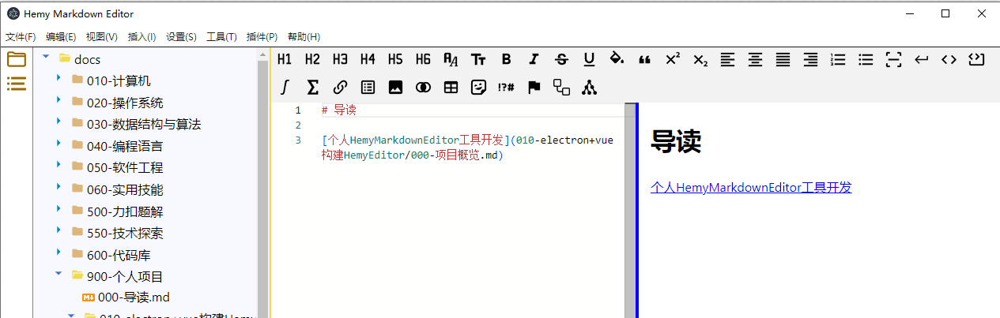
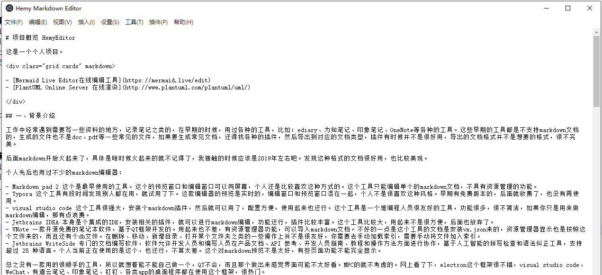

# 解决链接跳转问题

项目是用VUE + Electron + Typescript开发的。

在插件菜单，设置了在线工具网站，最早使用的方法是创建了一个单独的dialog，然后加载对应的网页，也能勉强使用，但是有各种不太方便的问题。

后面在文档编写，渲染出来的预览区域，点击对应的连接，发现直接在当前应用上打开了对应的连接内容，而没有跳转到某个网页，或者某个文件，这用起来很不爽。

如图：有如下文档：



当我点击了对应的连接之后，界面变成了下面这样



这就让人很不爽快了，没有回退按钮，使用鼠标回退功能，发现回退后整个APP直接成了刚打开的样子，得重新读取文件夹，重新打开需要编辑的文件，如果没有保存，那么之前的内容可能会消失。

后面研究了下，在vue组件中，可以通过window.open命令打开一个网页。

在预览的组件中，做了如下处理：


```typescript
onUpdated(() => {
  const links = document.querySelectorAll('#markdown-preview-html a')
  console.log('links', links)
  //遍历链接
  for (let i = 0; i < links.length; i++) {
    const href = links[i].getAttribute('href')
    console.log('href', href)
    if (!href) {
      continue
    }
    if (href.endsWith('.md')) {
      links[i].addEventListener('click', (event) => {
        event.preventDefault()
        const fileInfo: FileProperties = {
          name: parserFileName(href),
          path: href,
          type: 'file',
          content: ''
        }
        window.electron.ipcRenderer.send('open-select-file', fileInfo)
      })
    }

    if (href.startsWith('http')) {
      links[i].addEventListener('click', (event) => {
        event.preventDefault()
        window.open(href, '_blank', 'noopener, noreferrer')
      })
    }
  }
})
```


另外，菜单栏的在网页中打开链接，也有了新的方法：


```
mainWindow.webContents.send('open-url-in-web-browser-window', webAppDialogs[name].link)
```

这样在vue组件中监听这个事件，然后使用windows.open，就可以在网页中打开链接了。

当然也保留的原始的功能，可以通过开关进行控制，这个准备写在设置中