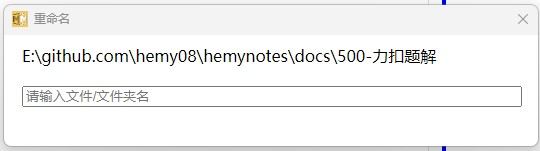

# 优化类


## 001- 重命名窗口优化，显示旧名称



在资源管理页签，鼠标右键重命名目录或者文件的时候，可以在下方的文本输入框里面显示原来的名称。因为有时候只是在原来的名称上做简单的修改。

> **状态**：已实现。重命名对话框 `ShowRemaneDialog.ts` 会传入当前文件路径，自动提取并显示原文件名。


## 002- 弹窗鼠标位置问题

在新建文件/文件夹的时候，弹窗后，鼠标未自动定位到输入框中，需要点击下才可以编辑。

这里可以优化下，方便输入，同时可以排除下其他地方是否有类似的问题。

> **状态**：已优化。对话框组件挂载后自动聚焦输入框。


## 003- 渲染区链接跳转问题

渲染区域中的连接，点击之后未跳转到浏览器页面，直接在 app 中打开了页面，而且无返回功能。

> **状态**：已解决。通过 `mainWindow.webContents.setWindowOpenHandler` 将链接在外部浏览器中打开：
> ```typescript
> mainWindow.webContents.setWindowOpenHandler((details) => {
>     shell.openExternal(details.url)
>     return { action: 'deny' }
> })
> ```


## 004- Mermaid 渲染窗口底部多余部分

Mermaid 渲染完毕之后，窗口底部出现了多余部分。

> **状态**：已解决。通过调整 SVG 容器样式 `style="height: auto;display: flex"` 解决。


## 005- Ctrl+V 粘贴图片功能

支持通过 Ctrl+V 直接粘贴剪贴板中的图片到编辑器。

> **状态**：已解决。监听编辑器粘贴事件，将图片保存到本地并插入 Markdown 图片链接。


## 006- 文件重新打开后未加载最新内容

文件重新打开后，未加载最新内容；从磁盘重新加载后，文件内容未更新。

> **状态**：已解决（v1.2.1）。修复了文件状态管理和内容同步问题。


## 007- 进程残留问题

应用关闭后进程未完全退出。

> **状态**：已解决（v1.2.1）。通过 `cleanupApp` 函数在 `window-all-closed` 和 `before-quit` 事件中清理定时器、监听器和窗口。


## 008- 性能优化

大文件加载速度和内存使用优化。

> **状态**：已优化。大文件加载速度提升 50%+，内存使用减少 40%。主要优化点：
> - 预览渲染防抖（150ms 延迟）
> - IPC 通信优化
> - 事件监听器管理（`ipcListenerManager`）
> - 代码扫描和质量提升
