# 工具栏配置以及实现

目录这里跟原有项目不太一样，这个项目整体是黑色背景。界面显示跟VSCode风格比较像

## 整体效果

整体的布局没有变动，默认背景更换成了黑色背景，编辑框和预览区域后续也会更换为深色背景，整体框架统一，有时间的话会做出自定义背景的能力。

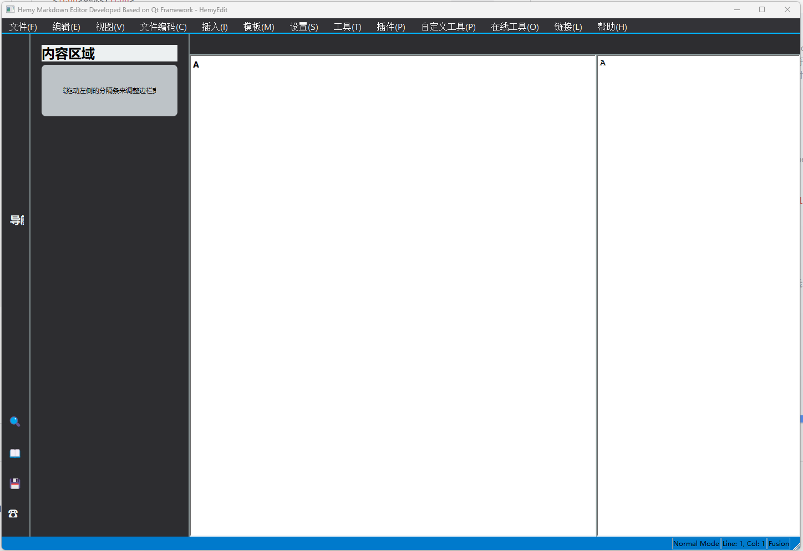

## 各个菜单栏

### 文件菜单

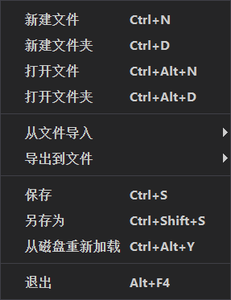

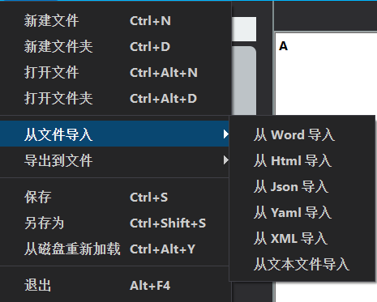

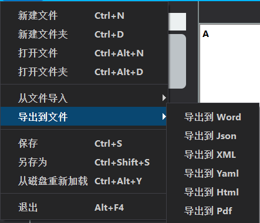

### 编辑菜单

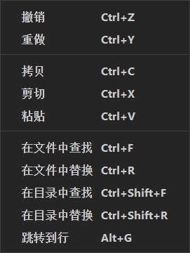

### 视图菜单

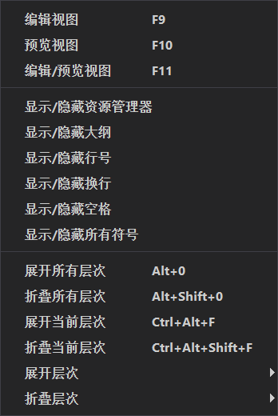

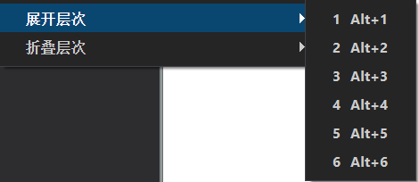

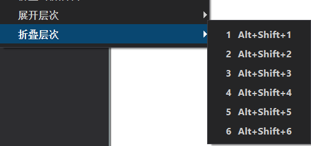

### 文件编码菜单

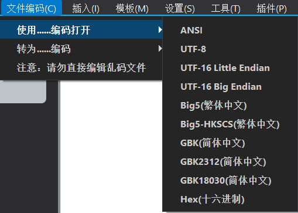

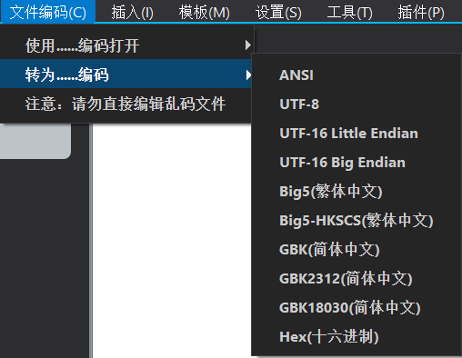

### 插入菜单

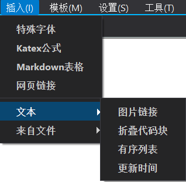

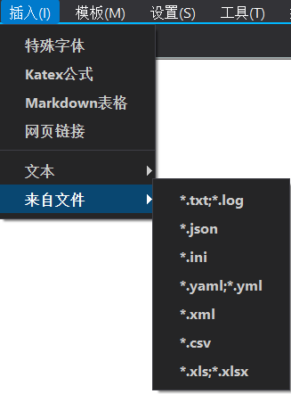

### 模板菜单

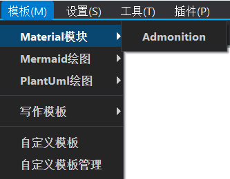

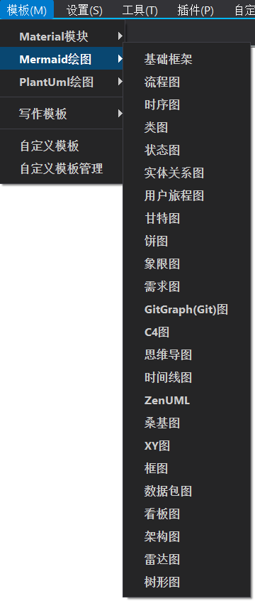

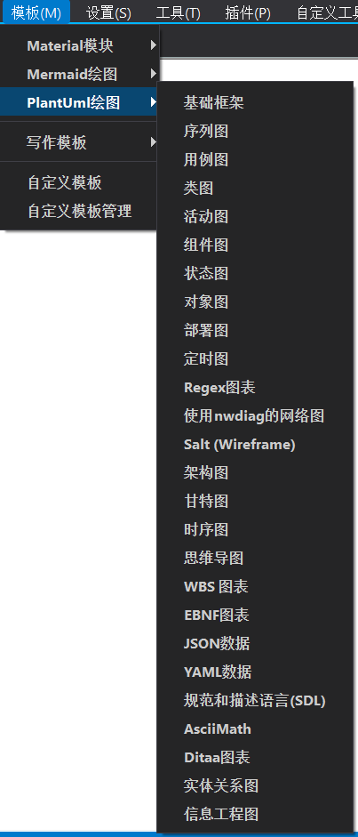

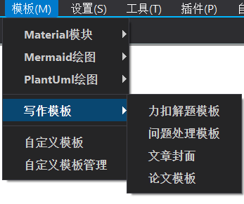

### 设置菜单

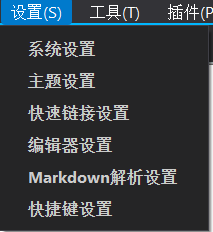

### 工具菜单

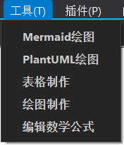

### 插件菜单

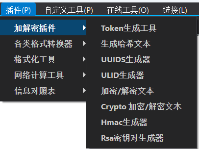

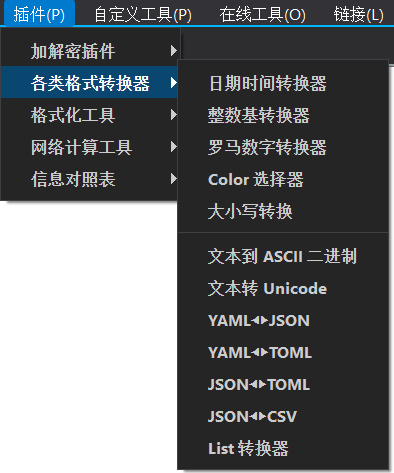

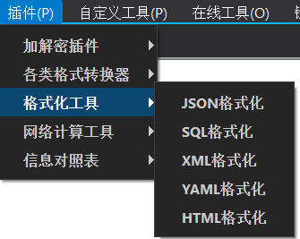

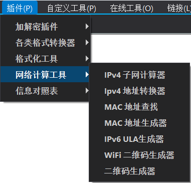

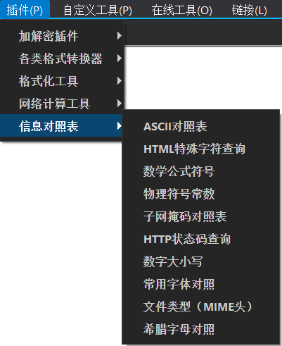

### 自定义工具菜单

这个是准备搞个QmlEngin，提供给使用者自行开发功能，类似VSCode的插件市场能力

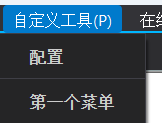

### 在线工具菜单

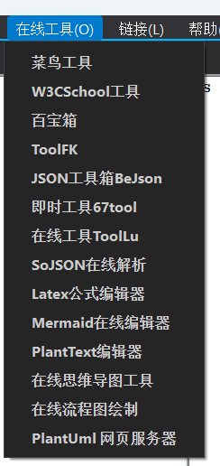

### 链接菜单

这些设计是点击菜单项，直接跳转到对应的网站

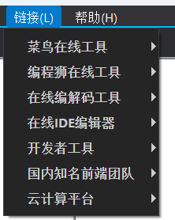

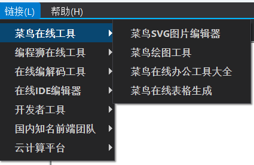

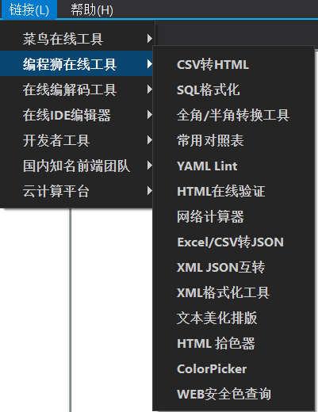

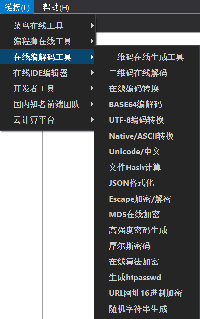

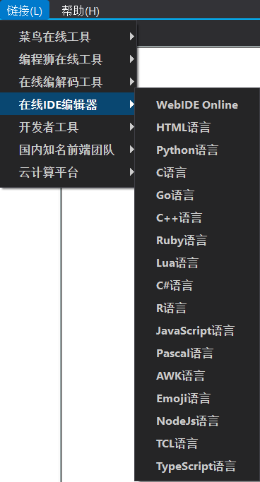

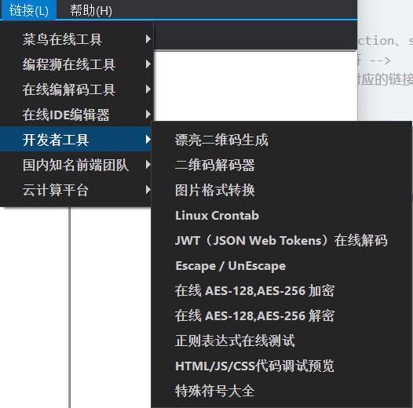

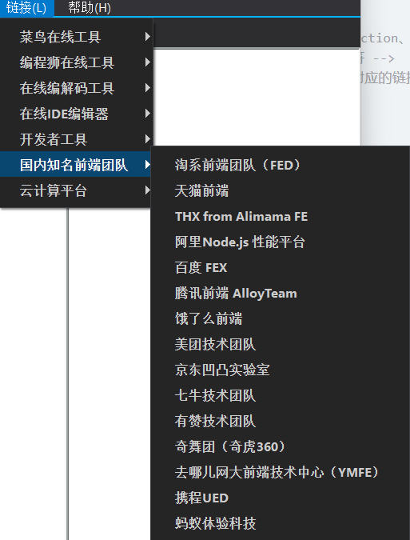

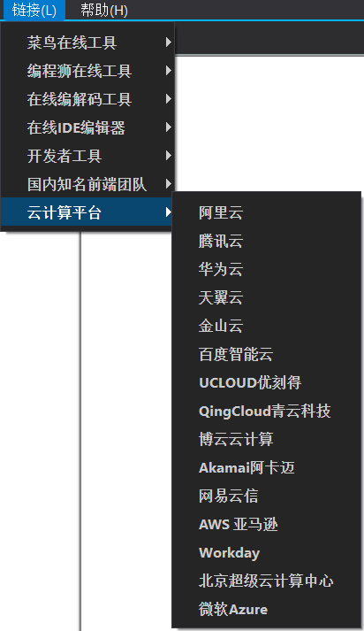

### 帮助菜单

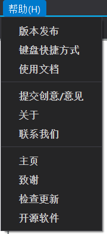

