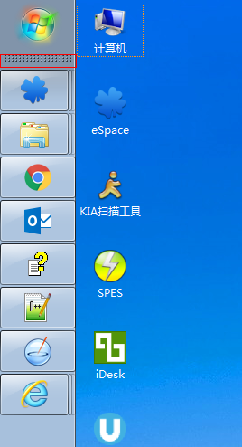
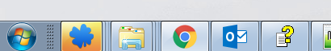
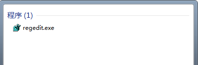
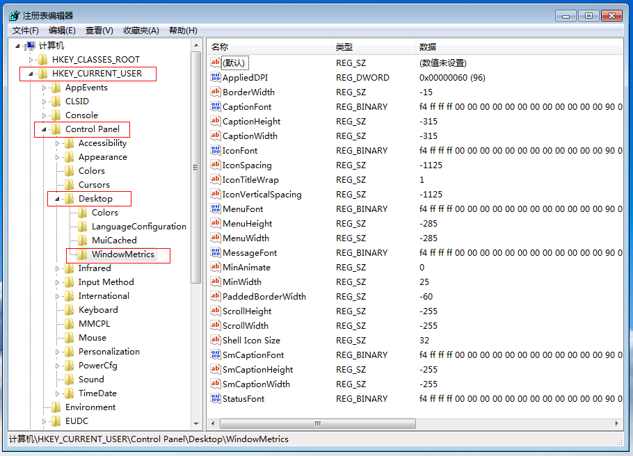
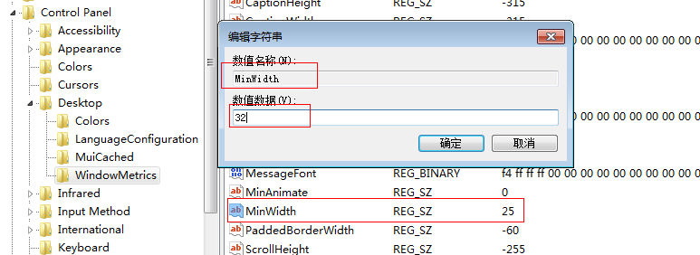
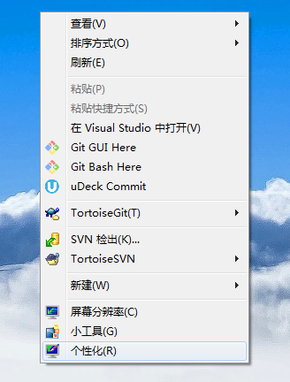
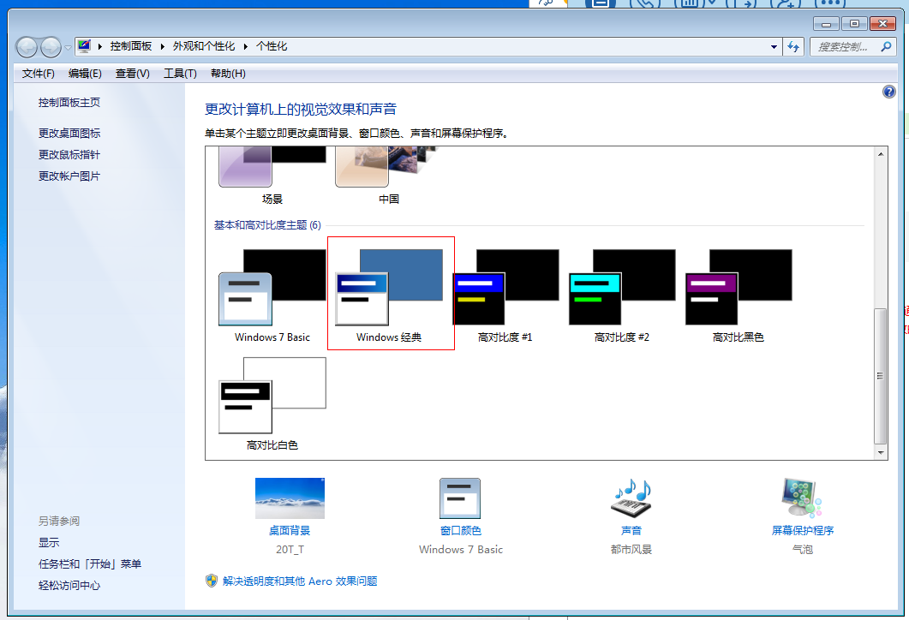

# 任务栏放在屏幕左侧，发现太宽了，怎么变窄

最后更新：2017-08-12

现在大多用的是宽屏，这样任务栏放在底部就有点不舒服了，但是放在左侧或者右侧，又太宽了，怎么办？

看吧，是不是宽了很多。

## **方案一：修改注册表**

这个方案修改起来比较麻烦，但是不影响美观。

### regedit

打开运行，输入regedit，打开系统的注册表编辑工具。

### WindowMetrics

进入路径\[HKEY\_CURRENT\_USER\\Control Panel\\Desktop\\WindowMetrics\]。

### 新建/修改MinWidth。

修改MinWidth的值，如果么有这个项，你可以新增一个，类型是字符串。

### 重启电脑。

 **须知：**
这个方法修改必须重启电脑才能生效。

## **方案二：更改为windows经典主题**

这个方案是修改主题，所以美观上不能保证。

### 打开个性化。

### 更改为Windows经典主题。

