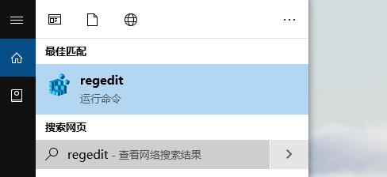
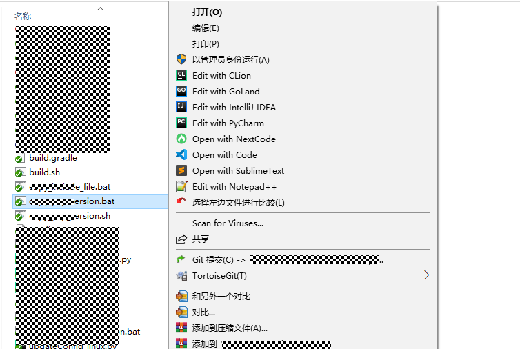
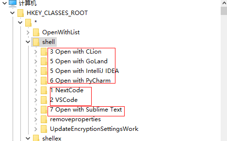
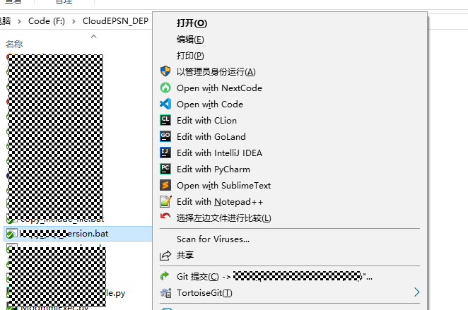
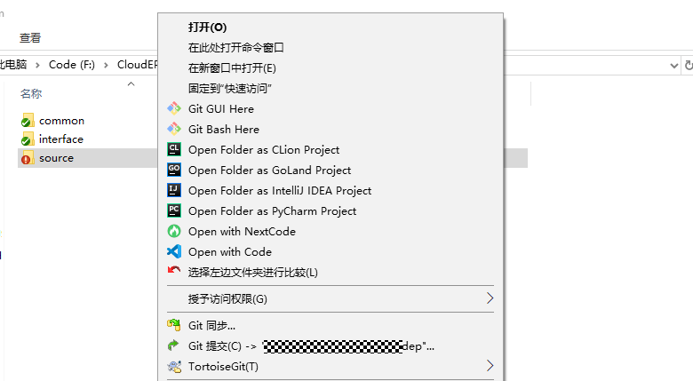
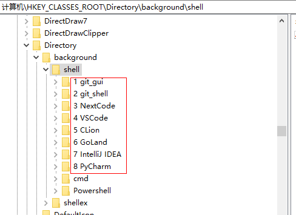
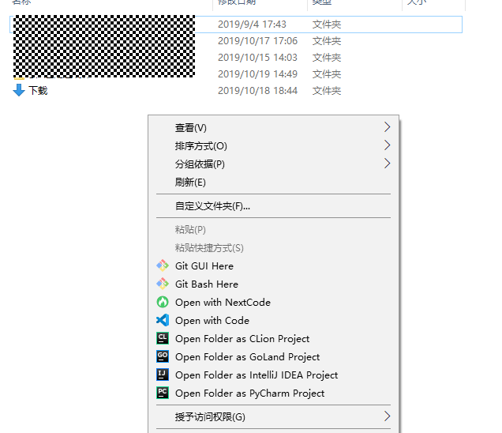

# 鼠标右键菜单太乱，想排个序

最后更新：2017-08-12

如图，看看我当前的右键，本来是很乱的，我给排了下序。具体怎么做呢？

### 打开注册表

在cmd命令界面，输入regedit，打开注册表。

我的是windows10的系统。

### 文件右键菜单排序

对文件右键菜单排序（有后缀的）

排序前：

修改注册表项：计算机\\HKEY\_CLASSES\_ROOT\\\*\\shell 将下面的文件夹进行排序，添加上序号，如图：

修改之后，再在文件上点击右键，如下：

看看，是按照我们标的序号显示的吧。

### 对文件夹的右键菜单排序

修改注册表项：计算机\\HKEY\_CLASSES\_ROOT\\Directory\\shell，同样加上序号。

修改后如下：

### 对文件夹背景右键菜单排序

修改注册表项：计算机\\HKEY\_CLASSES\_ROOT\\Directory\\background\\shell，方法同上

修改后如下：

