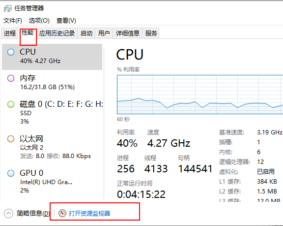
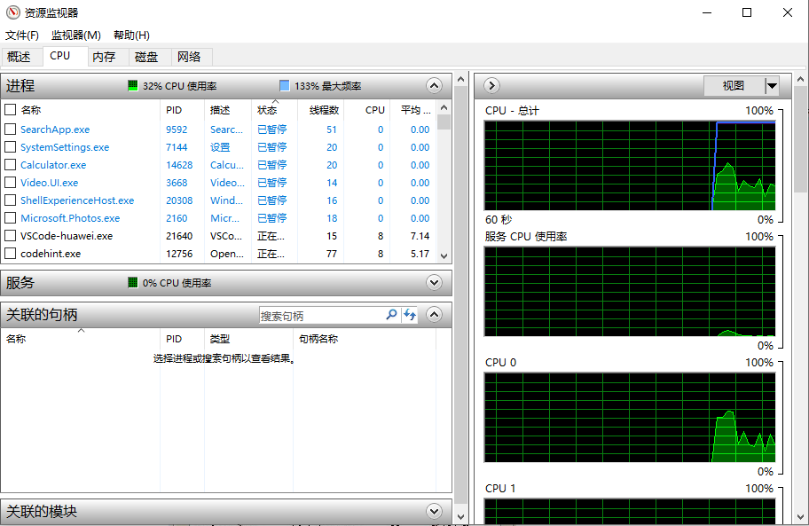
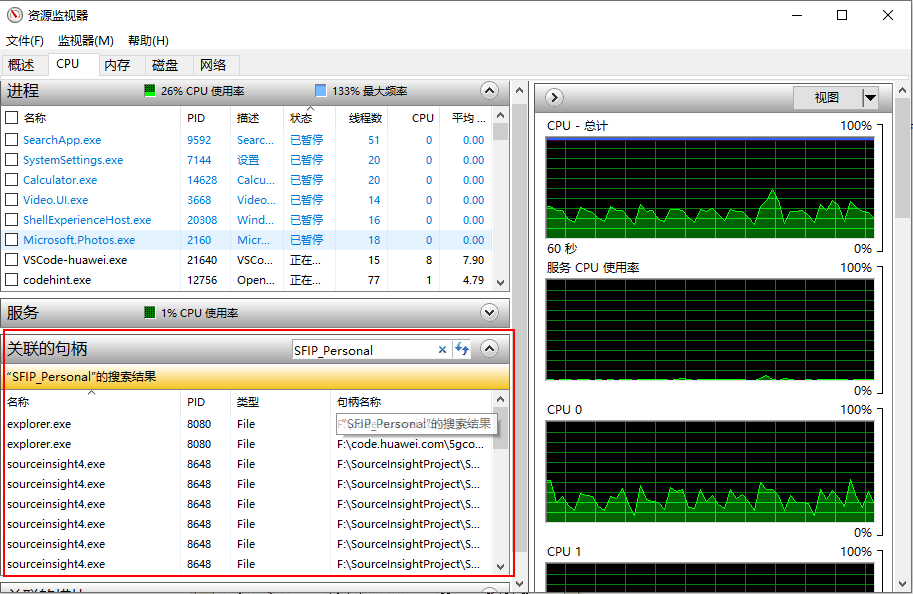
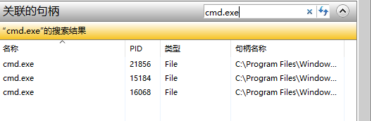

# 文件被进程占用，无法删除

最后更新：2017-08-12

经常在删除文件，文件重命名、移动文件等操作的时候，提示文件正在被进程占用，不允许操作。

而实际上在打开的程序中，并没有看到有读写文件或者文件夹的操作，这就很苦恼，下面这种方法教你快速找到占用文件的进程。

### 第一步、打开任务管理器

有以下几种方法：

- 在任务栏右键，打开任务管理器（任务来默认屏幕下方）。
- 使用ctrl+ shift+ esc的快捷键打开任务管理器。
- 使用快捷键ctrl+alt+delete调出锁屏界面，打开任务管理器。
- 在命令窗口输入taskmgr打开任务管理器。
- 另外，在win10的搜索里面输入taskmgr，也会有任务管理器。

### 第二步、打开资源监视器

在任务管理器的性能界面，左下角有资源检视器，打开它。

打开后图：

### 第三步、搜索句柄

在上一步打开的资源管理器界面，在CPU页面中，搜索句柄。

以SFIP_Personal为例，下面搜索到了很多正在使用这个目录的进程。文件名的话，可以是可以的。

