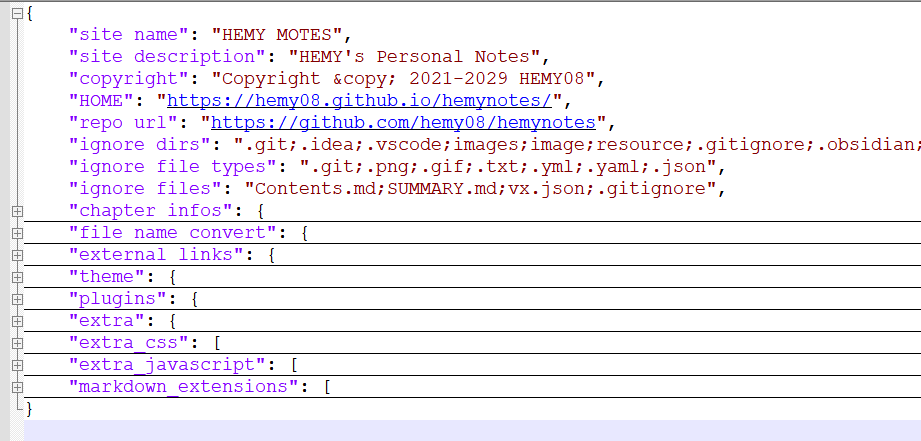
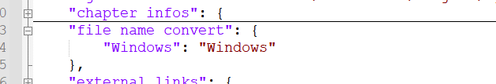
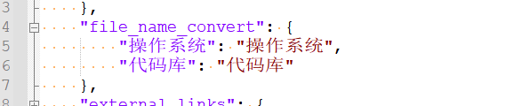
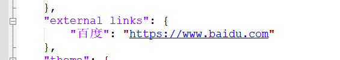

# <center> HEMY NOTES BOOKS  </center>

<style>
    .Red {color:rgb(255,0,0);font-weight:bold;}
    .Orange {color:rgb(255,128,0);font-weight:bold;}
    .Yellow {color:rgb(255,255,0);font-weight:bold;}
    .Green {color:rgb(0,160,0);font-weight:bold;}
    .Cyan {color:rgb(0,255,255);font-weight:bold;}
    .Blue {color:rgb(0,0,255);font-weight:bold;}
    .Purple {color:rgb(128,0,128);font-weight:bold;}
    table th {background-color:#2195f3;font-size:13pt}
    table th:nth-of-type(1) {width:80pt}
    .md-typeset .grid.cards>ol>li,.md-typeset .grid.cards>ul>li {BACKGROUND: lightgoldenrodyellow;}
</style>

-----------------


https://hemy08.github.io/hemynotes/

<details>
<summary style="color:rgb(0,0,255);font-weight:bold">pages_config.json 参考</summary>
<blockcode><pre><code>
</code></pre></blockcode></details>

# 版权声明

如非特别声明，所有博文都使用以下许可：

[署名-非商业性使用-禁止演绎 4.0](https://creativecommons.org/licenses/by-nc-nd/4.0/deed.zh-hans)


----------------

# 网站直达

<div class="grid cards" markdown>

- [腾讯云 开发者社区](https://cloud.tencent.com/developer)
- [华为云 开发者联盟](https://developer.huawei.com/)
- [HarmonyOS 开发者社区](https://developer.huawei.com/consumer/cn/forum/communityHome)
- [OpenHarmony 社区](https://www.openharmony.cn/mainPlay)
- [国家高等教育智慧教育平台](https://higher.smartedu.cn/)
- [力扣官网](https://leetcode.cn/)
- [nvm 一个nodejs版本管理工具！](https://nvm.uihtm.com/)

</div> 

-----------------

# 站内连接

=== "计算机" 

    - [计算机基础](010-计算机/010_计算机基础/000_导读.md)
    - [计算机组成原理](010-计算机/020_计算机组成原理/000-导读.md)
    - [计算机网络](010-计算机/040_计算机网络/000-导读.md)
    - [中央处理器](010-计算机/050_中央处理器/000-导读.md)
    - [存储系统](010-计算机/060_存储系统/000-导读.md)
    - [指令系统](010-计算机/070_指令系统/000-导读.md)
    - [输入输出系统](010-计算机/080_输入输出系统/000-导读.md)
    - [文件系统](010-计算机/090_文件系统/000-导读.md)
    - [总线](010-计算机/120_总线/000-导读.md)
    - [数据的表示和运算](010-计算机/150_数据的表示和运算/000-导读.md)
    - [进程与线程](010-计算机/170_进程与线程/000-导读.md)
    - [数据库系统](010-计算机/180_数据库系统/000-导读.md)

=== "操作系统"
    
    - [Windows系统](020-操作系统/010-Windows系统/000-导读.md)
    - [Linux系统](020-操作系统/020-Linux系统/000-导读.md)
    - [嵌入式系统](020-操作系统/030-嵌入式系统/000-导读.md)
    - [HarmonyOS]()
    - []()

=== "数据结构与算法"

    - [导读](030-数据结构与算法/000-导读.md)
    
=== "编程语言"

    - [C、C++语言](040-编程语言/C和C++/000-导读.md)
    - [Go](040-编程语言/Go语言/000-导读.md)
    - [Html](040-编程语言/Html语言/000-导读.md)
    - [JavaScript](040-编程语言/JavaScript语言/000-导读.md)
    - [Java](040-编程语言/Java语言/000-导读.md)
    - [Lua](040-编程语言/Lua语言/000-导读.md)
    - [Node.Js](040-编程语言/NodeJs语言/000-导读.md)
    - [Pascal](040-编程语言/Pascal语言/000-导读.md)
    - [Python](040-编程语言/Python语言/000-导读.md)
    - [Ruby](040-编程语言/Ruby语言/000-导读.md)
    - [Rust](040-编程语言/Rust语言/000-导读.md)
    - [Vue](040-编程语言/000-导读.md)

=== "软件工程"

    - [软件架构](050-软件工程/010-软件架构/000-导读.md)
    - [软件设计](050-软件工程/020-软件设计/000-导读.md)
    - [设计模式](050-软件工程/030-设计模式/000-导读.md)
    - [软件建模](050-软件工程/040-软件建模/000-导读.md)
    - [软件测试技术](050-软件工程/050-软件测试技术/000-导读.md)
    - [系统设计](050-软件工程/060-系统设计/000-导读.md)
    - [软件重构](050-软件工程/070-软件重构/000-导读.md)

=== "实用技能"

    - [导读](060-实用技能/000-导读.md)

=== "力扣题解"

    - [动态规划](500-力扣题解/动态规划/002-最长等差数列.md)
    - [堆栈相关](500-力扣题解/堆栈相关/001-有效的括号.md)
    - [滑动窗口](500-力扣题解/滑动窗口/003-滑动窗口最大值.md)
    - [求和](500-力扣题解/求和/001_两数之和.md)
    - [树、图和链表](500-力扣题解/树图和链表/链表/010_反转链表.md)
    - [数组和哈希](500-力扣题解/数组和哈希/哈希/001-有效的数独.md)
    - [双指针](500-力扣题解/双指针/001-接雨水.md)
    - [字符串](500-力扣题解/000-导读.md)

=== "技术探索"

    - [人工智能与识别](550-技术探索/070-人工智能与识别/000-导读.md)
    - [嵌入式软件与应用](550-技术探索/080-嵌入式软件与应用/000-导读.md)
    - [自动控制](550-技术探索/090-自动控制/000-导读.md)
    - [分布式计算与网格计算](550-技术探索/100-分布式计算与网格计算/000-导读.md)
    - [云计算技术](550-技术探索/110-云计算技术/000-导读.md)
    - [大数据分析与处理](550-技术探索/120-大数据分析与处理/000-导读.md)

=== "代码库"

    - [Hash](600-代码库/010_Hash/C语言哈希.md)
    - [堆栈](600-代码库/020_堆栈/简单栈实现.md)
    - [文件操作](600-代码库/200_文件操作/02-python实现批量重命名.md)
    - [各种算法](600-代码库/300_各种算法/排序算法.md)
    - [数学素材](600-代码库/400_数学素材/01-九九乘法表.md)
    - [机机通信人机交互](600-代码库/500_机机通信人机交互/实现简单的TCP通信.md)
    - [小游戏](600-代码库/800_小游戏/Python贪吃蛇.md)
    - []()

-----------------

https://www.jsdelivr.com/globalping

---------------------

## 一、配置pages\_config.json

这个是自定义的配置文件，在python脚本中会读取，文件名不可更改。

<font color="red" size=5px background-color="RGB(255,0,0)"><b><I><U>注意文件必须是UTF-8编码的。</u></i></b></font>




#### 1) site\_name

网站名称，可以中文或者英文。这个是显示在文档的上方的。


#### 2) site\_description

网站描述，当鼠标停留在图标上的时候，会显示出来。


#### 3) repo\_url

pages仓库地址，这个在文档右上方显示，是个按钮，鼠标点击可以跳转到仓库。


#### 4) copyright

copyright声明，这个是显示在网页的左下方的。


#### 5) ignore\_dirs

忽略的文件夹列表，多个目录以英文的分号（“;”）分隔。目的是在生成mkdocs.yml时，忽略对应的文件夹。

这里要写文件夹的全名。

这里列表配置的文件夹，在生成mkdocs.yml文件时，不会生成在nav中。即不在网站上显示。

#### 6) ignore\_file\_types

要忽略的文件类型，这里是文件后缀，多个类型以英文的分号（“;”）分隔。

在生成mkdocs.yml文件时，遇到这里后缀的文件，会跳过，不会生成在nav中。

#### 7) ignore\_files

要忽略的文件，这里是文件全名，多个文件以英文的分号（“;”）分隔。

这里列表配置的文件，在生成mkdocs.yml文件时，会跳过，不会生成在nav中。

#### 8) chapter infos

**<font color="red">配置章节信息，当前仅包含相对路径，仓库地址以及子文档根目录，相对路径不可重复</font>**

生成的mkdoc.yml会以这里定义的章节顺序，生成nav信息。这里的路径是mkdocs.yml的同级路径。



#### 9）file name convert

这里配置文件名的转换列表。

**<font color="red">注意文件必须是UTF-8编码的。</font>**

有些文件名、文件夹名称在本地会比较长。这样的名称在生成mkdocs.yml时，如果不做特殊处理，显示出来的文件名会很长，不是很美观。

这个配置文件就是专门干这个事情的，把长文件名转换为短文件名。



如图这种的文件名，我们可以配置转换成短文件名，这样在网页上显示就不会换行了。

#### 10) external links

外部链接，这里是与本地文件作为导航一起显示在导航栏的，所以不建议设置太多。



如图，这俩再本仓库实际是不存在的

#### 11）extra social
 
友情链接，配置的时候，注意图标的使用。

可以去[https://fontawesome.com/icons](https://fontawesome.com/icons)上进行查询


#### 12) mkdocs配置 theme、plugins、extra、extra_css、extra_javascript、markdown_extensions

这些都是mkdocs的主题配置。

theme 是配置主题名称，主题的图标、特性等

plugins 是mkdocs插件配置

extra 是扩展配置

extra_css 是扩展css样式配置，可以配置一些mkdocs的样式，比如标题颜色、字体等，网页宽度

extra_javascript 扩展js脚本，比如配置支持mermaid

markdown_extensions markdown扩展配置，比如支持emoji、mermaid

如果实在不会，可以参考本案例实现。

## 二、pages_config.json 参考

<details>
<summary style="color:rgb(0,0,255);font-weight:bold">pages_config.json 参考</summary>
<blockcode><pre><code>
```json
{
    "site name": "HEMY MOTES",
    "site description": "HEMY's Personal Notes",
    "copyright": "Copyright &copy; 2021-2029 HEMY08",
    "HOME": "https://hemy08.github.io/hemynotes/",
    "repo url": "https://github.com/hemy08/hemynotes",
    "ignore dirs": ".git;.idea;.vscode;images;image;resource;.gitignore;.obsidian;public_resources;figures;public_sys-resources;themes;docs;site;vx_notebook;document;logo",
    "ignore file types": ".git;.png;.gif;.txt;.yml;.yaml;.json",
    "ignore files": "Contents.md;SUMMARY.md;vx.json;.gitignore",
    "chapter infos": {
        "Windows": "\\docs\\Windows"
    },
    "file name convert": {
        "Windows": "Windows"
    },
    "external links": {
        "百度": "https://www.baidu.com"
    },
    "theme": {
        "favicon": "themes/images/lvye.png",
        "feature": {
            "tabs": "true"
        },
        "features": [
            "navigation.tracking",
            "navigation.tabs",
            "navigation.indexes",
            "navigation.prune",
            "navigation.top",
            "toc.follow",
            "header.autohide",
            "search.share",
            "search.suggest",
            "search.highlight"
        ],
        "icon": {
            "logo": "material/library",
            "admonition": {
                "note": "octicons/tag-16",
                "abstract": "octicons/checklist-16",
                "info": "octicons/info-16",
                "tip": "octicons/squirrel-16",
                "success": "octicons/check-16",
                "question": "octicons/question-16",
                "warning": "octicons/alert-16",
                "failure": "octicons/x-circle-16",
                "danger": "octicons/zap-16",
                "bug": "octicons/bug-16",
                "example": "octicons/beaker-16",
                "quote": "octicons/quote-16"
            }
        },
        "language": "zh",
        "name": "material",
        "palette": {
            "scheme": "default"
        }
    },
    "plugins": {
        "search": {
            "lang": [
                "en",
                "ru",
                "zh",
                "ja"
            ],
            "separator": "[\\s\\u200b\\-]"
        }
    },
    "extra": {
        "generator": false,
        "search": {
            "language": "en, jp, zh"
        },
        "social": [
            {
                "icon": "fontawesome/solid/chalkboard",
                "link": "https://www.w3cschool.cn/",
                "name": "编程狮W3C"
            },
            {
                "icon": "fontawesome/solid/dove",
                "link": "https://www.runoob.com/",
                "name": "菜鸟教程"
            },
            {
                "icon": "fontawesome/solid/laptop-code",
                "link": "https://leetcode.cn/",
                "name": "力扣"
            },
            {
                "icon": "fontawesome/solid/file-code",
                "link": "http://www.verysource.com/",
                "name": "源码查询"
            },
            {
                "icon": "fontawesome/solid/toolbox",
                "link": "https://c.runoob.com/",
                "name": "菜鸟工具"
            },
            {
                "icon": "fontawesome/solid/pen-nib",
                "link": "https://hdesign.ucd.huawei.com/assemble/designcloud",
                "name": "DesignCloud"
            },
            {
                "icon": "fontawesome/solid/at",
                "link": "mailto:<zhaojunwei008@yeah.net>",
                "name": "Email"
            }
        ]
    },
    "extra_css": [
        "themes/css/custom.css",
        "themes/css/simpleLightbox.min.css",
        "themes/css/pied_piper.css",
        "https://cdnjs.cloudflare.com/ajax/libs/KaTeX/0.16.9/katex.min.css"
    ],
    "extra_javascript": [
        "themes/js/custom.js",
        "themes/js/simpleLightbox.min.js",
        "themes/js/optionalConfig.js",
        "themes/js/mermaidloader.js",
        "themes/js/umlconvert.js",
        "themes/js/mathjax.js",
        "themes/js/katex.js",
        "https://unpkg.com/mermaid@10.0.2/dist/mermaid.esm.min.mjs",
        "https://cdnjs.cloudflare.com/ajax/libs/flowchart/1.17.1/flowchart.min.js",
        "https://cdnjs.cloudflare.com/ajax/libs/raphael/2.3.0/raphael.min.js",
        "https://cdnjs.cloudflare.com/ajax/libs/underscore.js/1.13.6/underscore-min.js",
        "https://unpkg.com/@mermaid-js/mermaid-mindmap@9.3.0/dist/mermaid-mindmap.esm.min.mjs",
        "https://unpkg.com/@markspec/markdown-it-plantuml@1.1.4/index.js",
        "https://cdnjs.cloudflare.com/ajax/libs/webfont/1.6.28/webfontloader.js",
        "https://cdnjs.cloudflare.com/ajax/libs/mathjax/3.2.0/es5/tex-mml-chtml.js",
        "https://cdnjs.cloudflare.com/ajax/libs/mathjax/3.2.0/es5/tex-chtml.js",
        "https://cdnjs.cloudflare.com/ajax/libs/mathjax/3.2.0/es5/tex-chtml-full.js",
        "https://cdnjs.cloudflare.com/ajax/libs/mathjax/3.2.0/es5/tex-svg-full.js",
        "https://cdnjs.cloudflare.com/ajax/libs/KaTeX/0.16.9/katex.min.js",
        "https://cdnjs.cloudflare.com/ajax/libs/KaTeX/0.16.9/contrib/auto-render.min.js"
    ],
    "markdown_extensions": [
        "admonition",
        "footnotes",
        "meta",
        "def_list",
        "pymdownx.caret",
        "pymdownx.critic",
        "pymdownx.details",
        "pymdownx.snippets",
        "tables",
        "pymdownx.mark",
        "pymdownx.inlinehilite",
        "pymdownx.smartsymbols",
        "pymdownx.tilde",
        "attr_list",
        "md_in_html",
        {
            "pymdownx.arithmatex": {
                "generic": true
            }
        },
        {
            "pymdownx.emoji": {
                "emoji_generator": "!!python/name:materialx.emoji.to_svg",
                "emoji_index": "!!python/name:materialx.emoji.twemoji"
            }
        },
        {
            "pymdownx.highlight": {
                "anchor_linenums": true,
                "line_spans": "__span",
                "pygments_lang_class": true,
                "linenums": true,
                "auto_title": true
            }
        },
        {
            "pymdownx.magiclink": {
                "repo_url_shorthand": true,
                "user": "squidfunk",
                "repo": "mkdocs-material"
            }
        },
        {
            "pymdownx.tabbed": {
                "alternate_style": true
            }
        },
        {
            "pymdownx.tasklist": {
                "custom_checkbox": true
            }
        },
        {
            "codehilite": {
                "guess_lang": false,
                "linenums": false
            }
        },
        {
            "toc": {
                "permalink": true
            }
        },
        {
            "pymdownx.betterem": {
                "smart_enable": "all"
            }
        },
        {
            "pymdownx.emoji": {
                "emoji_generator": "!!python/name:pymdownx.emoji.to_png"
            }
        },
        {
            "pymdownx.superfences": {
                "custom_fences": [
                    {
                        "name": "mermaid",
                        "class": "mermaid",
                        "format": "!!python/name:pymdownx.superfences.fence_code_format"
                    },
                    {
                        "name": "uml-flowchart",
                        "class": "flow",
                        "format": "!!python/name:pymdownx.superfences.fence_code_format"
                    },
                    {
                        "name": "sequence",
                        "class": "sequence",
                        "format": "!!python/name:pymdownx.superfences.fence_code_format"
                    }
                ],
                "preserve_tabs": true
            }
        }
    ]
}
```
</code></pre></blockcode></details>
