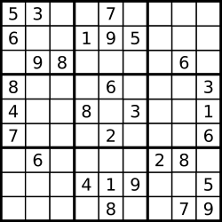

# 有效的数独

<span style="color:rgb(100,180,246);font-size:11pt">最后更新：2023-12-01</span>

链接：https://leetcode.cn/leetbook/read/top-interview-questions-easy/x2f9gg/

!!! Question "题目描述"
    请你判断一个`9 x 9`的数独是否有效。只需要 根据以下规则 ，验证已经填入的数字是否有效即可。

    - 数字`1-9`在每一行只能出现一次。
    - 数字`1-9`在每一列只能出现一次。
    - 数字`1-9`在每一个以粗实线分隔的`3x3`宫内只能出现一次。（请参考示例图）

!!! Warning "注意："
    - 一个有效的数独（部分已被填充）不一定是可解的。
    - 只需要根据以上规则，验证已经填入的数字是否有效即可。
    - 空白格用 '.' 表示。

!!! example "题目示例"
    === "示例 1："

        

        **输入:** 
        ```
        board = [["5","3",".",".","7",".",".",".","."]
                ,["6",".",".","1","9","5",".",".","."]
                ,[".","9","8",".",".",".",".","6","."]
                ,["8",".",".",".","6",".",".",".","3"]
                ,["4",".",".","8",".","3",".",".","1"]
                ,["7",".",".",".","2",".",".",".","6"]
                ,[".","6",".",".",".",".","2","8","."]
                ,[".",".",".","4","1","9",".",".","5"]
                ,[".",".",".",".","8",".",".","7","9"]]
        ```

        **输出:** true


    === "示例 2："

        **输入:** 
        ```
        board = [["8","3",".",".","7",".",".",".","."]
                ,["6",".",".","1","9","5",".",".","."]
                ,[".","9","8",".",".",".",".","6","."]
                ,["8",".",".",".","6",".",".",".","3"]
                ,["4",".",".","8",".","3",".",".","1"]
                ,["7",".",".",".","2",".",".",".","6"]
                ,[".","6",".",".",".",".","2","8","."]
                ,[".",".",".","4","1","9",".",".","5"]
                ,[".",".",".",".","8",".",".","7","9"]]
        ```

        **输出:** false

        **解释:** 除了第一行的第一个数字从 5 改为 8 以外，空格内其他数字均与 示例1 相同。 但由于位于左上角的 3x3 宫内有两个 8 存在, 因此这个数独是无效的。


!!! tip "提示："
    - $board.length == 9$
    - $board[i].length == 9$
    - board[i][j] 是一位数字（1-9）或者 '.'

=== "C"

    ```C
    #include <stdio.h>
    #include <stdlib.h>
    #include <string.h>

    bool isColValidSudoku(char** board, int boardSize, int* boardColSize) {
        for (int i = 0; i < 9; i++) {
            int hasTbl[10] = {0};
            for (int j = 0; j < 9; j++) {
                if (board[i][j] == '.') {
                    continue;
                }

                int val = board[i][j] - '0';
                if (hasTbl[val] != 0) {
                    return false;
                }  else {
                    hasTbl[val] = 1;
                }
            }
        }

        return true;
    }

    bool isRowValidSudoku(char** board, int boardSize, int* boardColSize){
        for (int i = 0; i < 9; i++) {
            int hasTbl[10] = {0};
            for (int j = 0; j < 9; j++) {
                if (board[j][i] == '.') {
                    continue;
                }

                int val = board[j][i] - '0';
                if (hasTbl[val] != 0) {
                    return false;
                }  else {
                    hasTbl[val] = 1;
                }
            }
        }

        return true;
    }

    bool checkSeqValidSudoku(char** board, int boardSize, int* boardColSize, int i,int j) {
        int hasTbl[10] = {0};
        for (int m = 0; m < 3; m++) {
            for (int n = 0; n < 3; n++) {
                if (board[m+i][n+j] == '.') {
                    continue;
                }

                int val = board[m+i][n+j] - '0';
                if (hasTbl[val] != 0) {
                    return false;
                }  else {
                    hasTbl[val] = 1;
                }
            }
        }

        return true;
    }

    bool isSeqValidSudoku(char** board, int boardSize, int* boardColSize){
        for (int i = 0; i < 9; i+=3) {
            for (int j = 0; j < 9; j+=3) {
                if (checkSeqValidSudoku(board,boardSize,boardColSize,i,j) == false) {
                    return false;
                }
            }
        }
        return true;
    }

    bool isValidSudoku(char** board, int boardSize, int* boardColSize) {
        bool colValid = isColValidSudoku(board,boardSize,boardColSize);
        bool rowValid = isRowValidSudoku(board,boardSize,boardColSize);
        bool seqValid = isSeqValidSudoku(board,boardSize,boardColSize);
        return colValid && rowValid && seqValid;
    }
    ```

=== "Golang"

    ```Go

    // isValidSudoku 暴力标记
    func isValidSudoku(board [][]byte) bool {

        return isRowValidSudoku(board) && isColValidSudoku(board) && isSeqValidSudoku(board)
    }

    func isRowValidSudoku(board [][]byte) bool {
        for _, row := range board {
            hasMap := map[byte]byte{}
            for _, val := range row {
                if val == '.' {
                    continue
                }
                if _, has := hasMap[val]; has {
                    return false
                }
                hasMap[val] = val
            }
        }

        return true
    }

    func isColValidSudoku(board [][]byte) bool {
        for i := 0; i < 9; i++ {
            for hasMap, j := map[byte]byte{}, 0; j < 9; j++ {
                val := board[j][i]
                if val == '.' {
                    continue
                }
                if _, has := hasMap[val]; has {
                    return false
                }
                hasMap[val] = val
            }
        }
        return true
    }

    func isSeqValidSudoku(board [][]byte) bool {

        for i := 0; i < 9; i += 3 {
            for j := 0; j < 9; j += 3 {
                hasMap := map[byte]byte{}
                for m := 0; m < 3; m++ {
                    for n := 0; n < 3; n++ {
                        val := board[m+i][n+j]
                        if val == '.' {
                            continue
                        }

                        if _, has := hasMap[val]; has {
                            return false
                        }
                        hasMap[val] = val
                    }
                }
            }
        }
        return true
    }
    ```