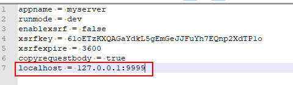

# Beego框架实现简单的WEB服务

帖子整理：

- Beego Web项目的搭建  [http://3ms.huawei.com/hi/group/2027489/wiki_5186763.html](http://3ms.huawei.com/hi/group/2027489/wiki_5186763.html)
- 用Beego开发web应用  [https://www.cnblogs.com/zhangweizhong/p/10919672.html](https://www.cnblogs.com/zhangweizhong/p/10919672.html)
- Go_Web编程.pdf [http://3ms.huawei.com/hi/group/2033815/file_10889001.html?for_statistic_from=my_group_file](http://3ms.huawei.com/hi/group/2033815/file_10889001.html?for_statistic_from=my_group_file)
- Beego官网 [https://beego.me/](https://beego.me/)
- build-web-application-with-golang [https://github.com/astaxie/build-web-application-with-golang/blob/master/zh/preface.md](https://github.com/astaxie/build-web-application-with-golang/blob/master/zh/preface.md)
- Beego开发文档 [https://www.kancloud.cn/hello123/beego/126086](https://www.kancloud.cn/hello123/beego/126086)

网上有很多帖子，这里就不多整理了，我下面会详细说下我之前搭建的server。

## 一、安装开发工具

```shell
go get github.com/astaxie/beego
go get github.com/beego/bee
```

> **注意**：
> beege和bee是两个概念。beego是框架，bee是工具，是命令。
> 在安装Beego前，先确认是否将$GOPATH/bin写入GO环境中。

## 二、创建应用

```shell
bee new webDemo     //创建一个web应用
```

也不一定非要用这个命令，只要创建好对应的目录，放好文件就可以了。

### 1）conf目录

这个目录是beego的配置文件目录，里面有个app.conf文件，你可以配置任何你想要的东西。

比如：我需要配置一个localhost， 就可以在文件中写 ``localhost = 127.0.0.1:9999``，然后在代码中使用对应的接口，就可以获取这个值。



### 2）controllers

这个目录主要是各个url的实现，我们作为WEB的服务端，主要的任务就是处理各个URL的消息。

当然不一定非要是这个名字，主要是当前主流默认这么写的。

<details>
<summary style="color:rgb(0,0,255);font-weight:bold">示例代码：controllers</summary>
<blockcode><pre><code>
```go
// LoginController
type LoginController struct {
	beego.Controller
}
//登录页面
func (c *LoginController) Get() {
	c.TplName = "login.html"
}

//登录功能
func (c *LoginController) Post() {

}

// LogoutController
type LogoutController struct {
    beego.Controller
}

//登录退出功能
func (c *LogoutController) Post() {

}
```
</code></pre></blockcode></details>

### 3）routers

这个目录是路由的定义，就是定义某个URL是由哪个controller去处理。

<details>
<summary style="color:rgb(0,0,255);font-weight:bold">示例代码：routers 1</summary>
<blockcode><pre><code>
```go
package routers

import (
	"../controllers"
	"github.com/astaxie/beego"
)

func Init() {
	beego.Router("/home/login", &controllers.LoginController{})
	beego.Router("/home/logout", &controllers.LogoutController{})
}
```
</code></pre></blockcode></details>

这里我定义的是两个URL，登陆和退出，分别由对应的controller去处理。

当然还另外一种定义方法：

<details>
<summary style="color:rgb(0,0,255);font-weight:bold">示例代码：routers 2</summary>
<blockcode><pre><code>
```go
package routers

import (
	"../controllers"
	"github.com/astaxie/beego"
)

func Init() {
	beego.Router("/home/login", &controllers.AccessController{}, "get:HomeProcess")
	beego.Router("/home/login", &controllers.AccessController{}, "post:LoginProcess")
	beego.Router("/home/logout", &controllers.AccessController{},"post:LogoutProcess")
}
```
</code></pre></blockcode></details>

就是比第一种方法多了个参数，而且是在同一个controller中处理。 这里就是定义两个URL分别由AccessController中的LoginProcess和LogoutProcess两个函数处理。

这个方法好的一点就是不需要那么多controller，不好的一点当然是放在一起的时候，很容易混淆，代码结构也看着不是很清晰。我更喜欢第一种方式。

### 4）static 和 views目录

static是静态访问目录。这里可以放置一些脚本之类的东西。

views是视图的目录，上面的get方法返回的login.html就是这个目录，不需要特定指定，按照上面 ``c.TplName = "login.html"``的写法，默认返回的是views
目录的html页面信息。

## 三、Beego的配置

这里介绍几个简单的，想要详细了解，可以去看相应的开发文档，前面有整理相关的地址。

### 1）配置监听端口

```go
	beego.BConfig.Listen.HTTPAddr = "127.0.0.1"
	beego.BConfig.Listen.HTTPPort = int(8080)
	beego.BConfig.Listen.HTTPSAddr = "127.0.0.1"
	beego.BConfig.Listen.HTTPSPort = int(8080)
    beego.BConfig.Listen.EnableHTTPS = true
    beego.BConfig.Listen.EnableHTTP = false
```

指定对应的IP地址和监听端口，并且指定是使用HTTP还是HTTPS，也可以俩都用，就是需要并行进行两个监听。

### 2）session

```go
    beego.BConfig.WebConfig.Session.SessionOn = true
```

session功能开启后，在处理的时候就可以使用SetSession、GetSession命令。

### 3）static

```go
    beego.SetStaticPath("/url", "static")
```

这里设置静态目录，第一个参数是以127.0.0.1:8080为基础的url，第二个是静态路径。

上面的代码就是指定访问127.0.0.1:8080/url的时候，返回static目录的东西。

### 4）证书的设置

```go
    beego.BConfig.Listen.HTTPSCertFile = certproc.GetCertPemFile()
	beego.BConfig.Listen.HTTPSKeyFile = certproc.GetCertDecKeyFile()
```

如果使用https，那么必然是要使用证书的，证书的生成可以看 “系统以及软件相关技能-->skills-->openssl生成证书步骤”， 当然如果你有现成的，那就没那么麻烦了。

<details>
<summary style="color:rgb(0,0,255);font-weight:bold">示例代码：TLS配置</summary>
<blockcode><pre><code>
```go
	tlsConfig, err := certproc.GetTlsConfig()
	if err == nil {
		beego.BeeApp.Server.TLSConfig = tlsConfig
	}
```

```go
// 获取TLS配置
func GetTlsConfig() (*tls.Config, error) {
	var config *tls.Config
	caCert := GetCaCertFile()
	pool, errPool := GetX509CACertPool(caCert)
	if errPool != nil {
		log.Error("generate certPool failed: %v", errPool)
		return config, errPool
	}

	config = &tls.Config{
		RootCAs:      pool,
		ClientAuth:   tls.NoClientCert,
		MinVersion:   tls.VersionTLS12,
		CipherSuites: []uint16{tls.TLS_ECDHE_RSA_WITH_AES_256_GCM_SHA384, tls.TLS_ECDHE_RSA_WITH_AES_128_GCM_SHA256},
	}
	return config, nil
}
```
</code></pre></blockcode></details>

上面这部分是证书的配置内容，只是简单的示例。

### 5）日志的设置

<details>
<summary style="color:rgb(0,0,255);font-weight:bold">示例代码：日志设置</summary>
<blockcode><pre><code>
```go
	jsonConfig := `{
			"filename": "./log/server.log",
			"daily": true,
			"maxdays": 7,
			"maxsize": 10240000
		}`
	_ = log.SetLogger("file", jsonConfig)
	log.SetLevel(log.LevelDebug)
	log.EnableFuncCallDepth(true)
	log.SetLogFuncCallDepth(4)

	log.Debug("=======================start server================================")
```
</code></pre></blockcode></details>

这个应该都看得懂。
