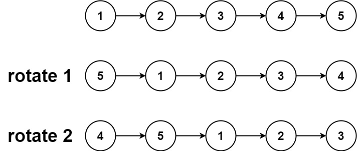
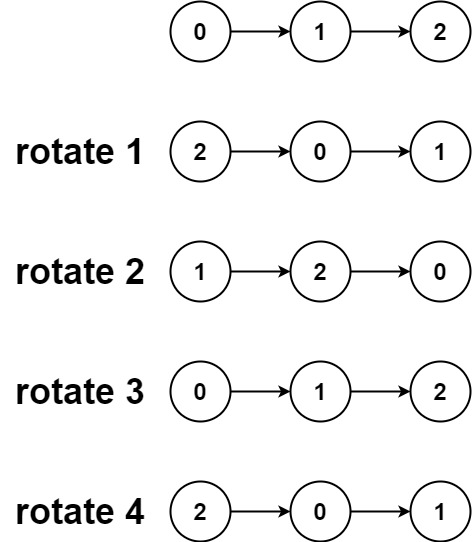

# 旋转链表

<span style="color:rgb(100,180,246);font-size:11pt">最后更新：2023-12-02</span>

链接：https://leetcode-cn.com/problems/rotate-list/

!!! Question "题目描述"

    给你一个链表的头节点 `head` ，旋转链表，将链表每个节点向右移动 `k` 个位置。

!!! example "题目示例"

    === "示例 1："
        
        
        **输入：** `head = [1,2,3,4,5], k = 2`

        **输出：** `[4,5,1,2,3]`

    === "示例 2："
        

        **输入：** `head = [0,1,2], k = 4`

        **输出：** `[2,0,1]`


!!! tip "提示："
    - 链表中节点的数目在范围 $[0, 500]$ 内
    - $-100 <= Node.val <= 100$
    - $0 <= k <= 2 * 10^9$


=== "C暴力解法"

    ```c
    #include <stdio.h>
    #include <stdlib.h>
    #include <string.h>
    #include "uthash.h"

    struct ListNode* rotateRight(struct ListNode* head, int k)
    {
        struct ListNode* node = head;
        int curVal = 0;
        int nextVal = 0;
        int count = 0;

        if ((head == NULL) || (k  == 0)) {
            return head;
        }

        while (node != NULL) {
            node = node->next;
            count++;
        }
        k = k % count;

        while (k) {
            curVal = head->val;
            node = head;
            while(node->next != NULL) {
                nextVal = node->next->val;
                node->next->val = curVal;
                curVal = nextVal;
                node = node->next;
                count++;
            }
            head->val = curVal;
            k--;
        }

        return head;
    }
    ```

=== "C环形链表"

    ```c
    #include <stdio.h>
    #include <stdlib.h>
    #include <string.h>
    #include "uthash.h"

    struct ListNode* rotateRight(struct ListNode* head, int k)
    {
        struct ListNode* node = head;
        int curVal = 0;
        int nextVal = 0;
        int count = 0;

        if ((head == NULL) || (head->next == NULL) || (k  == 0)) {
            return head;
        }

        // 计算节点
        while (node->next != NULL) {
            node = node->next;
            count++;
        }

        // 对K处理，让k < count
        int n = k % (count + 1);
        if (n == 0) {
            return head;
        }

        // 右移n次，相当于head后移count + 1 - n - 1个位置
        int num = count - n;
        struct ListNode* p = head;

        // 成环
        node->next = head;
        while (num > 0) {
            p = p->next;
            num--;
        }

        head = p->next;
        p->next = NULL;
        return head;
    }
    ```

=== "Golang"
    ```go


    ```