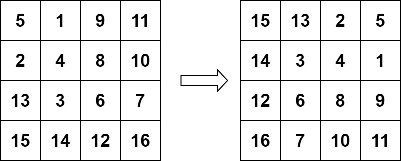

# 旋转图像

<span style="color:rgb(100,180,246);font-size:11pt">最后更新：2023-12-02</span>

链接：https://leetcode.cn/leetbook/read/top-interview-questions-easy/xnhhkv/

!!! Question "题目描述"

    给定一个 `n×n` 的二维矩阵`matrix`表示一个图像。请你将图像顺时针旋转 90 度。

    你必须在 **原地** 旋转图像，这意味着你需要直接修改输入的二维矩阵。**请不要**使用另一个矩阵来旋转图像。


!!! example "题目示例"

    === "示例 1："
        

        **输入：** `matrix = [[1,2,3],[4,5,6],[7,8,9]]`

        **输出：** `[[7,4,1],[8,5,2],[9,6,3]]`

    === "示例 2："
        

        **输入：** `matrix = [[5,1,9,11],[2,4,8,10],[13,3,6,7],[15,14,12,16]]`

        **输出：** `[[15,13,2,5],[14,3,4,1],[12,6,8,9],[16,7,10,11]]`


!!! tip "提示："
    - $n == matrix.length == matrix[i].length$
    - $1 <= n <= 20$
    - $-1000 <= matrix[i][j] <= 1000$

!!! note "解题思路"

    两次翻转
    - 先将数组的竖行变横行，这个可以看做是对角线翻转
    - 在将数组每一行反转，这个可以看做是水平翻转

    也可以借助复制数组实现，不过哪个我觉得不好

=== "C"

    ```c
    #include <stdio.h>
    #include <stdlib.h>
    #include <string.h>

    void rotate(int** matrix, int matrixSize, int* matrixColSize){
        if (matrixSize == 1) {
            return;
        }

        // 竖行变横行，交换对应值
        for (int i = 0; i < matrixSize; i++) {
            for (int j = i; j < matrixSize; j++) {
                int val = matrix[j][i];
                matrix[j][i] = matrix[i][j];
                matrix[i][j] = val;
            }
        }

        // 新数组，每行进行反转
        int n = (matrixSize + 1) / 2;
        for (int i = 0; i < matrixSize; i++) {
            for (int j = 0; j < n; j++) {
                int val = matrix[i][j];
                matrix[i][j] = matrix[i][matrixSize-1-j];
                matrix[i][matrixSize-1-j] = val;
            }
        }
    }
    ```

=== "Golang"

    ```go
    func rotate(matrix [][]int) {
        n := len(matrix[0])
        newMatrix := make([][]int, n)
        for i := 0; i < n; i++ {
            newMatrix[i] = make([]int, n)
        }
        for i := 0; i < n; i++ {
            for j := 0; j < n; j++ {
                newMatrix[j][i] = matrix[i][j]
            }
        }

        for i := 0; i < n; i++ {
            for j := 0; j < n; j++ {
                matrix[i][j] = newMatrix[i][n-j-1]
            }
        }
    }
    ```