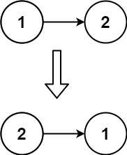

# 206 反转链表

<span style="color:rgb(100,180,246);font-size:11pt">最后更新：2023-12-02</span>

链接：https://leetcode-cn.com/leetbook/read/top-interview-questions-easy/xnnhm6/

!!! Question "题目描述"

    给你单链表的头节点 `head` ，请你反转链表，并返回反转后的链表。

!!! example "题目示例"

    === "示例 1："
        

        **输入：** `head = [1,2,3,4,5]`

        **输出：** `[5,4,3,2,1]`

    === "示例 2："
        

        **输入：** `head = [1,2]`

        **输出：** `[2,1]`

    === "示例 3："
        **输入：** `head = []`

        **输出：** `[]`

!!! tip "提示："
    - 链表中节点的数目范围是 $[0, 5000]$
    - $-5000 <= Node.val <= 5000$

!!! note "进阶"

    链表可以选用迭代或递归方式完成反转。你能否用两种方法解决这道题？

=== "C递归解法"

    ```c
    #include <stdio.h>
    #include <stdlib.h>
    #include <string.h>

    struct ListNode* reverseList(struct ListNode* head)
    {
        if (head == NULL) {
            return NULL;
        }

        if (head->next == NULL) {
            return head;
        }

        struct ListNode* newHead = head->next;
        head = reverseList(newHead->next);
        newHead->next = head;
        return newHead;
    }
    ```

=== "Golang解法一"

    ```go
    // 不进行节点交互，新创建一个单节点的链表，从输入的链表中，顺序取出节点，然后插入新链表的head.Next之后，最后返回head.Next
    /**
    * Definition for singly-linked list.
    * type ListNode struct {
    *     Val int
    *     Next *ListNode
    * }
    */
    func reverseList(head *ListNode) *ListNode {
        list := &ListNode{0, head}

        cur := head
        for cur != nil {
            tmp := cur.Next
            cur.Next = list.Next
            list.Next = cur
            cur = tmp
        }

        return list.Next
    }
    ```

=== "Golang解法二"

    ```go
    func reverseList(head *ListNode) *ListNode {
        var prev *ListNode
        curr := head
        for curr != nil {
            next := curr.Next
            curr.Next = prev
            prev = curr
            curr = next
        }
        return prev
    }
    ```