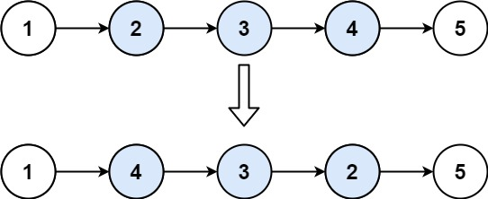

# 反转链表 II

<span style="color:rgb(100,180,246);font-size:11pt">最后更新：2023-12-02</span>

链接：https://leetcode.cn/problems/reverse-linked-list-ii/

!!! Question "题目描述"

    给你单链表的头指针 `head` 和两个整数 `left` 和 `right` ，其中 `left <= right` 。请你反转从位置 `left` 到位置 right 的链表节点，返回 反转后的链表 。

!!! example "题目示例"

    === "示例 1："
        

        **输入：** `head = [1,2,3,4,5], left = 2, right = 4`

        **输出：** `[1,4,3,2,5]`

    === "示例 2："
        **输入：** `head = [5], left = 1, right = 1`

        **输出：** `[5]`

!!! tip "提示："
    - 链表中节点数目为 `n`
    - $1 <= n <= 500$
    - $-500 <= Node.val <= 500$
    - $1 <= left <= right <= n$

!!! note "进阶"

    你可以使用一趟扫描完成反转吗？

=== "C"

    ```c
    #include <stdio.h>
    #include <stdlib.h>
    #include <string.h>
    #include "uthash.h"

    struct ListNode* reverseBetween(struct ListNode* head, int m, int n)
    {
        struct ListNode* node = head;
        struct ListNode* node2 = head;
        int mid = 0;
        int count = 0;
        if (head == NULL) {
            return NULL;
        }

        while (node) {
            count++;
            // m之前的
            if (count < m) {
                node = node->next;
                continue;
            }

            if (n <= count) {
                break;
            }

            // 从m开始到n的，交换值
            int num = 0;
            node2 = node;
            while (node2) {
                if (num == (n - count)) {
                    break;
                }
                node2 = node2->next;
                num++;
            }
            // printf("%d, %d\n", node->val, node2->val);
            int tmp = node2->val;
            node2->val = node->val;
            node->val = tmp;
            n--;
            node = node->next;
        }

        return head;
    }
    ```

=== "Golang"

    ```go


    ```