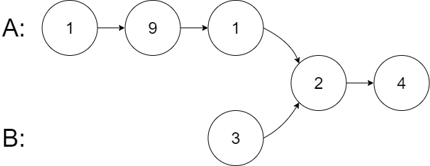
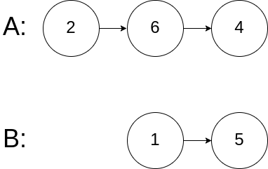

# 相交链表

<span style="color:rgb(100,180,246);font-size:11pt">最后更新：2023-12-02</span>

链接：https://leetcode.cn/problems/intersection-of-two-linked-lists/

!!! Question "题目描述"

    给你两个单链表的头节点 `headA` 和 `headB` ，请你找出并返回两个单链表相交的起始节点。如果两个链表不存在相交节点，返回 `null` 。

    图示两个链表在节点 `c1` 开始相交：

    

    题目数据 **保证** 整个链式结构中不存在环。

    **注意**，函数返回结果后，链表必须 **保持其原始结构** 。

    **自定义评测：**

    **评测系统** 的输入如下（你设计的程序 **不适用** 此输入）：

    - `intersectVal` - 相交的起始节点的值。如果不存在相交节点，这一值为 0
    - `listA` - 第一个链表
    - `listB` - 第二个链表
    - `skipA` - 在 `listA` 中（从头节点开始）跳到交叉节点的节点数
    - `skipB` - 在 `listB` 中（从头节点开始）跳到交叉节点的节点数
    
    评测系统将根据这些输入创建链式数据结构，并将两个头节点 `headA` 和 `headB` 传递给你的程序。如果程序能够正确返回相交节点，那么你的解决方案将被 **视作正确答案** 。

!!! example "题目示例"

    === "示例 1："
        

        **输入：** `intersectVal = 8, listA = [4,1,8,4,5], listB = [5,6,1,8,4,5], skipA = 2, skipB = 3`

        **输出：** `Intersected at '8'`

        **解释：**
        相交节点的值为 `8` （注意，如果两个链表相交则不能为 0）。

        从各自的表头开始算起，链表 `A` 为 `[4,1,8,4,5]`，链表 `B` 为 `[5,6,1,8,4,5]`。

        在 `A` 中，相交节点前有 `2` 个节点；在 `B` 中，相交节点前有 `3` 个节点。

        — 请注意相交节点的值不为 `1`，因为在链表 `A` 和链表 `B` 之中值为 `1` 的节点 (`A` 中第二个节点和 `B` 中第三个节点) 是不同的节点。换句话说，它们在内存中指向两个不同的位置，而链表 `A` 和链表 `B` 中值为 `8` 的节点 (`A` 中第三个节点，`B` 中第四个节点) 在内存中指向相同的位置。

    === "示例 2："
        

        **输入：** `intersectVal = 2, listA = [1,9,1,2,4], listB = [3,2,4], skipA = 3, skipB = 1`

        **输出：** `Intersected at '2'`

        **解释：**
        相交节点的值为 `2` （注意，如果两个链表相交则不能为 0）。

        从各自的表头开始算起，链表 `A` 为 `[1,9,1,2,4]`，链表 `B` 为 `[3,2,4]`。

        在 `A` 中，相交节点前有 `3` 个节点；在 `B` 中，相交节点前有 `1` 个节点。

    === "示例 3："
        

        **输入：** `intersectVal = 0, listA = [2,6,4], listB = [1,5], skipA = 3, skipB = 2`

        **输出：** `null`

        **解释：**
        从各自的表头开始算起，链表 `A` 为 `[2,6,4]`，链表 `B` 为 `[1,5]`。

        由于这两个链表不相交，所以 `intersectVal` 必须为 `0`，而 `skipA` 和 `skipB` 可以是任意值。

        这两个链表不相交，因此返回 `null` 。

!!! tip "提示："
    - `listA` 中节点数目为 `m`
    - `listB` 中节点数目为 `n`
    - $1 <= m, n <= 3 * 10^4$
    - $1 <= Node.val <= 10^5$
    - $0 <= skipA <= m$
    - $0 <= skipB <= n$
    - 如果 `listA` 和 `listB` 没有交点，`intersectVal` 为 `0`
    - 如果 `listA` 和 `listB` 有交点，`intersectVal == listA[skipA] == listB[skipB]`

!!! note "进阶："

    你能否设计一个时间复杂度 $O(m + n)$ 、仅用 $O(1)$ 内存的解决方案？

=== "C"

    ```c
    #include <stdio.h>
    #include <stdlib.h>
    #include <string.h>
    #include "uthash.h"

    struct ListNode *getIntersectionNode(struct ListNode *headA, struct ListNode *headB) {
        if ((headA == NULL) || (headB == NULL)) {
            return NULL;
        }

        struct ListNode *nodeA = headA;
        while (nodeA != NULL) {
            struct ListNode *nodeB = headB;
            while (nodeB != NULL) {
                if (nodeA == nodeB) {
                    return nodeA;
                }
                nodeB = nodeB->next;
            }
            nodeA = nodeA->next;
        }

        return NULL;
    }

    void TEST_getIntersectionNode_1() {
        // common
        struct ListNode node_3 = {5,NULL};
        struct ListNode node_2 = {4, &node_3};
        struct ListNode node_1 = {8, &node_2};

        // headA
        struct ListNode nodeA_1 = {1, &node_1};
        struct ListNode headA = {4, &nodeA_1};

        // headB
        struct ListNode nodeB_2 = {1, &node_1};
        struct ListNode nodeB_1 = {0, &nodeB_2};
        struct ListNode headB = {5, &nodeB_1};

        struct ListNode *result = getIntersectionNode(&headA, &headB);
        assert(result == &node_1);
        PRINT_CONSOLE(INFO, "success");
    }

    void TEST_getIntersectionNode_2() {
        // common
        struct ListNode node_2 = {4, NULL};
        struct ListNode node_1 = {2, &node_2};

        // headA
        struct ListNode headA = {3, &node_1};

        // headB
        struct ListNode nodeB_2 = {1, &node_1};
        struct ListNode nodeB_1 = {9, &nodeB_2};
        struct ListNode headB = {0, &nodeB_1};

        struct ListNode *result = getIntersectionNode(&headA, &headB);
        assert(result == &node_1);
        PRINT_CONSOLE(INFO, "success");
    }

    void TEST_getIntersectionNode_3() {
        // headA
        struct ListNode headA_1 = {5, NULL};
        struct ListNode headA = {1, &headA_1};

        // headB
        struct ListNode nodeB_2 = {4, NULL};
        struct ListNode nodeB_1 = {6, &nodeB_2};
        struct ListNode headB = {2, &nodeB_1};

        struct ListNode *result = getIntersectionNode(&headA, &headB);
        assert(result == NULL);
        PRINT_CONSOLE(INFO, "success");
    }

    void TEST_getIntersectionNode()
    {
        PRINT_CONSOLE(INFO, "Begin");
        TEST_getIntersectionNode_1();
        TEST_getIntersectionNode_2();
        TEST_getIntersectionNode_3();
        PRINT_CONSOLE(INFO, "End");
    }
    ```

=== "Golang"

    ```go
    func getIntersectionNode(headA, headB *ListNode) *ListNode {
        if headA == nil || headB == nil {
            return nil
        }

        na := headA
        for na != nil {
            nb := headB
            for nb != nil {
                if na == nb {
                    return na
                }
                nb = nb.Next
            }
            na = na.Next
        }

        return nil
    }
    ```