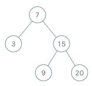

# 173. 二叉搜索树迭代器

<span style="color:rgb(100,180,246);font-size:11pt">最后更新：2024-05-10-22</span>

链接：https://leetcode.cn/problems/binary-search-tree-iterator/description/

!!! Question "题目描述"
    
    实现一个二叉搜索树迭代器类`BSTIterator` ，表示一个按中序遍历二叉搜索树（BST）的迭代器： 
      
    - `BSTIterator(TreeNode root)` 初始化 `BSTIterator` 类的一个对象。BST 的根节点 root 会作为构造函数的一部分给出。指针应初始化为一个不存在于 BST 中的数字，且该数字小于 BST 中的任何元素。
    - `boolean hasNext()` 如果向指针右侧遍历存在数字，则返回 true ；否则返回 false 。
    - `int next()`将指针向右移动，然后返回指针处的数字。
    
    注意，指针初始化为一个不存在于 BST 中的数字，所以对 `next()` 的首次调用将返回 BST 中的最小元素。

    你可以假设 `next()` 调用总是有效的，也就是说，当调用 `next()` 时，BST 的中序遍历中至少存在一个下一个数字。

!!! example "题目示例"

    === "示例 1："
    
        

        **输入：** 
        
        `["BSTIterator", "next", "next", "hasNext", "next", "hasNext", "next", "hasNext", "next", "hasNext"]`
        
        `[[[7, 3, 15, null, null, 9, 20]], [], [], [], [], [], [], [], [], []]`

        **输出：** `[null, 3, 7, true, 9, true, 15, true, 20, false]`

        **解释：** 
        
        `BSTIterator bSTIterator = new BSTIterator([7, 3, 15, null, null, 9, 20]);`  
        `bSTIterator.next();    // 返回 3`  
        `bSTIterator.next();    // 返回 7`    
        `bSTIterator.hasNext(); // 返回 True`   
        `bSTIterator.next();    // 返回 9`   
        `bSTIterator.hasNext(); // 返回 True`   
        `bSTIterator.next();    // 返回 15`   
        `bSTIterator.hasNext(); // 返回 True`   
        `bSTIterator.next();    // 返回 20`   
        `bSTIterator.hasNext(); // 返回 False`   

!!! tip "提示："
    - 树中节点的数目在范围 $[1, 10^5]$ 内
    - $0 <= Node.val <= 10^6$
    - 最多调用 $10^5$ 次 `hasNext` 和 `next` 操作

!!! note "进阶"
    
    你可以设计一个满足下述条件的解决方案吗？next() 和 hasNext() 操作均摊时间复杂度为 O(1) ，并使用 O(h) 内存。其中 h 是树的高度。

!!! note "解题思路"

    - 初始化的时候，对二叉树进行中序遍历，取出所有的值，存储在数组中，然后快速排序进行升序排序。   
    - root节点保留，防止后续会用到。其他的都是对数组的操作，这个就很简单了。  
    - 取next，只需要每次index++，返回nums[index]就可以。  
    - hasNext，只需要判断index是不是numsSize-1就可以了，是就返回false。  

    下面的代码里面有二叉树遍历取值的方案，可以忽略掉，只看数组的，另外一个方案也是可以用的，就是耗时较长。  
    
    数组的缺点就是大小固定，如果有兴趣的话可以试试动态申请的方式。


=== "C"

    ```c
    /**
    * Definition for a binary tree node.
    * struct TreeNode {
    *     int val;
    *     struct TreeNode *left;
    *     struct TreeNode *right;
    * };
    */


    #define MAX_NODE_LEN 10000

    typedef struct {
        struct TreeNode* root;
        int val;
        int max;
        int nums[MAX_NODE_LEN];
        int numsSize;
        int index;
    } BSTIterator;

    int compare(void *a, void *b)
    {
        return *(int*)a - *(int*)b;
    }

    void inorder(struct TreeNode* root, int* res, int* resSize) {
        if (root == NULL) {
            return;
        }
        inorder(root->left, res, resSize);
        res[(*resSize)++] = root->val;
        inorder(root->right, res, resSize);
    }

    BSTIterator* bSTIteratorCreate(struct TreeNode* root)
    {
        BSTIterator *it = NULL;

        if (root == NULL) {
            return NULL;
        }

        it = (BSTIterator *)malloc(sizeof(BSTIterator));
        (void)memset(it, 0, sizeof(BSTIterator));
        it->root = root;
        it->val = root->val - 1;
        it->max = root->val;
        struct TreeNode* node = root;
        while (node->left != NULL) {
            node = node->left;
        }
        it->val = node->val - 1;

        node = root;
        while (node->right != NULL) {
            node = node->right;
        }
        it->max = node->val;
        inorder(root, it->nums, &it->numsSize);
        qsort(it->nums, it->numsSize, sizeof(int), compare);
        it->index = -1;
        return it;
    }

    int bstFindValue(struct TreeNode* root, int target)
    {
        if (root == NULL) {
            return target;
        }

        // target 在左子节点
        if (root->val > target) {
            // 左子节点为空，返回root
            if (root->left == NULL) {
                return root->val;
            }

            int val = bstFindValue(root->left, target);
            if (val == target) {
                return root->val;
            }

            return val;

        }

        return bstFindValue(root->right, target);
    }

    /** @return the next smallest number */
    int bSTIteratorNext(BSTIterator* obj)
    {
        if (obj ==  NULL) {
            return 0;
        }

        obj->index++;

        /*int old_val = obj->val;
        if (obj->root->val > old_val) {
            obj->val = bstFindValue(obj->root->left, old_val);
            if (obj->val == old_val) {
                obj->val = obj->root->val;
            }
            return obj->val;
        }

        obj->val = bstFindValue(obj->root->right, old_val);
        //return obj->val;*/
        return obj->nums[obj->index];
    }

    /** @return whether we have a next smallest number */
    bool bSTIteratorHasNext(BSTIterator* obj) {
        if (obj ==  NULL) {
            return false;
        }
        
        if ((obj->index + 1) >= obj->numsSize) {
            return false;
        }

        if (obj->val >= obj->max) {
            return false;
        }

        return true;
    }

    void bSTIteratorFree(BSTIterator* obj) {
        if (obj !=  NULL) {
            free(obj);
            obj = NULL;
        }
    }
    /**
    * Your BSTIterator struct will be instantiated and called as such:
    * BSTIterator* obj = bSTIteratorCreate(root);
    * int param_1 = bSTIteratorNext(obj);
    
    * bool param_2 = bSTIteratorHasNext(obj);
    
    * bSTIteratorFree(obj);
    */
    ```

=== "Golang暴力解法"

    ```go
    ```

