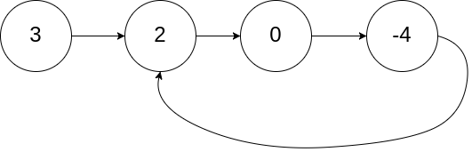
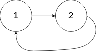

# 环形链表

<span style="color:rgb(100,180,246);font-size:11pt">最后更新：2023-12-02</span>

链接：https://leetcode.cn/leetbook/read/top-interview-questions-easy/xnwzei/

!!! Question "题目描述"

    给你一个链表的头节点 `head` ，判断链表中是否有环。

    如果链表中有某个节点，可以通过连续跟踪 `next` 指针再次到达，则链表中存在环。 为了表示给定链表中的环，评测系统内部使用整数 `pos` 来表示链表尾连接到链表中的位置（索引从 0 开始）。**注意：**`pos` **不作为参数进行传递**。仅仅是为了标识链表的实际情况。

    如果链表中存在环，则返回 `true` 。 否则，返回 `false` 。


!!! example "题目示例"

    === "示例 1："
        

        **输入：** `head = [3,2,0,-4], pos = 1`

        **输出：** `true`

        **解释：** 链表中有一个环，其尾部连接到第二个节点。

    === "示例 2："
        

        **输入：** `head = [1,2], pos = 0`

        **输出：** `true`

        **解释：** 链表中有一个环，其尾部连接到第一个节点。

    === "示例 3："
        

        **输入：** `head = [1], pos = -1`

        **输出：** `false`
        
        **解释：** 链表中没有环。


!!! tip "提示："
    - 链表中节点的数目范围是 $[0, 10^4]$
    - -$10^5 <= Node.val <= 10^5$
    - `pos` 为 `-1` 或者链表中的一个 有效索引 。

!!! note "进阶"

    你能用 $O(1)$（即，常量）内存解决此问题吗？

=== "C快慢指针"

    ```c
    #include <stdio.h>
    #include <stdlib.h>
    #include <string.h>

    /**
    * Definition for singly-linked list.
    * struct ListNode {
    *     int val;
    *     struct ListNode *next;
    * };
    */
    bool hasCycle(struct ListNode *head) {
        struct ListNode *slow = head, *fast = head;

        while((fast != 0) && (fast->next != 0)) {
            slow = slow->next;
            fast = fast->next->next;

            if (slow == fast) {
                return true;
            }
        }

        return false;

    }
    ```

=== "Golang快慢指针"

    ```go
    func hasCycle(head *ListNode) bool {
        //  双指针法，也可以通过记录标记，用一个map把索引和node地址对应起来
        fast, slow := head, head
        for fast != nil && slow != nil && fast.Next != nil {
            slow = slow.Next
            fast = fast.Next.Next
            if fast == slow {
                return true
            }
        }
        return false
    }
    ```