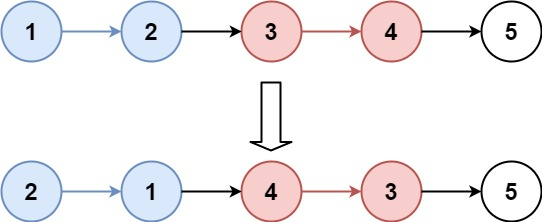
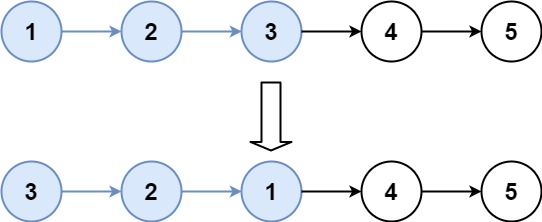

# 25. K 个一组翻转链表

<span style="color:rgb(100,180,246);font-size:11pt">最后更新：2024-05-10-22</span>

链接：https://leetcode.cn/problems/reverse-nodes-in-k-group/description/

!!! Question "题目描述"
    
    给你链表的头节点 head ，每 k 个节点一组进行翻转，请你返回修改后的链表。

    k 是一个正整数，它的值小于或等于链表的长度。如果节点总数不是 k 的整数倍，那么请将最后剩余的节点保持原有顺序。

    你不能只是单纯的改变节点内部的值，而是需要实际进行节点交换。

!!! example "题目示例"

    === "示例 1："
        

        **输入：** `head = [1,2,3,4,5], k = 2`

        **输出：** `[2,1,4,3,5]`

    === "示例 2："
        

        **输入：** `head = [1,2,3,4,5], k = 3`

        **输出：** `[3,2,1,4,5]`

!!! tip "提示："
    - 链表中的节点数目为 n
    - $1 <= k <= n <= 5000$
    - $0 <= Node.val <= 1000$

!!! note "进阶"
    你可以设计一个只用 O(1) 额外内存空间的算法解决此问题吗？
    
!!! note "解题思路解法"

    将链表进行分组，然后每个组进行单独翻转，如果最后一组节点个数小于k，则不翻转
    
    - 先用临时变量存储head，防止丢失
    - 按照k个node节点拆分出来一个子链表
    - 记录下一个链表的起点，当前拆分出来的子链表的尾节点的下一个节点清理，防止翻转的时候翻转的多了。
    - 翻转拆分出来的链表。翻转之后，新链表的head是之前的tail，新链表的tail是之前的head
    - 将上一个链表的next指向当前翻转后子链表的head
    - 将head->next指向下一个链表的head，链表链接起来
    - head指向下一组链表的起点，开始下一轮循环


=== "C暴力解法"

    ```c
    /**
    * Definition for singly-linked list.
    * struct ListNode {
    *     int val;
    *     struct ListNode *next;
    * };
    */
    struct ListNode* myReverseList(struct ListNode* head)
    {
        struct ListNode invert = {0,NULL};
        struct ListNode* temp = head;

        while (temp != NULL) {
            struct ListNode* next = temp->next;
            temp->next = invert.next;
            invert.next = temp;
            temp = next;
        }

        return invert.next;
    }

    struct ListNode* getLastNode(struct ListNode* head, int node_num) {
        node_num--;
        while (node_num > 0) {
            head = head->next;
            node_num--;
            if (head == NULL) {
                break;
            }
        }
        return head;
    }

    struct ListNode* reverseKGroup(struct ListNode* head, int k) {
        struct ListNode protect = {0,NULL};
        protect.next = head;
        struct ListNode* first_node = &protect;
        // 拆分链表，按照K长度拆分
        while (head != NULL) {
            struct ListNode* last_node = getLastNode(head, k);
            if (last_node == NULL) {
                break;
            }
            struct ListNode* next_head = last_node->next;
            last_node->next = NULL;
            //分组遍历
            first_node->next = myReverseList(head);
            head->next = next_head;
            first_node = head;
            head = next_head;
        }

        return protect.next;
    }
    ```

=== "Golang暴力解法"

    ```go
    ```

