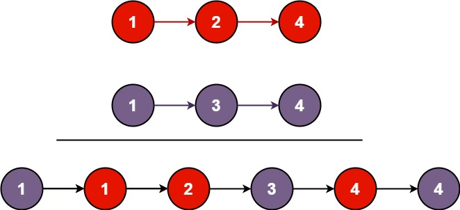

# 合并两个有序链表

<span style="color:rgb(100,180,246);font-size:11pt">最后更新：2023-12-02</span>

链接：https://leetcode.cn/leetbook/read/top-interview-questions-easy/xnnbp2/

!!! Question "题目描述"

    将两个升序链表合并为一个新的 **升序** 链表并返回。新链表是通过拼接给定的两个链表的所有节点组成的。 

!!! example "题目示例"

    === "示例 1："
        

        **输入：** `l1 = [1,2,4], l2 = [1,3,4]`

        **输出：** `[1,1,2,3,4,4]`

    === "示例 2："
        **输入：** `l1 = [], l2 = []`

        **输出：** `[]`

    === "示例 3："
        **输入：** `l1 = [], l2 = [0]`

        **输出：** `[0]`


!!! tip "提示："
    - 两个链表的节点数目范围是 $[0, 50]$
    - $-100 <= Node.val <= 100$
    - `l1` 和 `l2` 均按 非递减顺序 排列

=== "C解法一"

    ```c
    #include <stdio.h>
    #include <stdlib.h>
    #include <string.h>

    struct ListNode mr2ListHead = {0,NULL};

    #define INSERT_LIST_NEXT(list,node) \
        list->next = node;\
        node = node->next;\
        list = list->next;

    struct ListNode* mergeTwoLists(struct ListNode* l1, struct ListNode* l2) {
        struct ListNode *listl1 = l1;
        struct ListNode *listl2 = l2;
        struct ListNode *tmplist = &mr2ListHead;

        mr2ListHead.next = NULL;
        
        // 遍历，插入
        while ((listl1 != NULL) && (listl2 != NULL)) {
            if (listl1->val < listl2->val) { // 插入l1            
                INSERT_LIST_NEXT(tmplist,listl1);
            } else if (listl1->val == listl2->val) { // 依次插入L1和L2
                INSERT_LIST_NEXT(tmplist,listl1);
                INSERT_LIST_NEXT(tmplist,listl2);
            } else { // 插入l2            
                INSERT_LIST_NEXT(tmplist,listl2);
            }
        }

        // 插入l1。L2为空
        while (listl1 != NULL) {
            INSERT_LIST_NEXT(tmplist,listl1);
        }

        // 插入l2，l1为空
        while (listl2 != NULL) {
            INSERT_LIST_NEXT(tmplist,listl2);
        }

        return mr2ListHead.next;
    }
    ```


=== "C解法二"

    ```c
    #include <stdio.h>
    #include <stdlib.h>
    #include <string.h>

    struct ListNode* mergeTwoLists(struct ListNode* l1, struct ListNode* l2) {
        struct ListNode list = {0};
        struct ListNode *tmp = &list;
        // 遍历，插入
        while ((l1 != NULL) && (l2 != NULL)) {
            if (l1->val <= l2->val) { // 插入l1
                tmp->next = l1;
                l1 = l1->next;
            } else { // 插入l2
                tmp->next = l2;
                l2 = l2->next;
            }
            tmp = tmp->next;
        }

        // 插入l1。L2为空
        while (l1 != NULL) {
            tmp->next = l1;
            l1 = l1->next;
            tmp = tmp->next;
        }

        // 插入l2，l1为空
        while (l2 != NULL) {
            tmp->next = l2;
            l2 = l2->next;
            tmp = tmp->next;
        }

        return list.next;
    }
    ```


=== "Golang"

    ```go
    func mergeTwoLists(l1 *ListNode, l2 *ListNode) *ListNode {
        list := &ListNode{0, nil}
        inlist := list
        for l1 != nil && l2 != nil {
            if l1.Val <= l2.Val {
                inlist.Next = l1
                l1 = l1.Next
            } else {
                inlist.Next = l2
                l2 = l2.Next
            }

            inlist = inlist.Next
        }

        for l1 != nil {
            inlist.Next = l1
            l1 = l1.Next
            inlist = inlist.Next
        }

        for l2 != nil {
            inlist.Next = l2
            l2 = l2.Next
            inlist = inlist.Next
        }

        return list.Next
    }
    ```