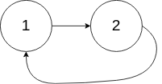
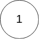

# 环形链表 II

<span style="color:rgb(100,180,246);font-size:11pt">最后更新：2023-12-02</span>

链接：https://leetcode.cn/problems/linked-list-cycle-ii/description/

!!! Question "题目描述"

    给定一个链表的头节点  `head` ，返回链表开始入环的第一个节点。 如果链表无环，则返回 `null`。

    如果链表中有某个节点，可以通过连续跟踪 `next` 指针再次到达，则链表中存在环。 为了表示给定链表中的环，评测系统内部使用整数 `pos` 来表示链表尾连接到链表中的位置 **（索引从 0 开始）** 。如果 `pos` 是 `-1`，则在该链表中没有环。 **注意：`pos` 不作为参数进行传递** ，仅仅是为了标识链表的实际情况。

    **不允许修改** 链表。

!!! example "题目示例"

    === "示例 1："
        

        **输入：** `head = [3,2,0,-4], pos = 1`

        **输出：** 返回索引为 `1` 的链表节点

        **解释：** 链表中有一个环，其尾部连接到第二个节点。

    === "示例 2："
        

        **输入：** `head = [1,2], pos = 0`

        **输出：** 返回索引为 `0` 的链表节点

        **解释：** 链表中有一个环，其尾部连接到第一个节点。

    === "示例 3："
        

        **输入：** `head = [1], pos = -1`

        **输出：** 返回 `null`

        **解释：** 链表中没有环

!!! tip "提示："
    - 链表中节点的数目范围在范围 $[0, 10^4]$ 内
    - $-10^5 <= Node.val <= 10^5$
    - `pos` 的值为 `-1` 或者链表中的一个有效索引

!!! note "进阶："
    你是否可以使用 $O(1)$ 空间解决此题？

=== "C快慢指针"

    ```c
    #include <stdio.h>
    #include <stdlib.h>
    #include <string.h>
    #include "uthash.h"

    struct ListNode *detectCycle(struct ListNode *head)
    {
        // 首节点为空或者只有一个head节点，返回null，没有环
        if ((head == NULL) || (head->next == NULL)) {
            return NULL;
        }

        struct ListNode *slow = head;
        struct ListNode *fast = head;

        // 快慢指针，先判断是不是环形链表
        while (fast != NULL) {
            slow = slow->next;
            // 快指针如果next为空，证明不是环形链表
            if (fast->next == NULL) {
                return NULL;
            }
            fast = fast->next->next;

            // 是环形链表，找入口节点
            if (slow == fast) {
                struct ListNode *find = head;
                // 从head往后，slow是在环形链表中进行循环，find是从head开始的,这里是找到环形链表的入口
                while (find != slow) {
                    find = find->next;
                    slow = slow->next;
                }

                return find;
            }
        }

        return NULL;
    }
    ```
    
=== "C官方哈希表"

    ```c
    struct hashTable {
        struct ListNode* key;
        UT_hash_handle hh;
    };

    struct hashTable* hashtable;

    struct hashTable* find(struct ListNode* ikey) {
        struct hashTable* tmp;
        HASH_FIND_PTR(hashtable, &ikey, tmp);
        return tmp;
    }

    void insert(struct ListNode* ikey) {
        struct hashTable* tmp = malloc(sizeof(struct hashTable));
        tmp->key = ikey;
        HASH_ADD_PTR(hashtable, key, tmp);
    }

    struct ListNode* detectCycle(struct ListNode* head) {
        hashtable = NULL;
        while (head != NULL) {
            if (find(head) != NULL) {
                return head;
            }
            insert(head);
            head = head->next;
        }
        return false;
    }
    ```

=== "Golang官方题解"

    ```go
    func detectCycle(head *ListNode) *ListNode {
        seen := map[*ListNode]struct{}{}
        for head != nil {
            if _, ok := seen[head]; ok {
                return head
            }
            seen[head] = struct{}{}
            head = head.Next
        }
        return nil
    }
    ```