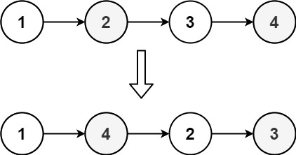
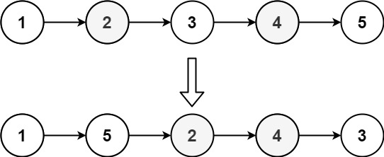

# 重排链表

<span style="color:rgb(100,180,246);font-size:11pt">最后更新：2023-12-02</span>

链接：https://leetcode.cn/problems/reorder-list/description/

!!! Question "题目描述"

    给定一个单链表 L 的头节点 head ，单链表 L 表示为：

    $L0 → L1 → … → Ln - 1 → Ln$

    请将其重新排列后变为：

    $L0 → Ln → L1 → Ln - 1 → L2 → Ln - 2 → …$

    不能只是单纯的改变节点内部的值，而是需要实际的进行节点交换。

!!! example "题目示例"

    === "示例 1："
        

        **输入：** `head = [1,2,3,4]`

        **输出：** `[1,4,2,3]`

    === "示例 2："
        

        **输入：** `head = [1,2,3,4,5]`

        **输出：** `[1,5,2,4,3]`


!!! tip "提示："
    - 链表的长度范围为 $[1, 5 * 10^4]$
    - $1 <= node.val <= 1000$


=== "C"

    ```c
    #include <stdio.h>
    #include <stdlib.h>
    #include <string.h>
    #include "uthash.h"

    #define INSERT_LIST_NEXT(list, node) \
        (list)->next = node;\
        (node) = (node)->next;\
        (list) = (list)->next;

    #define INSERT_LIST(list, node) \
        (list)->next = node;\
        (list) = (list)->next;\
        (list)->next = NULL;

    //  从链表中间拆分为两个两边
    void List_SpiltMiddle(struct ListNode* head, struct ListNode** list1, struct ListNode** list2)
    {
        struct ListNode* slow = head;
        struct ListNode* fast = head;
        struct ListNode* tail = NULL;

        while ((slow != NULL) && (fast->next != NULL)) {
            tail = slow;
            slow = slow->next;
            fast = fast->next->next;
            if (fast == NULL) {
                break;
            }
        }

        *list1 = head;

        tail->next = NULL;
        *list2 = slow;
    }

    struct ListNode* List_Inverted(struct ListNode* head)
    {
        struct ListNode invert = {0,NULL};
        struct ListNode* temp = head;

        while (temp != NULL) {
            struct ListNode* next = temp->next;
            temp->next = invert.next;
            invert.next = temp;
            temp = next;
        }

        return invert.next;
    }

    struct ListNode* List_Merged(struct ListNode* list1, struct ListNode* list2)
    {
        struct ListNode head = {0,NULL};
        struct ListNode *temp = &head;

        // 遍历，插入
        while ((list1 != NULL) && (list2 != NULL)) {
            INSERT_LIST_NEXT(temp, list1);
            INSERT_LIST_NEXT(temp, list2);
        }

        // 插入l1。L2为空
        while (list1 != NULL) {
            INSERT_LIST_NEXT(temp, list1);
        }

        // 插入l2，l1为空
        while (list2 != NULL) {
            INSERT_LIST_NEXT(temp, list2);
        }

        return head.next;
    }

    void reorderList(struct ListNode* head)
    {
        struct ListNode *list1 = NULL;
        struct ListNode *list2 = NULL;

        if ((head == NULL) || (head->next == NULL)){
            return head;
        }

        // 第一步，拆分成两个链表，list1，list2
        List_SpiltMiddle(head, &list1, &list2);

        // 第二步， 翻转list2
        list2 = List_Inverted(list2);

        // 第三步，合并list1和list2
        head = List_Merged(list1, list2);
    }
    ```

=== "C官方题解"

    ```c
    void reorderList(struct ListNode* head) {
        if (head == NULL) {
            return;
        }
        struct ListNode* vec[40001];
        struct ListNode* node = head;
        int n = 0;
        while (node != NULL) {
            vec[n++] = node;
            node = node->next;
        }
        int i = 0, j = n - 1;
        while (i < j) {
            vec[i]->next = vec[j];
            i++;
            if (i == j) {
                break;
            }
            vec[j]->next = vec[i];
            j--;
        }
        vec[i]->next = NULL;
    }
    ```


=== "Golang官方题解"

    ```go
    func reorderList(head *ListNode) {
        if head == nil {
            return
        }
        nodes := []*ListNode{}
        for node := head; node != nil; node = node.Next {
            nodes = append(nodes, node)
        }
        i, j := 0, len(nodes)-1
        for i < j {
            nodes[i].Next = nodes[j]
            i++
            if i == j {
                break
            }
            nodes[j].Next = nodes[i]
            j--
        }
        nodes[i].Next = nil
    }
    ```

=== "C++官方题解"

    ```cpp
    class Solution {
    public:
        void reorderList(ListNode *head) {
            if (head == nullptr) {
                return;
            }
            vector<ListNode *> vec;
            ListNode *node = head;
            while (node != nullptr) {
                vec.emplace_back(node);
                node = node->next;
            }
            int i = 0, j = vec.size() - 1;
            while (i < j) {
                vec[i]->next = vec[j];
                i++;
                if (i == j) {
                    break;
                }
                vec[j]->next = vec[i];
                j--;
            }
            vec[i]->next = nullptr;
        }
    };
    ```

=== "Python3官方题解"

    ```python
    class Solution:
        def reorderList(self, head: ListNode) -> None:
            if not head:
                return
            
            vec = list()
            node = head
            while node:
                vec.append(node)
                node = node.next
            
            i, j = 0, len(vec) - 1
            while i < j:
                vec[i].next = vec[j]
                i += 1
                if i == j:
                    break
                vec[j].next = vec[i]
                j -= 1
            
            vec[i].next = None
    ```