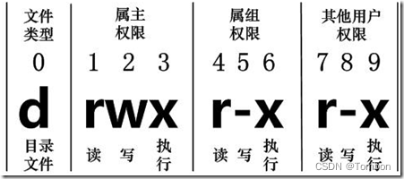

#`setfacl`(设置文件访问控制列表)

在linux的操作系统上，setfacl命令设置文件访问控制列表。

## 一、Linux文件属主和属组

通过命令ls 可以查看文件属性：

```
zc@argo-MS-7D53:~/Desktop/parent_ceshi$ ll -lh
total 16K
drwxrwxr-x 2 zc zc 4.0K 1月  10 13:59 ceshi/
drwxrwxr-x 2 zc zc 4.0K 1月  10 13:59 ceshi02/
```
以上展示命令的意思：


每个文件的属性由左边第一部分的 10 个字符来确定（如下图）。



从左至右用**0-9**这些数字来表示。

- 第**0**位确定文件类型，第**1-3**位确定属主（该文件的所有者）拥有该文件的权限。
- 第**4-6**位确定属组（所有者的同组用户）拥有该文件的权限，第**7-9**位确定其他用户拥有该文件的权限。
- 第**1、4、7**位表示读权限，如果用**r**字符表示，则有读权限，如果用**-**字符表示，则没有读权限；
- 第**2、5、8**位表示写权限，如果用**w**字符表示，则有写权限，如果用**-**字符表示没有写权限；
- 第**3、6、9**位表示可执行权限，如果用**x**字符表示，则有执行权限，如果用**-**字符表示，则没有执行权限。

参考[菜鸟教程 Linux 文件基本属性](https://www.runoob.com/linux/linux-file-attr-permission.html)


## 二、acl 命令

### 1） setfacl

```
setfacl 2.3.1 -- set file access control lists
Usage:`setfacl`[-bkndRLP] { -m|-M|-x|-X ... } file ...
  -m, --modify=acl        modify the current ACL(s) of file(s)
  -M, --modify-file=file  read ACL entries to modify from file
  -x, --remove=acl        remove entries from the ACL(s) of file(s)
  -X, --remove-file=file  read ACL entries to remove from file
  -b, --remove-all        remove all extended ACL entries
  -k, --remove-default    remove the default ACL
      --set=acl           set the ACL of file(s), replacing the current ACL
      --set-file=file     read ACL entries to set from file
      --mask              do recalculate the effective rights mask
  -n, --no-mask           don't recalculate the effective rights mask
  -d, --default           operations apply to the default ACL
  -R, --recursive         recurse into subdirectories
  -L, --logical           logical walk, follow symbolic links
  -P, --physical          physical walk, do not follow symbolic links
      --restore=file      restore ACLs (inverse of `getfacl -R')
      --test              test mode (ACLs are not modified)
  -v, --version           print version and exit
  -h, --help              this help text

```

### 2）getfacl

```
getfacl 2.3.1 -- get file access control lists
Usage:`getfacl`[-aceEsRLPtpndvh] file ...
  -a, --access            display the file access control list only
  -d, --default           display the default access control list only
  -c, --omit-header       do not display the comment header
  -e, --all-effective     print all effective rights
  -E, --no-effective      print no effective rights
  -s, --skip-base         skip files that only have the base entries
  -R, --recursive         recurse into subdirectories
  -L, --logical           logical walk, follow symbolic links
  -P, --physical          physical walk, do not follow symbolic links
  -t, --tabular           use tabular output format
  -n, --numeric           print numeric user/group identifiers
      --one-file-system   skip files on different filesystems
  -p, --absolute-names    don't strip leading '/' in pathnames
  -v, --version           print version and exit
  -h, --help              this help text
```

### 3）chacl

```
chacl: invalid option -- 'h'
Usage:
        chacl acl pathname...
        chacl -b acl dacl pathname...
        chacl -d dacl pathname...
        chacl -R pathname...
        chacl -D pathname...
        chacl -B pathname...
        chacl -l pathname...    [not IRIX compatible]
        chacl -r pathname...    [not IRIX compatible]
```

## 三、ACL 介绍

转载[CSDN setfacl command](https://blog.csdn.net/K346K346/article/details/127560421)

### 1） ACL 组成

ACL 是由一系列的 Access Entry 所组成的，每一条 Access Entry 定义了特定的类别可以对文件拥有的操作权限。Access Entry 有三个组成部分：

- Entry tag type
- Qualifier (optional)
- Permission

Entry tag type，它有以下几个类型：

```
ACL_USER_OBJ：相当于 Linux 里 file owner 的 permission。 
ACL_USER：定义了额外的用户可以对此文件拥有的 permission。 
ACL_GROUP_OBJ：相当于 Linux 里`group`的 permission。 
ACL_GROUP：定义了额外的组可以对此文件拥有的 permission。 
ACL_MASK：定义了 ACL_USER, ACL_GROUP_OBJ 和 ACL_GROUP 的最大权限。 
ACL_OTHER：相当于 Linux 里 other 的 permission。 
```
还是要讲一下设置 ACL 文件的格式。

每一个 Access Entry 都是由三个被 : 号分隔开的字段所组成，第一个就是 Entry tag type。

```
user	对应了 ACL_USER_OBJ 和 ACL_USER
group	对应了 ACL_GROUP_OBJ 和 ACL_GROUP
mask	对应了 ACL_MASK
other	对应了 ACL_OTHER
```

第二个字段称之为 qualifier，为用户名或组名，它定义了特定用户和组对于文件的权限。注意，只有`user`和`group`才有 qualifier，其他的都为空。

第三个字段就是我们熟悉的 permission 了。它和 Linux 的 permission 一样定义，这里就不多讲了。

### 2）ACL 设置

下面我们就来看一下怎么设置`test.txt`这个文件的 ACL 让它来达到我们上面的要求。

一开始文件没有 ACL 的额外属性：

```
ls -l test.txt
-rw-r--r-- 1 root root 0 Oct 27 21:37 test.txt

getfacl --omit-header test.txt
user::rw-
group::r--
other::r--
```

我们先让用户`alice`拥有对`test.txt`文件的读写权限。

```
setfacl -m user:alice:rw- ./test.txt
```

我们再查看一下`test.txt`的 ACL。
```
getfacl --omit-header ./test.txt
user::rw-
user:alice:rw-
group::r--
mask::rw-
other::r--
```

这时我们就可以看到`alice`用户在 ACL 里面已经拥有了对文件的读写权。这个时候如果我们查看一下 Linux 的 permission 我们还会发现一个不一样的地方。


```
ls -l ./test.txt
-rw-rw-r--+ 1 root root 0 Oct 27 21:37 test.txt
```

在文件 permission 的最后多了一个 + 号，当任何一个文件拥有了 ACL_USER 或者 ACL_GROUP 的值以后我们就可以称它为 ACL 文件，这个 + 号就是用来提示我们的。我们还可以发现当一个文件拥有了 ACL_USER 或者 ACL_GROUP 的值时 ACL_MASK 同时也会被定义。

接下来我们来设置`alice`组拥有 read permission：

```
setfacl -m group:alice:r-- ./test.txt

getfacl --omit-header ./test.txt
user::rw-
user:alice:rw-
group::r--
group:alice:r--
mask::rw-
other::r--
```

### 3）ACL_MASK 和 Effective permission

这里需要重点讲一下`ACL_MASK`，因为这是掌握 ACL 的另一个关键，在 Linux file permission 里面大家都知道比如对于`rw-rw-r--`来说, 当中的那个`rw-`是指文件组的permission。但是在`ACL`里面这种情况只是在`ACL_MASK`不存在的情况下成立。如果文件有`ACL_MASK`值，那么当中那个`rw-`代表的就是`mask`值而不再是`group permission`了。

```
ls -l
-rwxrw-r-- 1 root admin 0 Jul 3 23:10 test.sh
```

这里说明`test.sh`文件只有文件属主 root 拥有 rwx 权限。admin 组只有 rw 权限。现在我们想让用户`alice`也对`test.sh`具有和 root 一样的 permission。


```
setfacl -m user:alice:rwx ./test.sh

getfacl --omit-header ./test.sh
user::rwx
user:alice:rwx
group::rw-
mask::rwx
other::r--
```

这里我们看到`alice`已经拥有了 rwx 权限，mask 值也被设定为 rwx，那是因为它规定了`ACL_USER`，`ACL_GROUP`和`ACL_GROUP_OBJ`的最大值。现在我们再来看`test.sh`的 Linux permission，它已经变成了：

```
ls -l
-rwxrwxr--+ 1 root admin 0 Jul 3 23:10 test.sh
```
那么如果现在`admin`组的用户想要执行`test.sh`的程序会发生什么情况呢？它会被permission deny。原因在于实际上`admin`组的用户只有rw权限，这里当中显示的`rwx`是ACL_MASK的值而不是`group`的`permission`。

所以从这里我们就可以知道，如果一个文件后面有`+`标记，我们都需要用`getfacl`来确认它的`permission`，以免发生混淆。

下面我们再来继续看一个例子，假如现在我们设置`test.sh`的`mask`为 read only，那么 admin 组的用户还会有 write permission 吗？

```
setfacl -m mask::r-- ./test.sh

getfacl --omit-header ./test.sh
user::rwx
user:alice:rwx   #effective:r--
group::rw-        #effective:r--
mask::r--
other::r--
```

这时候我们可以看到`ACL_USER`和`ACL_GROUP_OBJ`旁边多了个`#effective:r–`，这是什么意思呢？

让我们再来回顾一下`ACL_MASK`的定义。它规定了`ACL_USER`，`ACL_GROUP_OBJ`和`ACL_GROUP`的最大权限。那么在我们这个例子中他们的最大权限也就是read only。虽然我们这里给`ACL_USER`和`ACL_GROUP_OBJ`设置了其他权限，但是他们真正有效果的只有 read 权限。

这时我们再来查看`test.sh`的 Linux file permission 时它的`group permission`也会显示其`mask`的值`r–`。

```
ls -l
-rwxr--r--+ 1 root admin 0 Jul 3 23:10 test.sh
```

### 4）Default ACL

上面我们所有讲的都是 Access ACL，也就是对文件而言。下面简单讲一下 Default ACL。

Default ACL 是指对于一个目录进行 Default ACL 设置，并且在此目录下建立的文件都将继承此目录的 ACL。

同样我们来做一个试验说明，比如现在 root 用户建立了一个`dir`目录：

```
mkdir dir
```

他希望所有在此目录下建立的文件都可以被`alice`用户所访问，那么我们就应该对`dir`目录设置 Default ACL。


```
setfacl -d -m user:alice:rw ./dir

getfacl --omit-header ./dir
user::rwx
group::rwx
other::r-x
default:user::rwx
default:user:alice:rwx
default:group::rwx
default:mask::rwx
default: other::r-x
```

这里我们可以看到 ACL 定义了`default`选项，`alice`用户拥有了`default`的`rwx`权限。所有没有定义的`default`都将从 file permission 里 copy 过来。现在 root 用户在`dir`下建立一个`test.txt`文件。

```
touch ./dir/test.txt
ls -l ./dir/test.txt
-rw-rw-r--+ 1 root root 0 Jul 3 23:46 ./dir/test.txt

getfacl --omit-header ./dir/test.txt
user::rw-
user:alice:rw-
group::rwx #effective:rw-
mask::rw-
other::r--
```

这里我们看到在`dir`下建立的文件`alice`用户自动就有了 rw 权限

### 5）ACL 相关命令
前面的例子中我们都注意到了`getfacl`命令是用来读取文件的 ACL，`setfacl`是用来设定文件的 Acess ACL。

这里还有一个`chacl`是用来改变文件和目录的 Access ACL and Default ACL，它的具体参数大家可以去看 man page。我只想提及一下`chacl -B`。它可以彻底删除文件或者目录的 ACL 属性(包括 Default ACL)，比如你即使用了`setfacl -x`删除了所有文件的 ACL 属性，那个`+`号还是会出现在文件的末尾，所以正确的删除方法应该是用`chacl -B`。

用cp来复制文件的时候我们现在可以加上`-p`选项，这样在拷贝文件的时候也将拷贝文件的ACL属性，对于不能拷贝的ACL属性将给出警告。

mv 命令将会默认地移动文件的 ACL 属性，同样如果操作不允许的情况下会给出警告。

## 三、setfacl

### 1） 描述

setfacl命令可以用来细分linux下的文件权限。chmod命令可以把文件权限分为u,g,o三个组，而setfacl可以对每一个文件或目录设置更精确的文件权限，setfacl可以更精确的控制权限的分配。比如：让某一个用户对某一个文件具有某种权限。

这种独立于传统的u,g,o的rwx权限之外的具体权限设置叫ACL（Access Control List）

ACL可以针对单一用户、单一文件或目录来进行r,w,x的权限控制，对于需要特殊权限的使用状况有一定帮助。如，某一个文件，不让单一的某个用户访问。

setfacl命令可以识别以下的规则格式：

- [d[efault]:] [u[ser]:]uid [:perms]  指定用户的权限，文件所有者的权限（如果uid没有指定）。
- [d[efault]:] g[roup]:gid [:perms]   指定群组的权限，文件所有群组的权限（如果gid未指定）
- [d[efault]:] m[ask][:] [:perms]     有效权限掩码
- [d[efault]:] o[ther] [:perms] 其他的权限


### 2）`setfacl`语法


```
setfacl [-bkndRLPvh] [{-m|-x} acl_spec] [{-M|-X} acl_file] file ...
setfacl --restore=file
```

| <div style="width:130pt;font-size:15pt"><center>选项</div>| <div style="font-size:15pt"><center>描述</div> |
| :--------- | :--------- |
| -b,--remove-all | 删除所有扩展的ACL条目。所有者，组和其他所有者的基本ACL条目将保留。 |
| -k，--remove-default | 删除默认ACL。如果不存在默认ACL，则不会发出警告。 |
| -n,-- no-mask | 不要重新计算有效的权限掩码。setfacl的默认行为是重新计算ACL掩码条目，除非明确给出了掩码条目。掩码条目设置为拥有组的所有权限以及所有命名的用户和组条目的并集。（这些正是受掩码条目影响的条目）。 |
| --mask | 即使已明确给出ACL掩码条目，也要重新计算有效权限掩码。（请参阅-n选项。） |
| -d，--default | 所有操作均适用于默认ACL。输入集中的常规ACL条目将提升为默认ACL条目。输入集中的默认ACL条目将被丢弃。（如果发生这种情况，将发出警告）。 |
| --restore =file | 恢复由“`getfacl`-R ”或类似文件创建的权限备份。使用此机制可以还原完整目录子树的所有权限。如果输入包含所有者注释或组注释，则setfacl尝试还原所有者和所有者组。如果输入包含标志注释（定义了setuid，setgid和sticky位），则setfacl相应地设置这三个位；否则，将清除它们。此选项不能与“ --test ”以外的其他选项混合使用。 |
| - test | 测试模式。列出更改后的ACL而不是更改任何文件的ACL。 |
| -R，--recursive | 递归地将操作应用于所有文件和目录。此选项不能与“ --restore ”混合使用。 |
| -L，--logical | “逻辑漫游”：跟随目录的符号链接。默认行为是遵循符号链接参数，并跳过子目录中遇到的符号链接。仅与-R组合有效。此选项不能与“ --restore ”混合使用。 |
| -P，--physical | “物理漫游”：不要遵循指向目录的符号链接。这也会跳过符号链接参数。仅与-R组合有效。此选项不能与“ --restore ”混合使用。 |
| -v，-- version | 打印setfacl的版本，然后退出。 |
| -h，--help | 打印说明命令行选项的帮助消息。 |
| - | 双破折号表示命令行选项的结尾；所有其余参数都解释为文件名。该选项对于以破折号开头的文件名特别有用。 |
| -- | 如果文件名参数是单破折号，则setfacl从标准输入中读取文件列表。 |


### 3）`setfacl`例子

授予用户lisa对文件file的读取访问权限。

```
setfacl -m u:lisa:r file
```

撤消所有组和所有命名用户（使用有效权限掩码）对文件file的写访问权。

```
setfacl -m m::rx file
```

从文件file的ACL中删除组staff的组条目。

```
setfacl -x g:staff file
```

将file1的ACL复制到file2。

```
getfacl file1 |`setfacl`--set-file=- file2
```

将访问ACL复制到默认ACL。

```
getfacl --access`dir`|`setfacl`-d -M- dir
```
