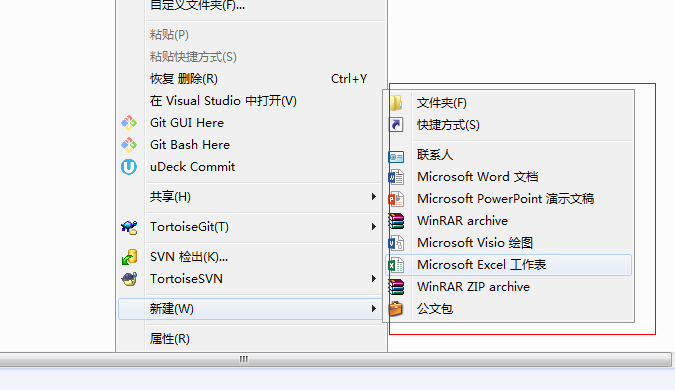
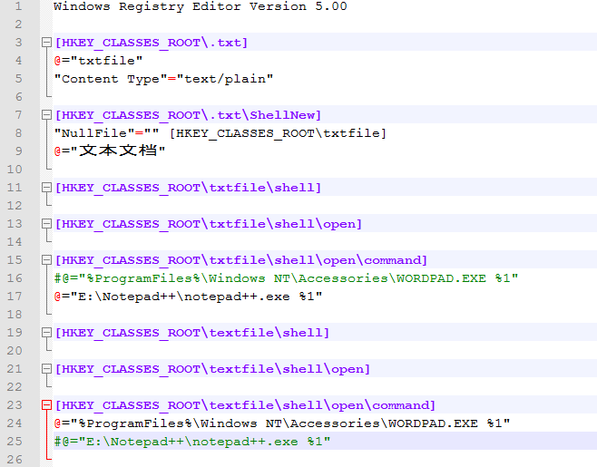
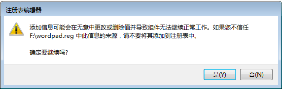
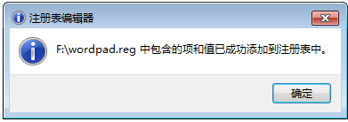
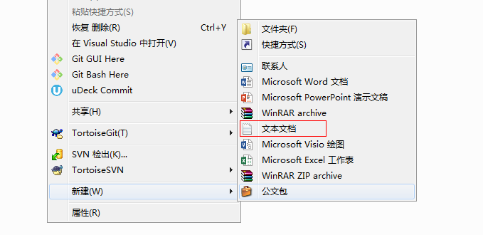
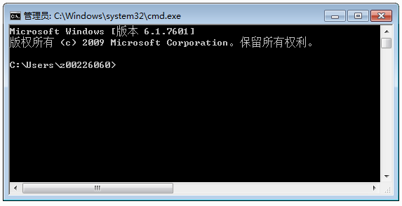
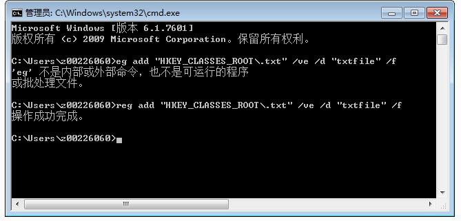
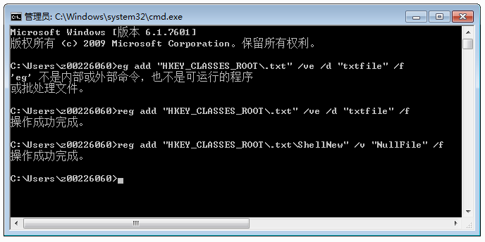
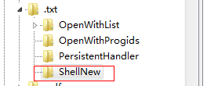
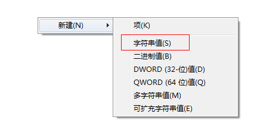

# Windows右键菜单新建项中添加新建记事本

<span style="color:rgb(100,180,246);font-size:11pt">最后更新：2017-08-12</span>

1. 想在某个文件夹下面新建一个记事本文档，结果发现右键菜单的新建项中没有“新建记事本”

   

## 方案一：使用注册表文件修改注册表

这个是最实用的方法。

### 1. 新建一个记事本文档

    把他另存为wordpad.reg。\*.reg后缀的就是注册表文件。

   


### 2. 将下面的代码拷贝到记事本中。

   ```
   Windows Registry Editor Version 5.00 

   [HKEY_CLASSES_ROOT\.txt] 
   @="txtfile" 
   "Content Type"="text/plain" 

   [HKEY_CLASSES_ROOT\.txt\ShellNew] 
   "NullFile"="" [HKEY_CLASSES_ROOT\txtfile] 
   @="文本文档" 

   [HKEY_CLASSES_ROOT\txtfile\shell] 

   [HKEY_CLASSES_ROOT\txtfile\shell\open] 

   [HKEY_CLASSES_ROOT\txtfile\shell\open\command] 
   #@="%ProgramFiles%\Windows NT\Accessories\WORDPAD.EXE %1" 
   @="E:\Notepad++\notepad++.exe %1" 

   [HKEY_CLASSES_ROOT\textfile\shell] 

   [HKEY_CLASSES_ROOT\textfile\shell\open] 

   [HKEY_CLASSES_ROOT\textfile\shell\open\command] 
   @="%ProgramFiles%\Windows NT\Accessories\WORDPAD.EXE %1" 
   @#="E:\Notepad++\notepad++.exe %1"
   ```

   

   >  **说明：**
   > E:\\Notepad++\\notepad++.exe是notepad++的安装路径，如果你没有安装的话，你也可以用“C:\\Windows\\notepad.exe”或者“C:\\Windows\\SysWOW64\\notepad.exe”，windows7系统默认一般是安装了nodepad的，你可以用这个。
   >
 

### 3. 双击执行wordpad.reg。


   

   选择是继续。

   
   
### 4. 如图，看看是不是有了。

   

## 方案二：直接cmd去修改注册表

这个方法比较复杂，不推荐。

### 1.运行cmd

打开开始菜单，运行，输入cmd进入命令提示符界面。

   

### 2. reg add

输入命令reg add "HKEY\_CLASSES\_ROOT\\.txt" /ve /d "txtfile" /f ，回车执行。

   

### 3. 再输入命令reg add

再输入命令reg add "HKEY\_CLASSES\_ROOT\\.txt\\ShellNew" /v "NullFile" /f ，回车执行。

   

### 4.完成，查看效果


桌面空白处点击右键，选择新建，已经可以看见文本文档的选项了。

   

## 方案三：regedit修改注册表

这是个最简单的方法。

### 1. 打开注册表，regedit。

### 2. 找到HKEY\_CLASSES\_ROOT.txt

   

### 3. 新增ShellNew。

   在.txt上右键，新增项，名称是ShellNew

   

   在ShellNew下新增NullFile参数。

   参数类型是字符串。值为空。

   

### 4. 保存退出。

   
