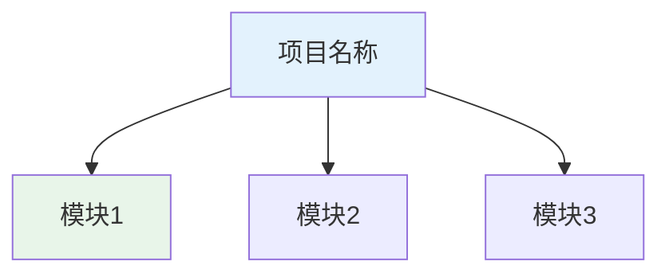
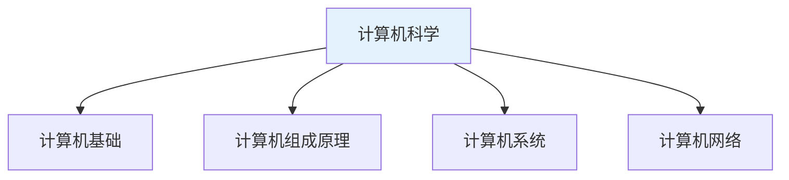
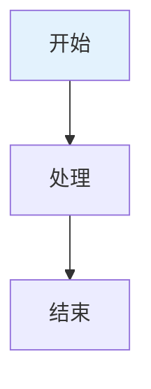
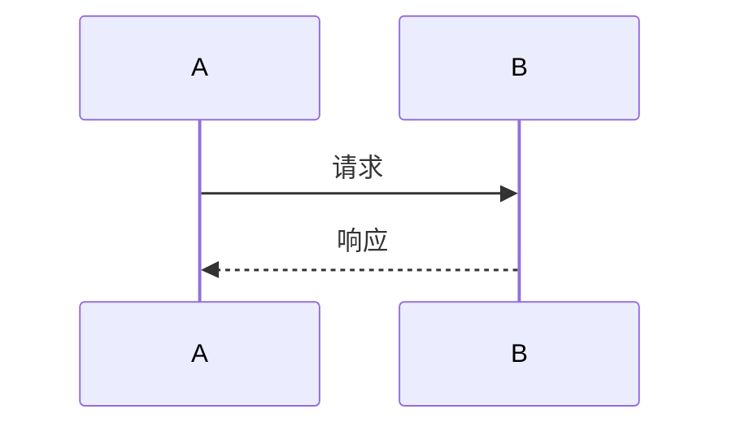

# 文档书写规范

## 概述

本文档规定了知识库文档的书写规范，以**项目为粒度**组织文档结构。一个项目是一个完整的知识体系，包含相关的子模块、具体内容和配套资源。

## 项目结构规范

### 项目定义

**项目**：具有独立知识体系的主题领域，如"计算机"、"数学"、"物理"等。

**示例项目：010-计算机**

```
docs/
└── 010-计算机/                          # 项目根目录
    ├── 000_导读.md                       # 项目导读（索引文件）
    ├── images/                           # 项目级共享图片
    │   └── 20240517204539.png
    │
    ├── 010_计算机基础/                   # 模块目录（一级模块）
    │   ├── 000_导读.md                   # 模块导读
    │   ├── 010_计算机发展历程/           # 子模块目录（二级模块）
    │   │   ├── 000-导读.md               # 子模块导读
    │   │   ├── images/                   # 子模块图片
    │   │   ├── 001-史前计算机时代.md     # 内容文件
    │   │   ├── 002-机械式计算机时代.md
    │   │   └── ...
    │   ├── 020_计算机的分类与发展方向/
    │   ├── 040_计算机工作过程/
    │   └── ...
    │
    ├── 020_计算机组成原理/               # 模块目录
    │   ├── 000_导读.md
    │   ├── images/
    │   ├── 001-控制器.md                 # 直接包含内容文件
    │   ├── 002-存储器.md
    │   └── ...
    │
    └── 030_计算机系统/                   # 模块目录
        └── ...
```

### 项目结构说明

| 组件 | 命名规则 | 作用 | 示例 |
|------|----------|------|------|
| 项目根目录 | `NNN-项目名称` | 项目根目录，包含所有相关内容 | `010-计算机` |
| 项目导读 | `000_导读.md` | 项目索引，描述知识体系、目录结构 | `010-计算机/000_导读.md` |
| 项目图片 | `images/` | 项目级共享图片资源 | `010-计算机/images/` |
| 模块目录 | `NNN_模块名称` | 一级模块，可包含子模块或内容 | `010_计算机基础` |
| 模块导读 | `000_导读.md` 或 `000-导读.md` | 模块索引，列出子模块或内容 | `010_计算机基础/000_导读.md` |
| 子模块目录 | `NNN_子模块名称` | 二级模块，通常包含具体内容 | `010_计算机发展历程` |
| 内容文件 | `NNN-标题.md` | 具体知识内容文档 | `001-史前计算机时代.md` |
| 模块图片 | `images/` | 模块级图片资源 | `010_计算机发展历程/images/` |

### 编号规则

#### 项目编号

- **格式**：三位数字 `NNN`
- **范围**：010-999
- **间隔**：建议以10为间隔，预留扩展空间。目录从100开始，每次加10，文件名从010开始，每次加1
- **示例**：`010-计算机`、`020-数学`、`030-物理`

#### 模块编号

- **格式**：三位数字 `NNN`
- **范围**：010-990
- **间隔**：建议以10为间隔，目录从100开始，每次加10，文件名从010开始，每次加1
- **示例**：
  - `010_计算机基础`
  - `020_计算机组成原理`
  - `030_计算机系统`

#### 内容编号

- **格式**：三位数字 `NNN`
- **范围**：
  - `000`：导读/索引文件
  - `001-999`：具体内容文件
- **示例**：
  - `000-导读.md`（导读）
  - `001-史前计算机时代.md`（内容）

#### 子模块编号

- **格式**：三位数字 `NNN`
- **范围**：010-990
- **间隔**：建议以10为间隔，目录从100开始，每次加10，文件名从010开始，每次加1
- **示例**：
  - `010_计算机发展历程`
  - `020_计算机的分类与发展方向`

## 核心文件规范

### 项目导读文件

**位置**：项目根目录下
**命名**：`000_导读.md` 或 `000-导读.md`

**作用**：
1. 描述项目整体知识体系
2. 提供学习路径指引
3. 列出所有模块目录
4. 包含项目概述图

**模板**：

```markdown
# 项目名称

## 概述

!!! note "项目名称"
    [项目简介，说明项目涵盖的知识领域]

## 知识体系结构



## 主要内容

### 分类1

<div style="background-color: #E3F2FD; padding: 15px; margin: 10px 0; border-left: 4px solid #2196F3; border-radius: 5px;">
    <strong>分类名称</strong>
    <ul style="margin: 5px 0;">
        <li><strong>子项1</strong>: 说明</li>
        <li><strong>子项2</strong>: 说明</li>
    </ul>
</div>

## 学习路径

!!! info "推荐学习路径"
    1. 模块1 → 模块2
    2. 模块3 → 模块4

## 目录

- [模块1](010_模块1/000_导读.md)
    - [子模块1](010_模块1/010_子模块1/000-导读.md)
    - [子模块2](010_模块1/020_子模块2/000-导读.md)
- [模块2](020_模块2/000_导读.md)

## 参考资料

- [参考资料名称](链接)
```

**实际示例**（010-计算机/000_导读.md）：

```markdown
# 计算机科学

## 概述

!!! note "计算机科学"
    计算机科学是研究计算机系统、软件、算法和信息处理的学科,涵盖硬件、软件、网络、数据库等多个领域。

## 知识体系结构



## 目录

- [计算机基础](010_计算机基础/000_导读.md)
    - [计算机发展历程](010_计算机基础/010_计算机发展历程/000-导读.md)
- [计算机组成原理](020_计算机组成原理/000_导读.md)
- [计算机操作系统](030_计算机系统/000_导读.md)
```

### 模块导读文件

**位置**：模块目录下
**命名**：`000_导读.md` 或 `000-导读.md`

**作用**：
1. 描述模块知识范围
2. 列出所有子模块或内容文件
3. 提供参考资料

**模板**：

```markdown
# 导读

> 参考资料：[参考资料链接]

## 概述

[模块概述内容]

## 知识结构


## 主要内容

- [内容1](./001-xxx.md)
- [内容2](./002-xxx.md)

## 参考资料

- [参考资料1](链接1)
```

**实际示例**（010-计算机/010_计算机基础/010_计算机发展历程/000-导读.md）：

```markdown
# 导读

> 参考资料：https://blog.csdn.net/weixin_42303403/article/details/129932204

## 概述

计算机的发展经历了很多代，网络上的介绍很多，这里大概总结了下，主要是四代。

## 参考资料

- [计算机发展史 知乎](https://zhuanlan.zhihu.com/p/562330220)
- [计算机发展史-序章 CSDN](https://blog.csdn.net/weixin_39660616/article/details/125821956)
```

### 内容文件

**位置**：模块或子模块目录下
**命名**：`NNN-标题.md`（NNN为001-999）

**作用**：描述具体知识点

**模板**：

```markdown
# 标题

## 概述

[概述内容]

## 第一部分

### 小节1

内容...

### 小节2

内容...

## 参考资料

- [参考资料名称](链接)
```

**实际示例**（010-计算机/020_计算机组成原理/001-控制器.md）：

```markdown
# 001-控制器

[控制器 百度百科(baidu.com)](https://baike.baidu.com/item/控制器/2206126)

控制器（controller）是指按照预定顺序改变主电路或控制电路的接线和改变电路中电阻值来控制电动机的启动、调速、制动和反向的主令装置。

## CU

Control Unit（控制单元）：在计算机的中央处理器（CPU）中，控制单元（CU）是负责协调和控制整个计算过程的组件。

### 指令寄存器 IR

- [指令寄存器 百度百科](https://baike.baidu.com/item/指令寄存器/3219483)

指令寄存器（IR，Instruction Register），用于暂存当前正在执行的指令。


```

## 图片资源规范

### 图片目录结构

```
010-计算机/                    # 项目根目录
├── images/                    # 项目级共享图片
│   └── 20240517204539.png
│
├── 010_计算机基础/
│   └── 010_计算机发展历程/
│       └── images/            # 子模块图片
│           ├── 450624874932154.png
│           └── 87342819240555.png
│
└── 020_计算机组成原理/
    └── images/                # 模块图片
        ├── 151721259684.png
        └── 20240517205137.png
```

### 图片命名规则

- **格式**：自由命名，建议使用时间戳或随机数字
- **格式限制**：PNG格式为主
- **示例**：
  - `20240517204539.png`（时间戳命名）
  - `450624874932154.png`（随机数字）
  - `jsjzc_20240517205339.png`（带前缀）

### 图片引用方式

```markdown
           # 相对路径，推荐
                   # 无描述，可接受
      # 外部链接，不推荐
```

## Markdown格式规范

### 标题层级

```markdown
# 一级标题（文档标题，唯一）
## 二级标题（主要章节）
### 三级标题（小节）
#### 四级标题（细项）
```

**规则**：
- 每个文档有且仅有一个一级标题
- 标题层级不跳跃
- 标题前后保持空行

### MkDocs Admonition扩展

用于创建提示框，增强可读性。

| 类型 | 用途 | 颜色 | 示例 |
|------|------|------|------|
| note | 备注、说明 | 蓝色 | `!!! note "标题"` |
| tip | 提示、技巧 | 绿色 | `!!! tip "标题"` |
| warning | 警告、注意 | 黄色 | `!!! warning "标题"` |
| danger | 危险、严重警告 | 红色 | `!!! danger "标题"` |
| info | 信息 | 蓝色 | `!!! info "标题"` |
| success | 成功、完成 | 绿色 | `!!! success "标题"` |

**语法**：

```markdown
!!! note "标题"
    内容文本，注意缩进4个空格
```

### Mermaid图表

**适用场景**：Mermaid适用于绘制流程图、时序图、甘特图、类图等结构化图表。

**流程图**：

```markdown

```

**时序图**：

```markdown

```

**方向说明**：
- `TB`/`TD`：从上到下（默认）
- `BT`：从下到上
- `LR`：从左到右
- `RL`：从右到左

**Mermaid局限性**：

Mermaid无法表达的复杂场景：
- 复杂的自定义布局和样式
- 特殊的图形元素（如雷达图、复杂的树形可视化）
- 需要精确控制位置的图形
- 交互式图表元素

**替代方案**：当Mermaid无法满足需求时,使用HTML内联样式实现可视化展示。

```markdown
<div style="background-color: #F3E5F5; padding: 20px; margin: 10px 0; border-radius: 10px;">
    <h4 style="color: #9C27B0; margin: 0 0 10px 0;">自定义可视化区域</h4>
    <div style="display: flex; justify-content: space-around; align-items: center;">
        <div style="text-align: center; padding: 10px;">
            <div style="width: 80px; height: 80px; background: #E3F2FD; border-radius: 50%; display: flex; align-items: center; justify-content: center; margin: 0 auto;">
                <span style="font-weight: bold;">模块A</span>
            </div>
            <p style="margin: 5px 0 0 0;">描述文本</p>
        </div>
        <div style="font-size: 24px; color: #9C27B0;">→</div>
        <div style="text-align: center; padding: 10px;">
            <div style="width: 80px; height: 80px; background: #E8F5E9; border-radius: 50%; display: flex; align-items: center; justify-content: center; margin: 0 auto;">
                <span style="font-weight: bold;">模块B</span>
            </div>
            <p style="margin: 5px 0 0 0;">描述文本</p>
        </div>
    </div>
</div>
```

**HTML绘图优势**：
- 完全自定义样式和布局
- 支持复杂的CSS效果（渐变、阴影、动画等）
- 可以模拟各种图形元素
- 兼容性好,MkDocs直接支持

### HTML内联样式

**彩色提示框**：

```markdown
<div style="background-color: #E3F2FD; padding: 15px; margin: 10px 0; border-left: 4px solid #2196F3; border-radius: 5px;">
    <strong>标题</strong>
    <ul style="margin: 5px 0;">
        <li>内容项1</li>
        <li>内容项2</li>
    </ul>
</div>
```

**常用颜色方案**：

| 颜色系 | 背景色 | 边框色 | 用途 |
|--------|--------|--------|------|
| 蓝色 | `#E3F2FD` | `#2196F3` | 信息、备注 |
| 绿色 | `#E8F5E9` | `#4CAF50` | 成功、提示 |
| 橙色 | `#FFF3E0` | `#FF9800` | 警告 |
| 紫色 | `#F3E5F5` | `#9C27B0` | 特殊标记 |
| 粉色 | `#FCE4EC` | `#E91E63` | 强调 |
| 黄色 | `#FFF9C4` | `#FFC107` | 注意 |

**文本强调**：

```markdown
<span style="color:rgb(255,0,0);font-weight:bold;">红色加粗文本</span>
```

### 表格

```markdown
| 列1 | 列2 | 列3 |
|-----|-----|-----|
| 内容 | 内容 | 内容 |
```

**对齐**：

```markdown
| 左对齐 | 居中 | 右对齐 |
|:-------|:----:|-------:|
| 内容 | 内容 | 内容 |
```

### 代码块

**代码块规范**：代码块(\`\`\`)仅用于展示**可执行的代码**或**配置文件内容**,不用于纯文字描述。

**正确使用**：

```markdown
**Python代码示例**：

```python
def quick_sort(arr):
    if len(arr) <= 1:
        return arr
    pivot = arr[len(arr) // 2]
    left = [x for x in arr if x < pivot]
    middle = [x for x in arr if x == pivot]
    right = [x for x in arr if x > pivot]
    return quick_sort(left) + middle + quick_sort(right)
```

**JSON配置示例**：

```json
{
    "name": "my-project",
    "version": "1.0.0",
    "dependencies": {
        "numpy": "^1.20.0"
    }
}
```

**Shell命令示例**：

```bash
# 编译C程序
gcc -o program program.c

# 运行程序
./program
```
```

**错误使用（禁止）**：

```markdown
❌ 错误：使用代码块展示纯文字描述

```text
这是一个文字描述，不应该使用代码块。
代码块应该只用于代码。
```

❌ 错误：使用代码块展示算法步骤

```
步骤1: 初始化数组
步骤2: 遍历元素
步骤3: 比较并交换
```

❌ 错误：使用代码块展示列表内容

```
- 项目1
- 项目2
- 项目3
```
```

**正确替代方案**：

对于非代码内容,应使用以下方式：

**1. 普通文本描述**：

```markdown
算法步骤如下：

1. 初始化数组
2. 遍历元素
3. 比较并交换
```

**2. 使用表格**：

```markdown
| 步骤 | 操作 | 说明 |
|------|------|------|
| 1 | 初始化 | 设置初始值 |
| 2 | 遍历 | 循环处理 |
| 3 | 比较 | 判断条件 |
```

**3. 使用引用块**：

```markdown
> 算法说明：该算法采用分治策略，时间复杂度为O(n log n)。
```

**4. 使用Admonition提示框**：

```markdown
!!! note "重要说明"
    这是重要的文字说明内容，使用提示框展示更加清晰。
```

**5. 使用HTML样式**：

```markdown
<div style="background-color: #FFF3E0; padding: 15px; margin: 10px 0; border-left: 4px solid #FF9800;">
    <strong>算法步骤</strong>
    <ol style="margin: 5px 0;">
        <li>初始化数组</li>
        <li>遍历元素</li>
        <li>比较并交换</li>
    </ol>
</div>
```

**代码块适用范围**：

| 适用 | 不适用 |
|------|--------|
| 编程语言代码(C, C++, Python, Java等) | 纯文字描述 |
| 配置文件(JSON, YAML, XML, INI等) | 算法步骤列表 |
| Shell/终端命令 | 普通段落文本 |
| 数据格式输出 | 表格数据(用Markdown表格) |
| 数学公式代码(LaTeX) | 概念解释说明 |
| 伪代码(标注语言) | 项目清单列表 |

**伪代码例外**：伪代码虽然不是可执行代码,但作为算法的形式化描述,可以使用代码块,但需标注语言：

```markdown
```text
算法: 快速排序
输入: 数组arr, 起始索引low, 结束索引high
输出: 排序后的数组

1. if low < high then
2.    pivot_index ← PARTITION(arr, low, high)
3.    QUICKSORT(arr, low, pivot_index - 1)
4.    QUICKSORT(arr, pivot_index + 1, high)
5. end if
```
```

```markdown
**代码块语法高亮支持**：

指定语言以启用语法高亮：

```python    # Python
def func():
    pass
```

```cpp       # C++
int main() {
    return 0;
}
```

```c         # C
#include <stdio.h>
int main() {
    return 0;
}
```

```java      # Java
public class Main {
    public static void main(String[] args) {
    }
}
```

```go        # Go
func main() {
}
```

```rust      # Rust
fn main() {
}
```

```bash      # Shell/Bash
echo "Hello"
```

```json      # JSON
{"key": "value"}
```

```yaml      # YAML
key: value
```

```markdown  # Markdown
# 标题
```
```
```

### 标签页（Tabs）

MkDocs Material 支持标签页功能，用于展示同一内容的不同版本，如不同语言实现、不同方式等。

**基本语法**：

```markdown
=== "标签1"
    内容1（注意缩进4个空格）

=== "标签2"
    内容2（注意缩进4个空格）
```

**应用场景**：

| 场景 | 示例 |
|------|------|
| 多语言实现 | C、C++、Python、Java 等 |
| 不同实现方式 | 迭代实现、递归实现 |
| 不同版本 | 基本版本、优化版本 |
| 不同数据结构 | 数组实现、链表实现 |

**示例1：多语言代码实现**

```markdown
=== "C"
    ```c
    int binarySearch(int arr[], int n, int target) {
        int low = 0, high = n - 1;
        while (low <= high) {
            int mid = low + (high - low) / 2;
            if (arr[mid] == target) return mid;
            if (arr[mid] < target) low = mid + 1;
            else high = mid - 1;
        }
        return -1;
    }
    ```

=== "C++"
    ```cpp
    int binarySearch(vector<int>& arr, int target) {
        int low = 0, high = arr.size() - 1;
        while (low <= high) {
            int mid = low + (high - low) / 2;
            if (arr[mid] == target) return mid;
            if (arr[mid] < target) low = mid + 1;
            else high = mid - 1;
        }
        return -1;
    }
    ```

=== "Python"
    ```python
    def binary_search(arr, target):
        low, high = 0, len(arr) - 1
        while low <= high:
            mid = low + (high - low) // 2
            if arr[mid] == target:
                return mid
            if arr[mid] < target:
                low = mid + 1
            else:
                high = mid - 1
        return -1
    ```
```

**示例2：不同实现方式**

```markdown
=== "迭代实现"
    ```c
    int factorial_iterative(int n) {
        int result = 1;
        for (int i = 2; i <= n; i++) {
            result *= i;
        }
        return result;
    }
    ```
    
    时间复杂度：O(n)
    空间复杂度：O(1)

=== "递归实现"
    ```c
    int factorial_recursive(int n) {
        if (n <= 1) return 1;
        return n * factorial_recursive(n - 1);
    }
    ```
    
    时间复杂度：O(n)
    空间复杂度：O(n)（递归栈）
```

**示例3：不同数据结构实现**

```markdown
=== "数组实现"
    使用连续内存空间，支持随机访问。
    
    ```c
    typedef struct {
        int data[100];
        int size;
    } ArrayStack;
    ```

=== "链表实现"
    使用链式存储，动态分配内存。
    
    ```c
    typedef struct Node {
        int data;
        struct Node *next;
    } Node;
    
    typedef struct {
        Node *top;
    } LinkedStack;
    ```
```

**嵌套标签页**：

```markdown
=== "排序算法"
    === "O(n²)"
        - 冒泡排序
        - 选择排序
        - 插入排序
    
    === "O(n log n)"
        - 快速排序
        - 归并排序
        - 堆排序
```

**注意事项**：

- 标签名称用双引号包裹
- 标签内容必须缩进4个空格
- 代码块内部的缩进不受影响
- 标签页内可以包含任意Markdown内容（代码、表格、列表等）

### 链接和引用

```markdown
[链接文字](URL)                    # 外部链接
[链接文字](./相对路径.md)          # 相对路径链接
[链接文字](../上级目录/文件.md)    # 上级目录链接

> 引用内容                         # 引用块
> 参考资料：[链接](URL)            # 参考资料引用
```

## 内容编写规范

### 重要规范提醒

<div style="background-color: #FCE4EC; padding: 20px; margin: 10px 0; border-left: 4px solid #E91E63; border-radius: 5px;">
    <h4 style="color: #E91E63; margin: 0 0 15px 0;">⚠️ 核心规范要点</h4>
    
    <h5 style="margin: 10px 0 5px 0;">1. 图表展示规范</h5>
    <ul style="margin: 0 0 15px 0; padding-left: 20px;">
        <li><strong>优先使用Mermaid</strong>: 流程图、时序图、类图等结构化图表</li>
        <li><strong>备选HTML方案</strong>: Mermaid无法表达的复杂场景,使用HTML内联样式</li>
        <li><strong>HTML优势</strong>: 完全自定义布局、样式、支持复杂CSS效果</li>
    </ul>
    
    <h5 style="margin: 10px 0 5px 0;">2. 代码块使用规范</h5>
    <ul style="margin: 0 0 15px 0; padding-left: 20px;">
        <li><strong>仅用于代码</strong>: 代码块(\`\`\`)必须包含可执行代码或配置文件</li>
        <li><strong>禁止纯文字</strong>: 绝不使用代码块展示纯文字描述、步骤列表、普通段落</li>
        <li><strong>替代方案</strong>: 使用表格、引用块、Admonition、HTML样式等</li>
    </ul>
    
    <h5 style="margin: 10px 0 5px 0;">3. 快速判断</h5>
    <table style="width: 100%; margin: 0; border-collapse: collapse;">
        <tr>
            <th style="text-align: left; padding: 5px; border-bottom: 1px solid #E91E63;">内容类型</th>
            <th style="text-align: left; padding: 5px; border-bottom: 1px solid #E91E63;">展示方式</th>
        </tr>
        <tr>
            <td style="padding: 5px;">代码/配置文件</td>
            <td style="padding: 5px;">✅ 代码块 \`\`\`</td>
        </tr>
        <tr>
            <td style="padding: 5px;">流程图/结构图</td>
            <td style="padding: 5px;">✅ Mermaid或HTML</td>
        </tr>
        <tr>
            <td style="padding: 5px;">文字描述/步骤</td>
            <td style="padding: 5px;">❌ 不用代码块,用表格/列表/HTML</td>
        </tr>
        <tr>
            <td style="padding: 5px;">数据对比</td>
            <td style="padding: 5px;">❌ 不用代码块,用Markdown表格</td>
        </tr>
    </table>
</div>

### 概述部分

每个文档应包含概述部分：

```markdown
## 概述

[简要说明主题、目的、核心概念]
```

## HTML可视化设计规范

### 设计原则

HTML可视化用于展示Mermaid无法表达的复杂场景，如数据结构内存布局、操作过程演示等。

**核心原则**：
- **专业美观**：使用彩色、立体、现代化的设计
- **统一规范**：遵循颜色编码和布局标准
- **清晰直观**：通过视觉层次传达信息
- **紧凑格式**：`</p>` 等闭合标签后不空行

### 颜色编码规范

<div style="background-color: #F5F5F5; padding: 20px; margin: 10px 0; border-radius: 8px;">

**四色系标准**：

| 颜色系 | 背景色 | 边框/强调色 | 应用场景 |
|--------|--------|-----------|----------|
| 🔵 蓝色系 | `#E3F2FD` | `#2196F3` | 普通元素、信息、主要数据 |
| 🟢 绿色系 | `#E8F5E9` | `#4CAF50` | 成功、添加、队尾/栈顶、正向操作 |
| 🟠 橙色系 | `#FFF3E0` | `#FF9800` | 警告、特殊标记、重要说明 |
| 🔴 红色系 | `#FFEBEE` | `#F44336` | 删除、队首/栈底、问题、错误 |
| ⚫ 灰色系 | `#F5F5F5` | `#666` | 容器背景、次要文字 |

**容器背景色**：
- 主容器：`#F5F5F5`（浅灰）
- 提示框：`#E3F2FD`（浅蓝）、`#E8F5E9`（浅绿）、`#FFF3E0`（浅橙）
- 元素格子：`#E3F2FD`（蓝色）、`#E8F5E9`（绿色）

</div>

### 布局设计规范

**容器设计**：

```html
<div style="background-color: #F5F5F5; padding: 20px; margin: 10px 0; border-radius: 8px;">
    <p style="margin: 0 0 15px 0; font-weight: bold; color: #1976D2;">标题</p>
    <!-- 内容区域 -->
</div>
```

**标准参数**：
- 内边距：`padding: 20px` 或 `padding: 25px`
- 外边距：`margin: 10px 0`
- 圆角：`border-radius: 8px`
- 边框：`border-left: 4px solid #2196F3`（提示框）

**提示框设计**：

```html
<div style="background-color: #E3F2FD; padding: 15px; margin: 10px 0; border-left: 4px solid #2196F3; border-radius: 5px;">
    <strong>标题</strong>
    <p style="margin: 5px 0 0 0;">内容</p>
</div>
```

### 元素设计规范

**数据格子**：

```html
<div style="width: 50px; height: 40px; background: #E3F2FD; border: 2px solid #2196F3; display: flex; align-items: center; justify-content: center; font-weight: bold;">数据</div>
```

**标准尺寸**：
- 数组元素：`width: 50px`, `height: 40px`
- 链表节点：`width: 70px`, `height: 60px`
- 栈/队列元素：`width: 50px`, `height: 45px`

**布局方式**：
- 水平排列：`display: flex; gap: 2px;`
- 垂直排列：`display: flex; flex-direction: column; gap: 5px;`
- 居中对齐：`align-items: center; justify-content: center;`

### 常用模板

#### 1. 数组/内存布局模板

```html
<div style="background-color: #F5F5F5; padding: 20px; margin: 10px 0; border-radius: 8px;">
    <p style="margin: 0 0 15px 0; font-weight: bold; color: #1976D2;">数组结构示意</p>
    <div style="display: flex; gap: 2px; margin-bottom: 10px;">
        <div style="width: 50px; height: 40px; background: #E3F2FD; border: 2px solid #2196F3; display: flex; align-items: center; justify-content: center; font-weight: bold;">元素1</div>
        <div style="width: 50px; height: 40px; background: #E3F2FD; border: 2px solid #2196F3; display: flex; align-items: center; justify-content: center; font-weight: bold;">元素2</div>
    </div>
</div>
```

#### 2. 链表节点模板

```html
<div style="background-color: #F5F5F5; padding: 20px; margin: 10px 0; border-radius: 8px;">
    <p style="margin: 0 0 15px 0; font-weight: bold; color: #1976D2;">链表结构示意</p>
    <div style="display: flex; align-items: center; gap: 20px;">
        <div style="width: 70px; height: 60px; background: #E3F2FD; border: 2px solid #2196F3; border-radius: 5px; display: flex; flex-direction: column; justify-content: center; align-items: center;">
            <span style="font-size: 12px; color: #666;">data</span>
            <span style="font-size: 12px; color: #666;">next</span>
        </div>
        <span style="font-size: 24px; color: #2196F3;">→</span>
    </div>
</div>
```

#### 3. 栈结构模板

```html
<div style="background-color: #F5F5F5; padding: 20px; margin: 10px 0; border-radius: 8px;">
    <p style="margin: 0 0 15px 0; font-weight: bold; color: #1976D2;">栈结构示意</p>
    <div style="display: flex; flex-direction: column; align-items: center; gap: 5px;">
        <div style="width: 70px; height: 45px; background: #E8F5E9; border: 2px solid #4CAF50; display: flex; align-items: center; justify-content: center; font-weight: bold;">栈顶</div>
        <div style="width: 70px; height: 45px; background: #E3F2FD; border: 2px solid #2196F3; display: flex; align-items: center; justify-content: center; font-weight: bold;">元素</div>
        <div style="width: 70px; height: 45px; background: #FFF3E0; border: 2px solid #FF9800; display: flex; align-items: center; justify-content: center; font-weight: bold;">栈底</div>
    </div>
</div>
```

#### 4. 提示框模板

```html
<!-- 蓝色信息框 -->
<div style="background-color: #E3F2FD; padding: 15px; margin: 10px 0; border-left: 4px solid #2196F3; border-radius: 5px;">
    <p style="margin: 0 0 10px 0; font-weight: bold; color: #1976D2;">ℹ️ 信息提示</p>
    <p style="margin: 0; color: #666;">内容说明</p>
</div>

<!-- 绿色成功框 -->
<div style="background-color: #E8F5E9; padding: 15px; margin: 10px 0; border-left: 4px solid #4CAF50; border-radius: 5px;">
    <p style="margin: 0 0 10px 0; font-weight: bold; color: #388E3C;">✓ 成功说明</p>
    <p style="margin: 0; color: #666;">内容说明</p>
</div>

<!-- 橙色警告框 -->
<div style="background-color: #FFF3E0; padding: 15px; margin: 10px 0; border-left: 4px solid #FF9800; border-radius: 5px;">
    <p style="margin: 0 0 10px 0; font-weight: bold; color: #F57C00;">⚠️ 警告提示</p>
    <p style="margin: 0; color: #666;">内容说明</p>
</div>

<!-- 红色错误框 -->
<div style="background-color: #FFEBEE; padding: 15px; margin: 10px 0; border-left: 4px solid #F44336; border-radius: 5px;">
    <p style="margin: 0 0 10px 0; font-weight: bold; color: #D32F2F;">✗ 错误说明</p>
    <p style="margin: 0; color: #666;">内容说明</p>
</div>
```

### 格式规范

**重要格式规则**：

1. **紧凑格式**：
   ```html
   <!-- 正确：闭合标签后不空行 -->
   <p style="margin: 0;">内容</p>
   <div style="...">下一个元素</div>
   
   <!-- 错误：不要在闭合标签后空行 -->
   <p style="margin: 0;">内容</p>
   
   <div style="...">下一个元素</div>
   ```

2. **内联样式**：
   - 所有样式使用内联 `style` 属性
   - 不使用外部CSS类
   - 属性值用分号分隔

3. **标签嵌套**：
   - 正确闭合所有标签
   - 使用语义化标签（`<p>`, `<div>`, `<span>`）
   - 避免过深嵌套（建议不超过3层）

4. **间距规范**：
   - 标题段落：`margin: 0 0 15px 0`
   - 内容段落：`margin: 5px 0`
   - 最后段落：`margin: 0`
   - 元素间隙：`gap: 2px` 或 `gap: 5px`

### 完整示例

```html
<div style="background-color: #F5F5F5; padding: 25px; margin: 10px 0; border-radius: 8px;">
    <p style="margin: 0 0 20px 0; text-align: center; font-weight: bold; color: #1976D2; font-size: 16px;">队列结构示意</p>
    <div style="display: flex; align-items: center; gap: 10px; margin-bottom: 15px;">
        <div style="width: 50px; height: 50px; background: #E3F2FD; border: 2px solid #2196F3; display: flex; align-items: center; justify-content: center; font-weight: bold; font-size: 16px;">1</div>
        <div style="width: 50px; height: 50px; background: #E3F2FD; border: 2px solid #2196F3; display: flex; align-items: center; justify-content: center; font-weight: bold; font-size: 16px;">2</div>
        <div style="width: 50px; height: 50px; background: #E8F5E9; border: 2px solid #4CAF50; display: flex; align-items: center; justify-content: center; font-weight: bold; font-size: 16px;">3</div>
    </div>
    <div style="background: #E8F5E9; padding: 12px; border-radius: 5px;">
        <p style="margin: 0; color: #666;"><strong>说明：</strong>队尾元素标记为绿色</p>
    </div>
</div>
```

### 最佳实践

**设计建议**：

1. **视觉层次**：
   - 使用颜色区分不同类型元素
   - 用边框粗细区分重要程度
   - 通过大小对比突出重点

2. **交互提示**：
   - 使用箭头 `→` `←` `↑` `↓` 指示方向
   - 用图标 `✓` `✗` `⚠️` `ℹ️` 增强表达
   - 添加指针标记（front、rear、top）

3. **信息密度**：
   - 避免过于拥挤
   - 保持合理间距
   - 使用分组和分区

4. **一致性**：
   - 同类元素使用相同样式
   - 保持颜色语义一致
   - 遵循统一的布局模式

### 参考资料格式

**方式一**：章节形式（推荐）

```markdown
## 参考资料

- [参考资料1](链接1)
- [参考资料2](链接2)
```

**方式二**：引用块形式

```markdown
> 参考资料：[参考资料](链接)
```

### 术语和概念

- **首次出现**：加粗显示
- **英文术语**：`中文（英文）`格式
- **缩写**：首次出现写全称

```markdown
**中央处理器（Central Processing Unit，CPU）**是计算机的核心部件。
```

### 目录链接

**项目导读中的目录**：

```markdown
## 目录

- [计算机基础](010_计算机基础/000_导读.md)
    - [计算机发展历程](010_计算机基础/010_计算机发展历程/000-导读.md)
    - [计算机分类](010_计算机基础/020_计算机的分类与发展方向/000-导读.md)
- [计算机组成原理](020_计算机组成原理/000_导读.md)
```

**模块导读中的目录**：

```markdown
## 主要内容

- [内容1](./001-xxx.md)
- [内容2](./002-xxx.md)
```

## 最佳实践

### 项目组织

1. **项目独立**：每个项目独立成体系，包含完整的知识结构
2. **模块清晰**：模块划分清晰，每个模块聚焦一个主题
3. **层次分明**：项目 → 模块 → 子模块 → 内容，层次不超过4层

### 文档编写

1. **概述优先**：每个文档开头写概述，说明主题和目的
2. **结构清晰**：使用标题、列表、表格组织内容
3. **图文并茂**：适当使用Mermaid图表和图片辅助说明
4. **引用规范**：正确标注参考资料来源

### 资源管理

1. **图片分类**：项目级共享图片放根目录，模块图片放模块目录
2. **相对路径**：链接和图片使用相对路径
3. **命名规范**：文件和目录命名符合规范

## 检查清单

### 项目检查

- [ ] 项目根目录命名：`NNN-项目名称`
- [ ] 包含项目导读：`000_导读.md`
- [ ] 包含项目图片目录：`images/`
- [ ] 模块目录命名：`NNN_模块名称`
- [ ] 编号间隔合理（建议10）

### 文档检查

- [ ] 文件命名：`NNN-标题.md` 或 `000_导读.md`
- [ ] 使用UTF-8编码
- [ ] 有且仅有一个一级标题
- [ ] 标题层级不跳跃
- [ ] 概述部分完整
- [ ] 参考资料标注正确

### 格式检查

- [ ] 图片使用相对路径
- [ ] 链接可访问
- [ ] 代码块语法正确
- [ ] 表格格式正确
- [ ] Mermaid语法正确
- [ ] HTML标签闭合正确

## 参考资料

- [Markdown语法说明](https://www.markdownguide.org/)
- [MkDocs文档](https://www.mkdocs.org/)
- [MkDocs Material主题](https://squidfunk.github.io/mkdocs-material/)
- [Mermaid文档](https://mermaid.js.org/)
