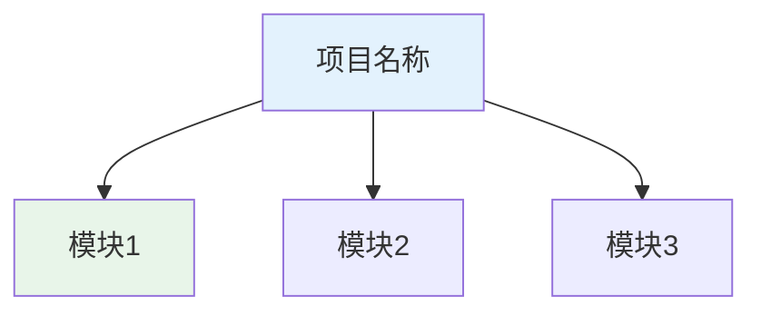
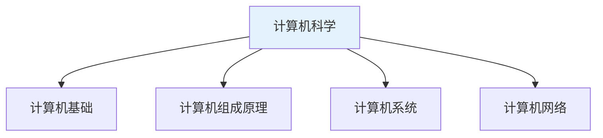
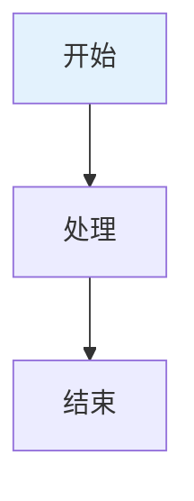
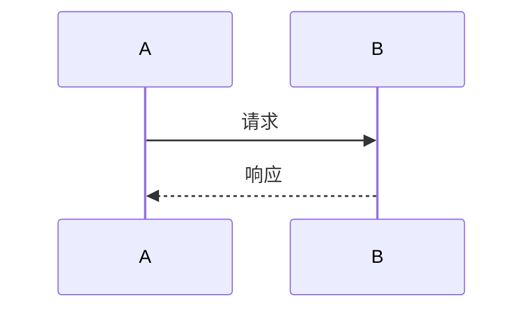

# 文档书写规范

## 概述

本文档规定了知识库文档的书写规范，以**项目为粒度**组织文档结构。一个项目是一个完整的知识体系，包含相关的子模块、具体内容和配套资源。

## 项目结构规范

### 项目定义

**项目**：具有独立知识体系的主题领域，如"计算机"、"数学"、"物理"等。

**示例项目：010-计算机**

```
docs/
└── 010-计算机/                          # 项目根目录
    ├── 000_导读.md                       # 项目导读（索引文件）
    ├── images/                           # 项目级共享图片
    │   └── 20240517204539.png
    │
    ├── 010_计算机基础/                   # 模块目录（一级模块）
    │   ├── 000_导读.md                   # 模块导读
    │   ├── 010_计算机发展历程/           # 子模块目录（二级模块）
    │   │   ├── 000-导读.md               # 子模块导读
    │   │   ├── images/                   # 子模块图片
    │   │   ├── 001-史前计算机时代.md     # 内容文件
    │   │   ├── 002-机械式计算机时代.md
    │   │   └── ...
    │   ├── 020_计算机的分类与发展方向/
    │   ├── 040_计算机工作过程/
    │   └── ...
    │
    ├── 020_计算机组成原理/               # 模块目录
    │   ├── 000_导读.md
    │   ├── images/
    │   ├── 001-控制器.md                 # 直接包含内容文件
    │   ├── 002-存储器.md
    │   └── ...
    │
    └── 030_计算机系统/                   # 模块目录
        └── ...
```

### 项目结构说明

| 组件 | 命名规则 | 作用 | 示例 |
|------|----------|------|------|
| 项目根目录 | `NNN-项目名称` | 项目根目录，包含所有相关内容 | `010-计算机` |
| 项目导读 | `000_导读.md` | 项目索引，描述知识体系、目录结构 | `010-计算机/000_导读.md` |
| 项目图片 | `images/` | 项目级共享图片资源 | `010-计算机/images/` |
| 模块目录 | `NNN_模块名称` | 一级模块，可包含子模块或内容 | `010_计算机基础` |
| 模块导读 | `000_导读.md` 或 `000-导读.md` | 模块索引，列出子模块或内容 | `010_计算机基础/000_导读.md` |
| 子模块目录 | `NNN_子模块名称` | 二级模块，通常包含具体内容 | `010_计算机发展历程` |
| 内容文件 | `NNN-标题.md` | 具体知识内容文档 | `001-史前计算机时代.md` |
| 模块图片 | `images/` | 模块级图片资源 | `010_计算机发展历程/images/` |

### 编号规则

#### 项目编号

- **格式**：三位数字 `NNN`
- **范围**：010-999
- **间隔**：建议以10为间隔，预留扩展空间。目录从100开始，每次加10，文件名从010开始，每次加1
- **示例**：`010-计算机`、`020-数学`、`030-物理`

#### 模块编号

- **格式**：三位数字 `NNN`
- **范围**：010-990
- **间隔**：建议以10为间隔，目录从100开始，每次加10，文件名从010开始，每次加1
- **示例**：
  - `010_计算机基础`
  - `020_计算机组成原理`
  - `030_计算机系统`

#### 内容编号

- **格式**：三位数字 `NNN`
- **范围**：
  - `000`：导读/索引文件
  - `001-999`：具体内容文件
- **示例**：
  - `000-导读.md`（导读）
  - `001-史前计算机时代.md`（内容）

#### 子模块编号

- **格式**：三位数字 `NNN`
- **范围**：010-990
- **间隔**：建议以10为间隔，目录从100开始，每次加10，文件名从010开始，每次加1
- **示例**：
  - `010_计算机发展历程`
  - `020_计算机的分类与发展方向`

## 核心文件规范

### 项目导读文件

**位置**：项目根目录下
**命名**：`000_导读.md` 或 `000-导读.md`

**作用**：
1. 描述项目整体知识体系
2. 提供学习路径指引
3. 列出所有模块目录
4. 包含项目概述图

**模板**：

```markdown
# 项目名称

## 概述

!!! note "项目名称"
    [项目简介，说明项目涵盖的知识领域]

## 知识体系结构



## 主要内容

### 分类1

<div style="background-color: #E3F2FD; padding: 15px; margin: 10px 0; border-left: 4px solid #2196F3; border-radius: 5px;">
    <strong>分类名称</strong>
    <ul style="margin: 5px 0;">
        <li><strong>子项1</strong>: 说明</li>
        <li><strong>子项2</strong>: 说明</li>
    </ul>
</div>

## 学习路径

!!! info "推荐学习路径"
    1. 模块1 → 模块2
    2. 模块3 → 模块4

## 目录

- [模块1](010_模块1/000_导读.md)
    - [子模块1](010_模块1/010_子模块1/000-导读.md)
    - [子模块2](010_模块1/020_子模块2/000-导读.md)
- [模块2](020_模块2/000_导读.md)

## 参考资料

- [参考资料名称](链接)
```

**实际示例**（010-计算机/000_导读.md）：

```markdown
# 计算机科学

## 概述

!!! note "计算机科学"
    计算机科学是研究计算机系统、软件、算法和信息处理的学科,涵盖硬件、软件、网络、数据库等多个领域。

## 知识体系结构



## 目录

- [计算机基础](010_计算机基础/000_导读.md)
    - [计算机发展历程](010_计算机基础/010_计算机发展历程/000-导读.md)
- [计算机组成原理](020_计算机组成原理/000_导读.md)
- [计算机操作系统](030_计算机系统/000_导读.md)
```

### 模块导读文件

**位置**：模块目录下
**命名**：`000_导读.md` 或 `000-导读.md`

**作用**：
1. 描述模块知识范围
2. 列出所有子模块或内容文件
3. 提供参考资料

**模板**：

```markdown
# 导读

> 参考资料：[参考资料链接]

## 概述

[模块概述内容]

## 知识结构


## 主要内容

- [内容1](./001-xxx.md)
- [内容2](./002-xxx.md)

## 参考资料

- [参考资料1](链接1)
```

**实际示例**（010-计算机/010_计算机基础/010_计算机发展历程/000-导读.md）：

```markdown
# 导读

> 参考资料：https://blog.csdn.net/weixin_42303403/article/details/129932204

## 概述

计算机的发展经历了很多代，网络上的介绍很多，这里大概总结了下，主要是四代。

## 参考资料

- [计算机发展史 知乎](https://zhuanlan.zhihu.com/p/562330220)
- [计算机发展史-序章 CSDN](https://blog.csdn.net/weixin_39660616/article/details/125821956)
```

### 内容文件

**位置**：模块或子模块目录下
**命名**：`NNN-标题.md`（NNN为001-999）

**作用**：描述具体知识点

**模板**：

```markdown
# 标题

## 概述

[概述内容]

## 第一部分

### 小节1

内容...

### 小节2

内容...

## 参考资料

- [参考资料名称](链接)
```

**实际示例**（010-计算机/020_计算机组成原理/001-控制器.md）：

```markdown
# 001-控制器

[控制器 百度百科(baidu.com)](https://baike.baidu.com/item/控制器/2206126)

控制器（controller）是指按照预定顺序改变主电路或控制电路的接线和改变电路中电阻值来控制电动机的启动、调速、制动和反向的主令装置。

## CU

Control Unit（控制单元）：在计算机的中央处理器（CPU）中，控制单元（CU）是负责协调和控制整个计算过程的组件。

### 指令寄存器 IR

- [指令寄存器 百度百科](https://baike.baidu.com/item/指令寄存器/3219483)

指令寄存器（IR，Instruction Register），用于暂存当前正在执行的指令。


```

## 图片资源规范

### 图片目录结构

```
010-计算机/                    # 项目根目录
├── images/                    # 项目级共享图片
│   └── 20240517204539.png
│
├── 010_计算机基础/
│   └── 010_计算机发展历程/
│       └── images/            # 子模块图片
│           ├── 450624874932154.png
│           └── 87342819240555.png
│
└── 020_计算机组成原理/
    └── images/                # 模块图片
        ├── 151721259684.png
        └── 20240517205137.png
```

### 图片命名规则

- **格式**：自由命名，建议使用时间戳或随机数字
- **格式限制**：PNG格式为主
- **示例**：
  - `20240517204539.png`（时间戳命名）
  - `450624874932154.png`（随机数字）
  - `jsjzc_20240517205339.png`（带前缀）

### 图片引用方式

```markdown
           # 相对路径，推荐
                   # 无描述，可接受
      # 外部链接，不推荐
```

## Markdown格式规范

### 标题层级

```markdown
# 一级标题（文档标题，唯一）
## 二级标题（主要章节）
### 三级标题（小节）
#### 四级标题（细项）
```

**规则**：
- 每个文档有且仅有一个一级标题
- 标题层级不跳跃
- 标题前后保持空行

### MkDocs Admonition扩展

用于创建提示框，增强可读性。

| 类型 | 用途 | 颜色 | 示例 |
|------|------|------|------|
| note | 备注、说明 | 蓝色 | `!!! note "标题"` |
| tip | 提示、技巧 | 绿色 | `!!! tip "标题"` |
| warning | 警告、注意 | 黄色 | `!!! warning "标题"` |
| danger | 危险、严重警告 | 红色 | `!!! danger "标题"` |
| info | 信息 | 蓝色 | `!!! info "标题"` |
| success | 成功、完成 | 绿色 | `!!! success "标题"` |

**语法**：

```markdown
!!! note "标题"
    内容文本，注意缩进4个空格
```

### Mermaid图表

**流程图**：

```markdown

```

**时序图**：

```markdown

```

**方向说明**：
- `TB`/`TD`：从上到下（默认）
- `BT`：从下到上
- `LR`：从左到右
- `RL`：从右到左

### HTML内联样式

**彩色提示框**：

```markdown
<div style="background-color: #E3F2FD; padding: 15px; margin: 10px 0; border-left: 4px solid #2196F3; border-radius: 5px;">
    <strong>标题</strong>
    <ul style="margin: 5px 0;">
        <li>内容项1</li>
        <li>内容项2</li>
    </ul>
</div>
```

**常用颜色方案**：

| 颜色系 | 背景色 | 边框色 | 用途 |
|--------|--------|--------|------|
| 蓝色 | `#E3F2FD` | `#2196F3` | 信息、备注 |
| 绿色 | `#E8F5E9` | `#4CAF50` | 成功、提示 |
| 橙色 | `#FFF3E0` | `#FF9800` | 警告 |
| 紫色 | `#F3E5F5` | `#9C27B0` | 特殊标记 |
| 粉色 | `#FCE4EC` | `#E91E63` | 强调 |
| 黄色 | `#FFF9C4` | `#FFC107` | 注意 |

**文本强调**：

```markdown
<span style="color:rgb(255,0,0);font-weight:bold;">红色加粗文本</span>
```

### 表格

```markdown
| 列1 | 列2 | 列3 |
|-----|-----|-----|
| 内容 | 内容 | 内容 |
```

**对齐**：

```markdown
| 左对齐 | 居中 | 右对齐 |
|:-------|:----:|-------:|
| 内容 | 内容 | 内容 |
```

### 代码块

```markdown
```python
def hello():
    print("Hello, World!")
```
```

### 链接和引用

```markdown
[链接文字](URL)                    # 外部链接
[链接文字](./相对路径.md)          # 相对路径链接
[链接文字](../上级目录/文件.md)    # 上级目录链接

> 引用内容                         # 引用块
> 参考资料：[链接](URL)            # 参考资料引用
```

## 内容编写规范

### 概述部分

每个文档应包含概述部分：

```markdown
## 概述

[简要说明主题、目的、核心概念]
```

### 参考资料格式

**方式一**：章节形式（推荐）

```markdown
## 参考资料

- [参考资料1](链接1)
- [参考资料2](链接2)
```

**方式二**：引用块形式

```markdown
> 参考资料：[参考资料](链接)
```

### 术语和概念

- **首次出现**：加粗显示
- **英文术语**：`中文（英文）`格式
- **缩写**：首次出现写全称

```markdown
**中央处理器（Central Processing Unit，CPU）**是计算机的核心部件。
```

### 目录链接

**项目导读中的目录**：

```markdown
## 目录

- [计算机基础](010_计算机基础/000_导读.md)
    - [计算机发展历程](010_计算机基础/010_计算机发展历程/000-导读.md)
    - [计算机分类](010_计算机基础/020_计算机的分类与发展方向/000-导读.md)
- [计算机组成原理](020_计算机组成原理/000_导读.md)
```

**模块导读中的目录**：

```markdown
## 主要内容

- [内容1](./001-xxx.md)
- [内容2](./002-xxx.md)
```

## 最佳实践

### 项目组织

1. **项目独立**：每个项目独立成体系，包含完整的知识结构
2. **模块清晰**：模块划分清晰，每个模块聚焦一个主题
3. **层次分明**：项目 → 模块 → 子模块 → 内容，层次不超过4层

### 文档编写

1. **概述优先**：每个文档开头写概述，说明主题和目的
2. **结构清晰**：使用标题、列表、表格组织内容
3. **图文并茂**：适当使用Mermaid图表和图片辅助说明
4. **引用规范**：正确标注参考资料来源

### 资源管理

1. **图片分类**：项目级共享图片放根目录，模块图片放模块目录
2. **相对路径**：链接和图片使用相对路径
3. **命名规范**：文件和目录命名符合规范

## 检查清单

### 项目检查

- [ ] 项目根目录命名：`NNN-项目名称`
- [ ] 包含项目导读：`000_导读.md`
- [ ] 包含项目图片目录：`images/`
- [ ] 模块目录命名：`NNN_模块名称`
- [ ] 编号间隔合理（建议10）

### 文档检查

- [ ] 文件命名：`NNN-标题.md` 或 `000_导读.md`
- [ ] 使用UTF-8编码
- [ ] 有且仅有一个一级标题
- [ ] 标题层级不跳跃
- [ ] 概述部分完整
- [ ] 参考资料标注正确

### 格式检查

- [ ] 图片使用相对路径
- [ ] 链接可访问
- [ ] 代码块语法正确
- [ ] 表格格式正确
- [ ] Mermaid语法正确
- [ ] HTML标签闭合正确

## 参考资料

- [Markdown语法说明](https://www.markdownguide.org/)
- [MkDocs文档](https://www.mkdocs.org/)
- [MkDocs Material主题](https://squidfunk.github.io/mkdocs-material/)
- [Mermaid文档](https://mermaid.js.org/)
