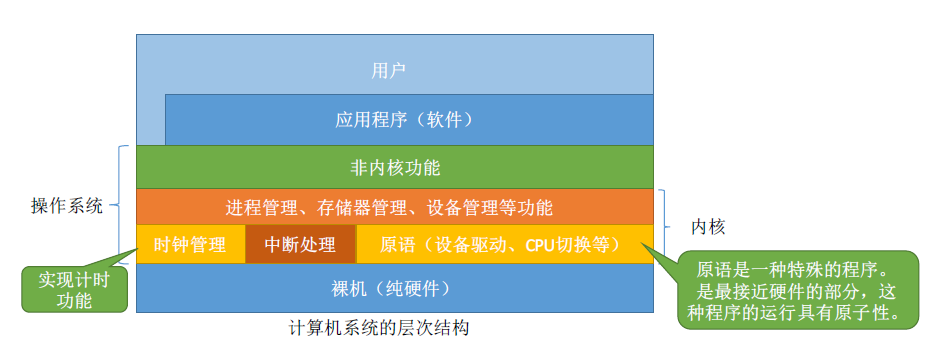

# 计算机基础

参考文档：

- [【王道计算机组成原理】1.2.5 计算机系统的多级层次结构](https://blog.csdn.net/qq_29678157/article/details/128592318)
- [操作系统的运行机制体系结构](https://blog.csdn.net/qq_45495899/article/details/109818864)
- [计算机组成原理（详细）](https://blog.csdn.net/weixin_42303403/article/details/129932204)
- [计算机组成原理（ 程序员必学简化版 ）](https://blog.csdn.net/weixin_48720080/article/details/124962455)
- [理解计算机系统：计算机的组成](https://zhuanlan.zhihu.com/p/74740342)
- [操作系统的体系结构](https://blog.csdn.net/2301_76197086/article/details/132976687)
- [计算机基础课程学习](https://github.com/LamberttLiu/CS-Basic-SelfLearning/tree/main)
- [计算机组成原理](https://zhuanlan.zhihu.com/p/554546968)
- [操作系统整理](https://zhuanlan.zhihu.com/p/557894163)

- 计算机概述
    - [计算机发展历程](000_概述/010_计算机发展历程/000-导读.md)
    - [计算机分类与发展方向](000_概述/020_计算机的分类与发展方向/000-导读.md)