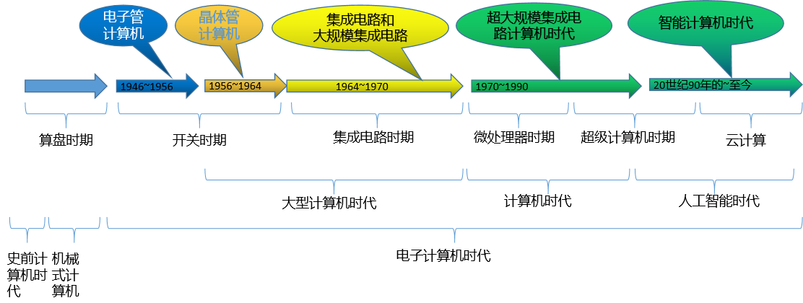

# 导读

https://blog.csdn.net/weixin_42303403/article/details/129932204

计算机的发展经历了很多代，网络上的介绍很多，这里大概总结了下，主要是四代。

不过在有些资料/帖子里，也提到过其他的一些阶段，主要如下：

电子管计算机、晶体管计算机、开关时期、机械式计算机、算盘时期、超级计算机时代、集成电路时期、电子计算机时代、史前计算机时代、电子管时代、人工智能时代、大型计算机时代、智能化、微处理器时期

按照各个帖子的描述，大概整理了一个图：

参考：

- [计算机发展史 知乎](https://zhuanlan.zhihu.com/p/562330220?utm_id=0)
- [计算机发展史-序章 CSDN](https://blog.csdn.net/weixin_39660616/article/details/125821956)
- [计算机的产生与发展历程 百度文库](https://wenku.baidu.com/view/49aea1b4fbc75fbfc77da26925c52cc58ad6905c.html?_wkts_=1715608762574&needWelcomeRecommand=1)
- [计算机的发展历史汇总  百度贴](https://baijiahao.baidu.com/s?id=1735046171786766661&wfr=spider&for=pc)

通用的说法，是四个阶段，分别是电子管时代、晶体管时代、集成电路时代、超大规模集成电路时代，
再加一个智能计算机时代（第五代计算机）

- 硬件
    - 1946-1957 第一代 电子管
        - 面向机器的语言
    - 1958-1964 第二代 晶体管
        - 面向过程的语音
        - 有了操作系统的雏形
    - 1964-1971 第三代 中小规模集成电路
        - 高级语言迅速发展
        - 有了分时操作系统
    - 1972-现在 第四代 大规模、超大规模集成电路
        - 微处理器
        - 并行 流水线 高速缓存 虚拟存储器
    - 微型 处理器的发展是以微处理器技术为标志
    - 机器字长
        - 计算机一次整数运算所能处理的二进制位数
    - 摩尔定律
        - 揭示了信息技术进步的速度
        - 集成电路上可容纳的晶体管数目约每隔18个月会增长一倍，整体性能也将提升一倍
- 软件
    - 机器语言 汇编语言
    - FORTRAN
    - PASCAL
    - C++
    - Java
