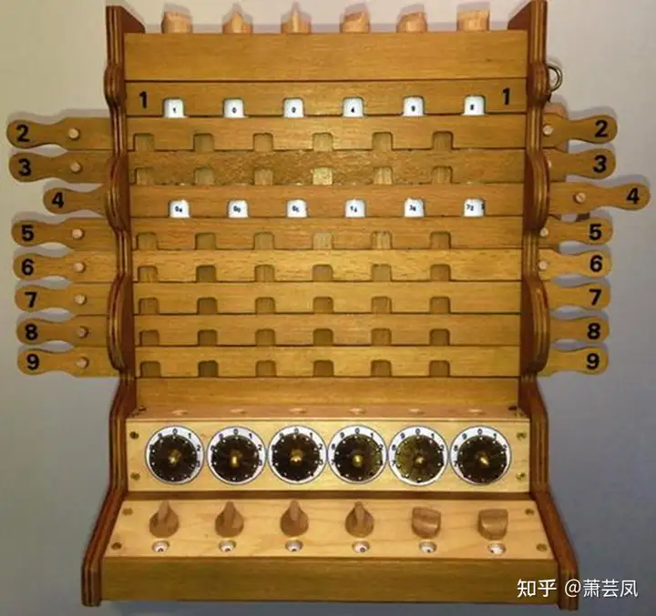
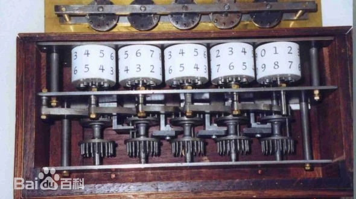
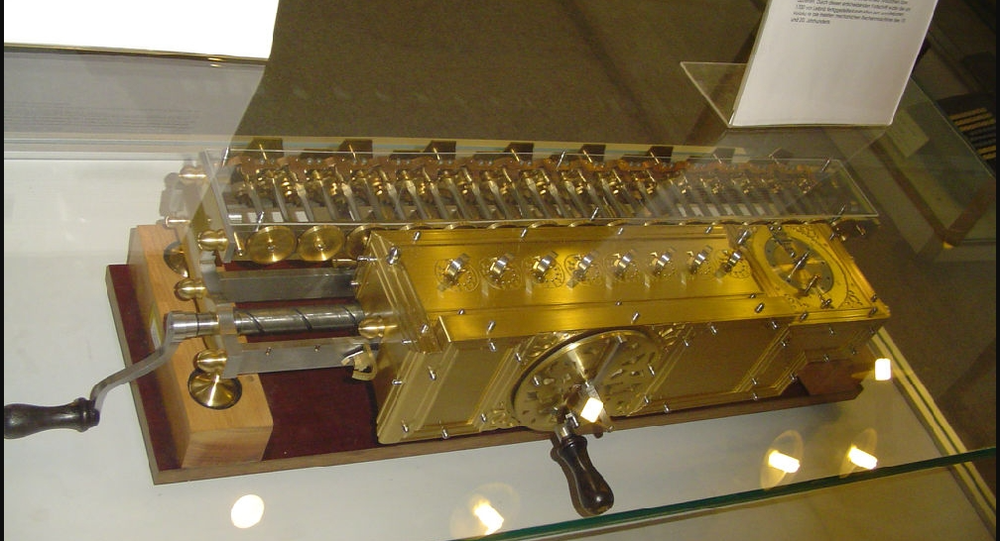
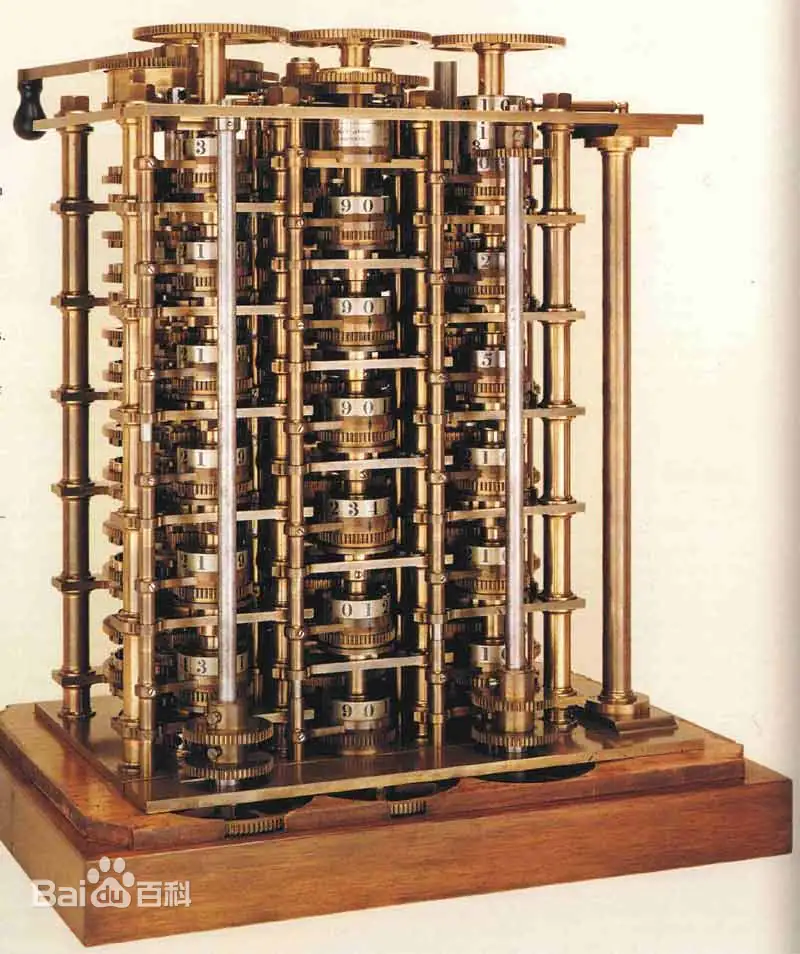
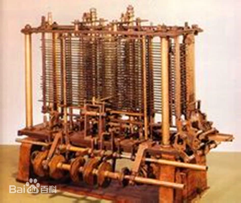
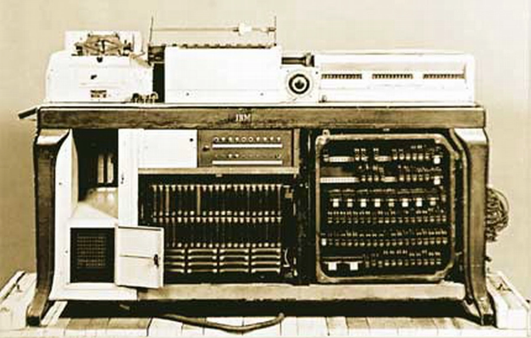

# 002-机械式计算机时代

这个时代，又可以看做是电子计算机先驱

在西欧，由中世纪进入文艺复兴时期的社会大变革，大大促进了自然科学技术的发展，人们长期被神权压抑的创造力得到空前释放。其中制造一台能帮助人进行计算的机器，就是最耀眼的思想火花之一。从那时起，一个又一个科学家为把这一思想火花变成引导人类进入自由王国的火炬而不懈努力。但限于当时的科技总体水平，大都失败了，这就是拓荒者的共同命运：往往见不到丰硕的果实。后人在享用这甜美的时候，应该能从中品出一些汗水与泪水的滋味……

进入19世纪，科学家们开始研究利用电学原理进行计算的可能性。查尔斯·巴贝奇于19世纪30年代提出了差分机的概念，虽然该机器并未完全制造出来，但其思想对后续电子计算机的发展产生了深远影响。此外，阿达·洛芙莱斯为差分机编写了“算法”，成为计算机科学和程序设计领域的先驱。

机械式计算器的第一个发明人一般认为是帕斯卡。据说契克卡德的是第一个制作出机械计算器的人。

## 1623年

1623年：德国科学家契克卡德（W. Schickard）制造了人类有史以来第一台机械计算机，这台机器能够进行六位数的加减乘除运算。 

1623年9月20日，契克卡德在与开普勒的通信中表示自己制作了一台用以计算的机器，不过后来在一场大火中烧毁了，契克卡德也懒得再做了，就把草图寄给了开普勒，当然开普勒也没有制造而是把草图当做书签了，一放就是300年。道听途说[机械式计算器的发展----契克卡德的计算钟](https://zhuanlan.zhihu.com/p/675405158)

1960年，图宾根大学学者布鲁若冯弗雷格格洛林霍夫制作了一台复制品

## 1642年

1642年：法国科学家帕斯卡（B.Pascal）发明了著名的帕斯卡机械计算机，首次确立了计算机器的概念。 

[科普中国  机械式电脑](https://baike.baidu.com/item/机械式电脑/6070542?fr=ge_ala)

帕斯卡加法器，也被称为滚轮式加法器（Pascaline），是计算机科学史上的重要里程碑之一。这是由法国数学家布莱斯·帕斯卡（Blaise Pascal）在1642年发明的，最初是为了帮助他的父亲解决税务上的计算问题。它标志着人类历史上第一台真正的计算机器的诞生。

帕斯卡加法器是由一系列齿轮组成的装置，其外观像一个长方盒子。这些齿轮分别代表个、十、百、千、万及十万等单位。其工作原理类似于手表，需要用钥匙旋紧发条后才能转动。使用者只需顺时针拨动齿轮，就可以实现加法运算，而逆时针拨动则进行减法运算。

为了解决“逢十进一”的进位问题，帕斯卡设计了一种特别的棘轮装置。当定位齿轮朝9转动时，棘轮会逐渐升高；一旦齿轮转到0，棘轮便跌落下来，推动前一位数的齿轮前进一档，从而实现进位。

帕斯卡加法器的出现大大提高了计算的效率和准确性，为后来的计算机科学奠定了基础，也为计算机的发展铺平了道路。它不仅在数学教育中起到了重要的作用，帮助学生更好地理解加法运算的原理，也在商业和科学研究中产生了深远影响，使得商业人士能够更高效地进行计算，为科学家们提供了更准确和可靠的计算工具。

总之，帕斯卡加法器以其独特的设计和前瞻性的理念，展示了人类智慧的结晶，并在计算机发展史上留下了浓墨重彩的一笔。

## 1674年

1674年：莱布尼茨改进了帕斯卡的计算机，使之成为一种能够进行连续运算的机器，并且提出了“二进制”数的概念。（据说这个概念来源于中国的八卦）

## 1725年

1725年：法国纺织机械师布乔（B.Bouchon）发明了“穿孔纸带”的构想。

[穿孔纸带](https://baike.baidu.com/item/穿孔纸带/1234150?fr=ge_ala)

## 1805年

1805年： 法国机械师杰卡德（J.Jacquard）根据布乔“穿孔纸带”的构想完成了“自动提花编织机”的设计制作，在后来电子计算机开始发展的最初几年中，在多款著名计算机中我们均能找到自动提花机的身影。 

## 1822年

1822年：英国科学家巴贝奇（C.Babbage）制造出了第一台差分机，它可以处理3个不同的5位数，计算精度达到6位小数。

[百度百科 差分机](https://baike.baidu.com/item/差分机/9423361?fr=ge_ala)

差分机

## 1834 年

1834 年：巴贝奇提出了分析机的概念，机器共分为三个部分：堆栈，运算器，控制器。巴贝奇对计算机的预见起码超前了一个世纪以上，正是他们的辛勤努力，为后来计算机的出现奠定了坚实的基础。 

[百度百科 分析机](https://baike.baidu.com/item/分析机?fromModule=lemma_search-box)

分析机

## 1847年

1847年：英国数学家布尔（G.Boole）发表著作《逻辑的数学分析》。 

## 1854年

1854年：布尔发表《思维规律的研究——逻辑与概率的数学理论基础》，并综合自己的另一篇文章《逻辑的数学分析》，从而创立了一门全新的学科－布尔代数，为百年后出现的数字计算机的开关电路设计提供了重要的数学方法和理论基础。 

## 1890年

1890年：美国在第12次人口普查中使用了由统计学家霍列瑞斯（H.Hollerith）博士发明的制表机，从而完成了人类历史上第一次大规模数据处理。此后霍列瑞斯根据自己的发明成立了自己的制表机公司，并最终演变成为IBM公司。 

[百度百科 穿孔制表机](https://baike.baidu.com/item/穿孔制表机/10736363?fromModule=search-result_lemma-recommend)

