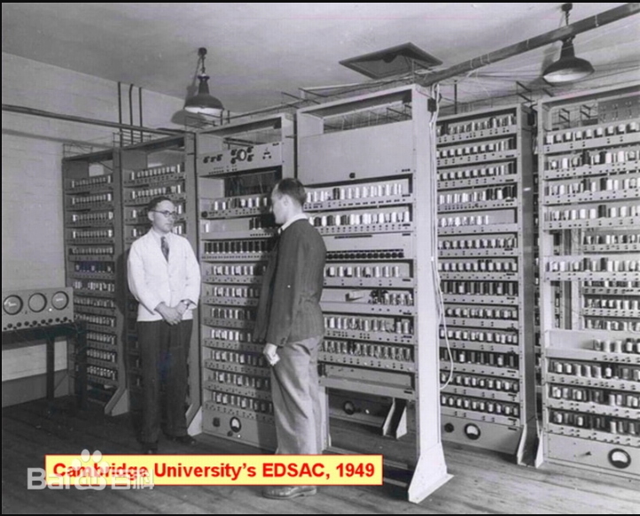
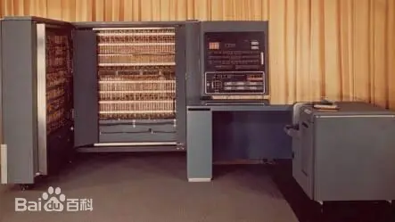
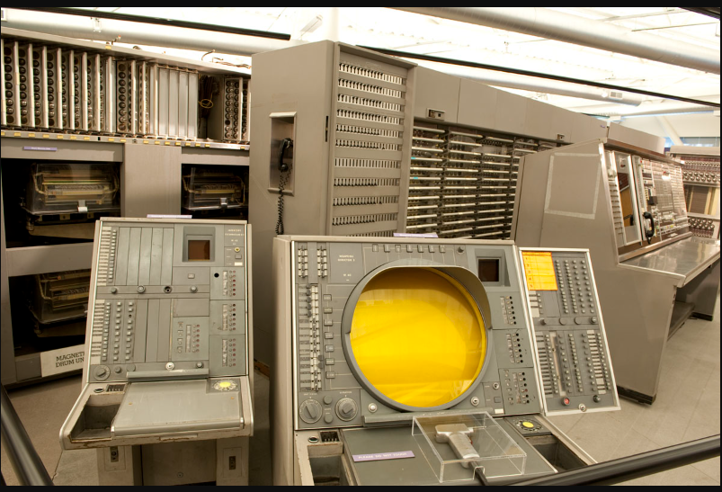
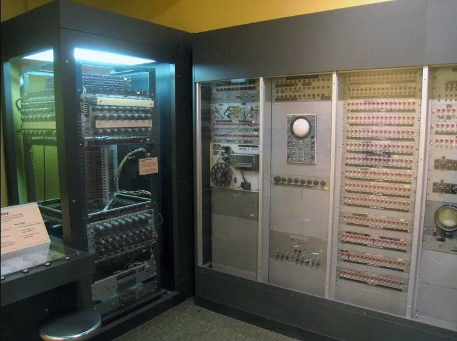

# 004-晶体管计算机 第二代电子计算机

真空管(电子管)时代的计算机尽管已经步入了现代计算机的范畴，但其体积之大、能耗之高、故障之多、价格之贵大大制约了它的普及应用。直到晶体管被发明出来，电子计算机才找到了腾飞的起点，一发而不可收…… 

随着晶体管的发明和普及，第二代计算机应运而生。晶体管替代了电子管，使得计算机的体积大大缩小，功耗降低，可靠性提升。此外，高级编程语言的出现也使得计算机编程变得更加简单和高效。

[百度百科 科普中国 晶体管计算机](https://baike.baidu.com/item/晶体管计算机/6908630?fromModule=search-result_lemma-recommend)

[百度百科 科普中国 第二代电子计算机](https://baike.baidu.com/item/%E7%AC%AC%E4%BA%8C%E4%BB%A3%E7%94%B5%E5%AD%90%E8%AE%A1%E7%AE%97%E6%9C%BA)

## 20世纪40年代

### 1947年

1947年：12月23号，贝尔实验室的肖克利、 布拉顿、巴丁创造出了世界上第一只半导体放大器件，他们将这种器件重新命名为“晶体管”

[百度百科 晶体管](https://baike.baidu.com/item/晶体管/569042?fr=ge_ala)

### 1948年

1948年：6月10日，香农阐明了通信的基本问题，给出了通信系统的模型，成为了信息论的奠基人。 

克劳德·艾尔伍德·香农（1916—2001）——1916年4月30日出生于美国密歇根州的加洛德（Petoskey），1936年毕业于密歇根大学并获得数学和电子工程学士学位，1940年获得麻省理工学院（MIT）数学博士学位和电子工程硕士学位。1941年他加入贝尔实验室数学部，工作到1972年。1956年他成为麻省理工学院（MIT）客座教授，并于1958年成为终生教授，1978年成为名誉教授。香农博士于2001年2月26日去世，享年84岁。 

香农在普林斯顿高级研究所（The Institute for Advanced Study at Princeton）期间，开始思考信息论与有效通信系统的问题。经过8年的努力，从1948年6月到10月，香农在《贝尔系统技术杂志》（Bell System Technical Journal）上连载发表了影响深远的论文《通讯的数学原理》。1949年，香农又在该杂志上发表了另一著名论文《噪声下的通信》。在这两篇论文中，香农解决了过去许多悬而未决的问题：阐明了通信的基本问题，给出了通信系统的模型，提出了信息量的数学表达式，并解决了信道容量、信源统计特性、信源编码、信道编码等一系列基本技术问题。两篇论文成为了信息论的基础性理论著作

1948年12月，ENAIC的两位缔造者共同创办了世界上第一家电脑公司“埃克特—莫契利计算机公司”（EMCC）。

[百度百科 埃克特—莫契利电脑公司](https://baike.baidu.com/item/埃克特—莫契利电脑公司/10736631?fr=ge_ala)

### 1949年

1949: “未来的计算机不会超过1.5吨。”这是当时科学杂志的大胆预测。

1949年：当时尚在美国哈佛大学计算机实验室的上海籍华人留学生王安向美国国家专利局申请了磁芯的专利。 第一台并行计算机

1949年9月，“马克”3号计算机研制成功，“马克”3号也是霍德华.艾肯研制的第一台内存程序的大型计算机，他在这台计算机上首先使用了磁鼓作为数与指令的存储器，这是计算机发展史上的一项重大改进，从此磁鼓成为第一代电子管计算机中广泛使用的存储器。

1949年英国剑桥大学数学实验室的Wilkes和他的小组建成了一台存储程序的计算机EDSAC，输入输出设备仍是纸带。 

[百度百科 EDSAC 电子延迟存储自动计算器](https://baike.baidu.com/item/EDSAC/7639053?fr=ge_ala)

## 20世纪50年代

### 1950年

1950年：日本人发明了软磁盘，从而开创了计算机存储的新纪元 ；

1950年10月，阿兰.图灵发表自己另外一篇及其重要的论文《机器能思考吗》，从而为人工智能奠定了基础，图灵也获得了“人工智能之父”的美誉。甚至有人说在第一代电脑占统治地位的那个时代，这篇论文我们可以把它看作第五代，第六代电脑的宣言书。

1950年EDVAC第一台并行计算机，实现了计算机之父“冯.诺伊曼”的两个设想：采用二进制和存储程序。

[百度百科 EDVAC  世界上第一台并行计算机](https://baike.baidu.com/item/EDVAC/8438215?fr=ge_ala)

### 1951年

1951年，UNIVAC计算机正式移交美国人口普查局使用，从而使电脑走出了实验室，开始为人类社会服务，从此人类社会进入了计算机时代。

1951年6月，王安创办了王安实验室，即王安电脑公司的前身，从此开始了王安电脑传奇般的历程。

### 1953年

1953年：4月7日，IBM正式对外发布自己的第一台电子计算机 IBM701。并邀请了冯.诺依曼、肖克利和奥本海默等人共150名各界名人出席揭幕仪式，为自己的第一台计算机宣传。

[百度百科 IBM 701](https://baike.baidu.com/item/IBM%20701/1750299?fr=ge_ala)

1953年8月

### 1954年

1954年，美国贝尔实验室研制成功第一台使用晶体管线路的计算机，取名“催迪克”（TRADIC），装有800个晶体管，只有100瓦功率，占地也仅有3立方英尺。

1954年，防空用的计算机“赛其”诞生。1954年，防空用的计算机“赛其”在美国诞生。“赛其”（SAGE）半自动地面防空系统（Semi-Automatic Ground Environment）是用来帮助美空军追踪雷达信号的。它是最早由人工操作的实时控制计算机系统，能够接收各侦察站雷达传来的信息，识别出来袭飞行物，然后由操作者指挥地面防御武器瞄准敌方飞行器。它重达 300 吨，放置在一个水泥堡垒中。它配备了诸如调制解调器和图形显示技术，而且它的处理器还是“双核”的。“赛其”是冷战时期的产物。当时，苏联爆炸了第一颗原子弹，冷战日渐加剧，美国政府希望把电脑的优势用于军事目的上，由此建立了一个能使国家边境免遭空袭的半自动地面防御系统“赛其”。 

[百度百科 sage 半自动地面防空系统](https://baike.baidu.com/item/Sage/2877718)

半自动地面防空系统

### 1955年

1955年，美国在阿塔拉斯洲际导弹上装备了以晶体管为主要元件的小型计算机。以后，在美国生产的同一型号的导弹中，由于改用集成电路元件，重量只有原来的1/100，体积与功耗减少到原来的1/300。

### 1956年

IBM公司小沃森向各地IBMI厂和实验室发出指令： “从1956年10月1日起，我们将不再设计使用电子管的机器，所有的计算机和打卡机都要实现晶体管化。”

RAMAC（Random Access Method of Accounting and Control）为IBM公司在1956年推出的首台硬磁盘存储器。该磁盘采用50个直径为24英寸的盘片组成。容量为5MB，约有两个冰箱大。

[百度百科 RAMAC](https://baike.baidu.com/item/RAMAC?fromModule=lemma_search-box)

### 1957年

1957年，诺依斯、摩尔、布兰克、克莱尔、赫尔尼、拉斯特、罗伯茨和格里尼克共同从晶体管之父肖克利的实验室出走，创办了仙童公司，这就是历史上著名的“八天才叛逆”，从此，才有了我们熟悉的intel， AMD，IDT等等一大批我们熟知的企业。  

### 1958年

1958年，IBM公司制成了第一台全部使用晶体管的计算机RCA501型。由于采用晶体管逻辑元件以及快速磁芯存储器，计算机速度大幅度提高，从每秒几千次一下子提高到几十万次，主存储器的存贮量，从几千字节一下子提高到10万字节以上

1958年：11月，IBM推出了自己的IBM709大型计算机，这时IBM公司自IBM701以来性能最为优秀的电子管计算机，但同时它也是IBM最后一款电子管计算机。 

### 1959年

1959年，IBM公司又生产出全部晶体管化的电子计算机IBM7090，换下了诞生不过一年的IBM709电子管计算机。IBM7090从1960年到1964年一直统治着科学计算的领域，并作为第二代电子计算机的典型代表，永载计算机发展的史册。