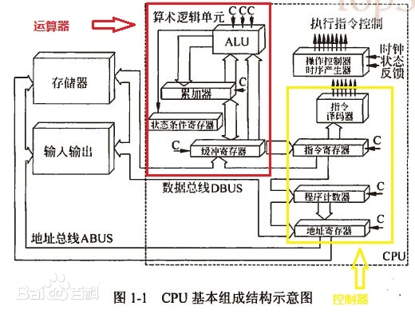

# 000-导读

计算机系统主要由硬件和软件两大部分组成。硬件包括中央处理器（CPU）、内存、输入输出设备等；软件包括操作系统、应用程序等。这些部件相互协作，共同实现计算机的各种功能。

计算机硬件是构成计算机系统各功能部件的集合。是由电子、机械和光电元件组成的各种计算机部件和设备的总称，是计算机完成各项工作的物质基础。计算机硬件是看得见、摸得着的，实实在在存在的物理实体。

计算机软件是指与计算机系统操作有关的各种程序以及任何与之相关的文档和数据的集合。其中程序是用程序设计语言描述的适合计算机执行的语句指令序列。

## 计算机硬件

1. 中央处理器（CPU）：计算机的核心部件，负责执行指令、处理数据和控制各种硬件设备。

2. 内存：临时存储数据和指令，用于CPU执行过程中的读写操作。内存主要包括随机存取存储器（RAM）和只读存储器（ROM）。

3. 输入设备：将外部数据转换为计算机能够识别的形式，并输入到计算机系统中。常见的输入设备包括键盘、鼠标、扫描仪等。

4. 输出设备：将计算机处理后的数据以适合人类阅读或其他设备使用的形式输出。常见的输出设备包括显示器、打印机、音响等。

5. 存储设备：用于永久性地存储数据和程序。常见的存储设备包括硬盘、固态硬盘（SSD）、光盘、U盘等。

6. 通信设备：负责计算机系统与其他设备或网络之间的数据传输。常见的通信设备包括网卡、路由器、调制解调器等。

## 计算机软件

1. 操作系统：计算机系统的基础软件，负责管理硬件资源、提供用户接口和运行应用程序等功能。常见的操作系统包括Windows、macOS、Linux等。

2. 应用程序：针对特定任务或需求开发的软件，如文本编辑器、图像处理软件、游戏等。

3. 系统软件：为计算机系统提供基本功能和服务的软件，如驱动程序、编译器、数据库管理系统等。

4. 工具软件：用于辅助用户完成特定任务的软件，如杀毒软件、压缩软件、文件管理器等。

5. 编程语言与开发环境：用于编写和调试计算机程序的软件和工具，如C++、Java、Python等编程语言和相关的集成开发环境（IDE）。

## 链接

原始数据——输入设备（人与机器沟通的桥梁）——运算器（处理数据）——输出设备——计算结果

计算机硬件由五个基本部分组成：运算器、控制器、存储器、输入设备和输出设备。

- 控制器：协调各个部件相关的问题
- 存储器：存放程序 数据
- CPU=运算器+控制器
    - 运算器
        - MQ
        - ACC
        - 核心ALU（算术逻辑单元）
        - X（其他的）
        - PSW
    - 控制器
        - CU 分析指令 给出控制信号
        - IR
        - PC
- 主机=CPU+主存储器
- I/O设备=输入设备+输出设备
- 外设=辅助存储器+I/O设备

- [计算机系统 百度百科 (baidu.com)](https://baike.baidu.com/item/计算机系统/7210959?fr=ge_ala)