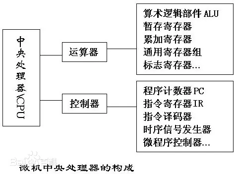
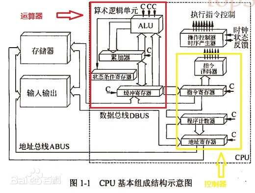
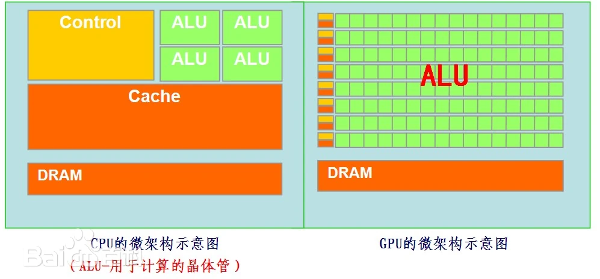
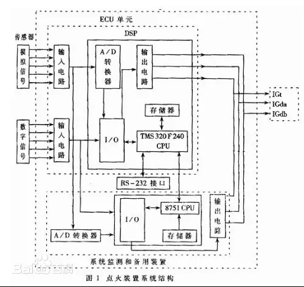
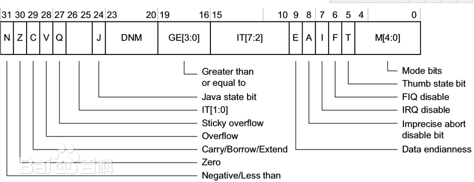
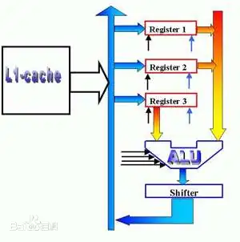

# 003-运算器

- [运算器 百度百科(baidu.com)](https://baike.baidu.com/item/运算器/2667320)

运算器：arithmetic unit，计算机中执行各种算术和逻辑运算操作的部件。运算器的基本操作包括加、减、乘、除四则运算，与、或、非、异或等逻辑操作，以及移位、比较和传送等操作，亦称算术逻辑部件（ALU）。

运算器由算术逻辑单元（ALU）、累加器、状态寄存器、通用寄存器组等组成。

-算术逻辑运算单元（ALU）的基本功能为加、减、乘、除四则运算，与、或、非、异或等逻辑操作，以及移位、求补等操作。计算机运行时，运算器的操作和操作种类由控制器决定。运算器处理的数据来自存储器；处理后的结果数据通常送回存储器，或暂时寄存在运算器中。与Control Unit共同组成了CPU的核心部分。
运算器是计算机中处理数据的功能部件。对数据处理主要包括数据的算术运算和逻辑数据的逻辑操作。因此,实现对数据的算术与逻辑运算是运算器的核心功能。

## 算术逻辑部件ALU

- [算术逻辑单元 百度百科(baidu.com)](https://baike.baidu.com/item/算术逻辑单元/8954657)

ALU 主要完成对二进制信息的定点算术运算、逻辑运算和各种移位操作。

算术运算主要包括定点加、减、乘和除运算。逻辑运算主要有逻辑与、逻辑或、逻辑异或和逻辑非操作。

移位操作主要完成逻辑左移和右移、算术左移和右移及其他一些移位操作。

某些机器中，ALU 还要完成数值比较、变更数值符号、计算操作数在存储器中的地址等。

可见，ALU 是一种功能较强的组合逻辑电路，有时被称为多功能发生器，它是运算器组成中的核心部件。

ALU 能处理的数据位数（即字长）与机器有关。如 Z80单板机中，ALU 是 8 位；IBM PC/XT和 AT 机中，ALU 为 16 位；386 和 486微机中，ALU 是 32 位。

ALU 有两个数据输入端和一个数据输出端，输入输出的数据宽度（即位数）与 ALU 处理的数据宽度相同。

### 累加器

- [累加器 百度百科(baidu.com)](https://baike.baidu.com/item/累加器/8590163)

在中央处理器中，累加器 (accumulator) 是一种寄存器，用来储存计算产生的中间结果。如果没有像累加器这样的寄存器，那么在每次计算 (加法，乘法，移位等等) 后就必须要把结果写回到 内存，也许马上就得读回来。然而存取主存的速度是比从算术逻辑单元到有直接路径的累加器存取更慢。

### 状态寄存器

- [状态寄存器 百度百科(baidu.com)](https://baike.baidu.com/item/状态寄存器/2477799)

状态寄存器用来记录算术、逻辑运算或测试操作的结果状态。程序设计中，这些状态通常用作条件转移指令的判断条件，所以又称为条件码寄存器。一般均设置如下几种状态位：

- 零标志位（Z）：当运算结果为 0 时，Z 位置“1”；非 0 时，置“0”；
- 负标志位（N）：当运算结果为负时，N 位置“1”；为正时，置“0”；
- 溢出标志位（V）：当运算结果发生溢出时，V 位置“1”；无溢出时，置“0”；
- 进位或借位标志（C）：
    - 在做加法时，如果运算结果最高有效位（对于有符号数来说，即符号位；对无符号数来说，即数值最高位向前产生进位时，C 位置“1”；无进位时，置“0”。
    - 在做减法时，如果不够减，最高有效位向前有借位（这时向前无进位产生）时，C 位置“1”；无借位（即有进位产生）时，C 位置“0”。
    - 除上述状态外，状态寄存器还常设有保存有关中断和机器工作状态（用户态或核心态）等信息的一些标志位（应当说明，不同的机器规定的内容和标志符号不完全相同），以便及时反映机器运行程序的工作状态，所以有的机器称它为“程序状态字”或“处理机状态字”（Processor Status Word，PSW ）。
    
### 通用寄存器 

- [通用寄存器 百度百科(baidu.com)](https://baike.baidu.com/item/通用寄存器/0)

通用寄存器组涉及的机器的运算器都有一组通用寄存器。它主要用来保存参加运算的操作数和运算的结果。

早期的机器只设计一个寄存器，用来存放操作数、操作结果和执行移位操作，由于可用于存放重复累加的数据，所以常称为累加器。

通用寄存器均可以作为累加器使用。通用寄存器的数据存取速度是非常快的，一般是十几个毫微秒（μs）。

如果 ALU 的两个操作数都来自寄存器，则可以极大地提高运算速度。

通用寄存器同时可以兼作专用寄存器，包括用于计算操作数的地址（用来提供操作数的形式地址，据此形成有效地址再去访问主存单元）。例如，可作为变址寄存器、程序计数器（PC）、堆栈指示器（SP）等。必须注意的是，不同的机器对这组寄存器使用的情况和设置的个数是不相同的。

通用寄存器可用于传送和暂存数据，也可参与算术逻辑运算，并保存运算结果。除此之外，它们还各自具有一些特殊功能。汇编语言程序员必须熟悉每个寄存器的一般用途和特殊用途，只有这样，才能在程序中做到正确、合理地使用它们。

16位cpu通用寄存器共有　8　个：AX,BX,CX,DX,BP,SP,SI,DI，八个寄存器都可以作为普通的数据寄存器使用。

但有的有特殊的用途：

- AX为累加器
- CX为计数器
- BX，BP为基址寄存器
- SI,DI为变址寄存器
- BP还可以是基指针
- SP为堆栈指针。

32位cpu通用寄存器共有　8　个： EAX,EBX,ECX,EDX,EBP,ESP,ESI,EDI功能和上面差不多